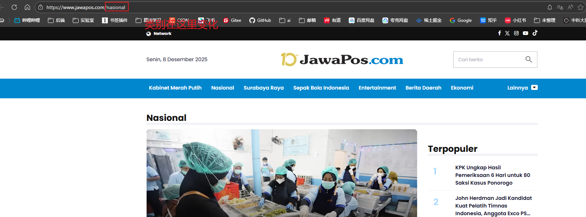
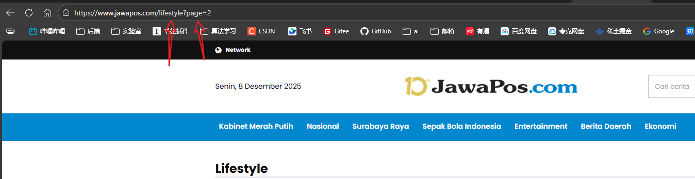
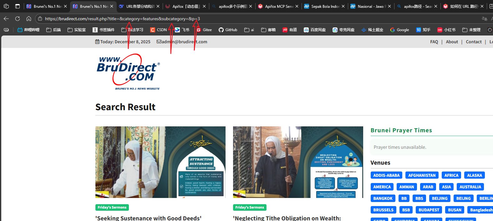
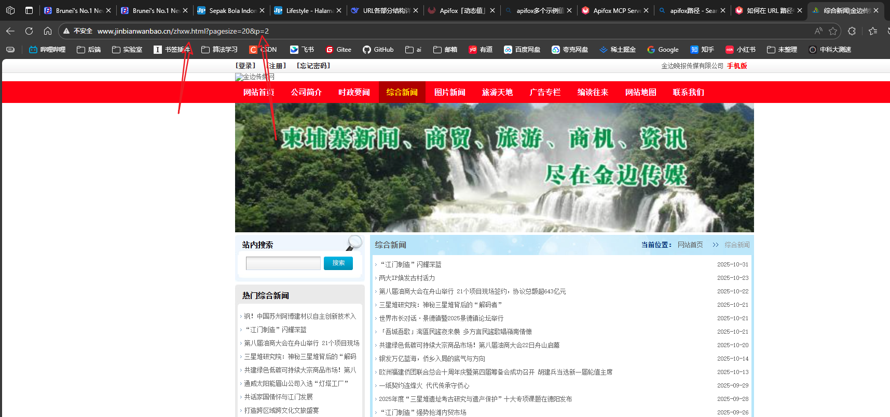
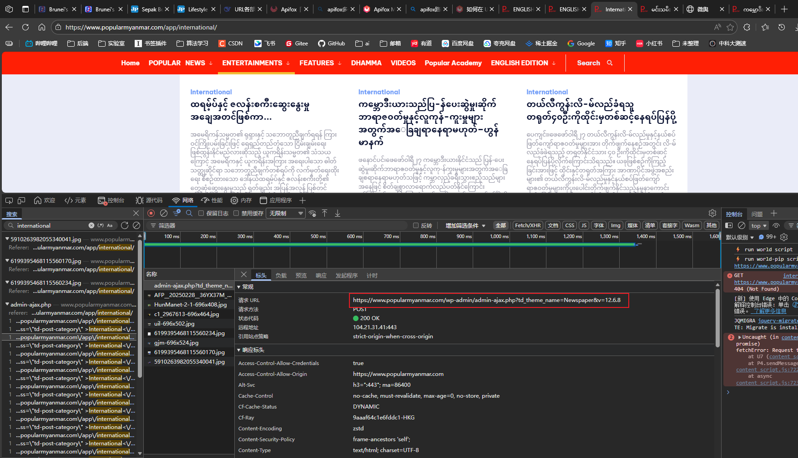
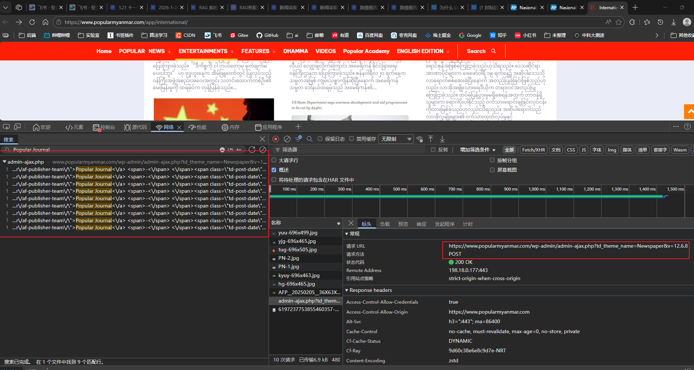
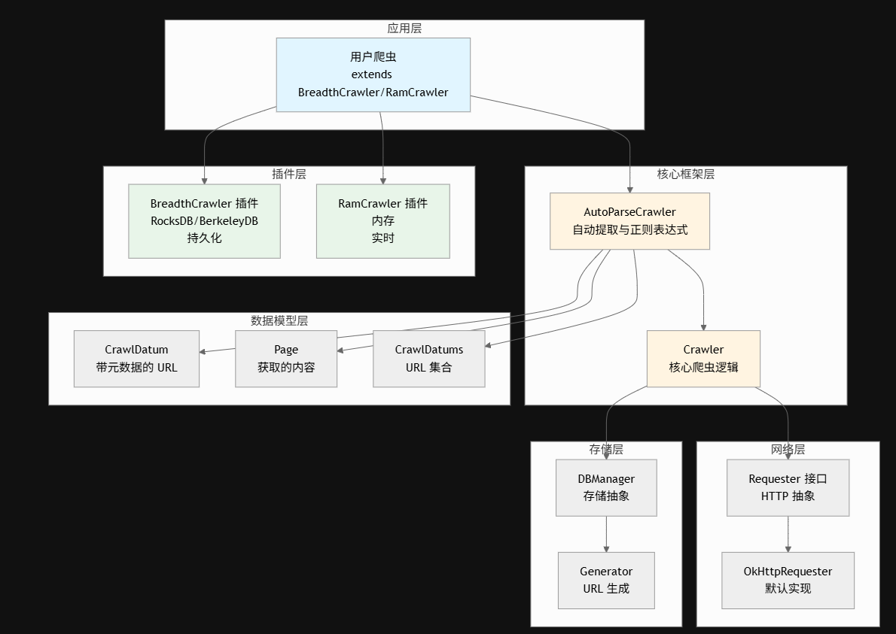
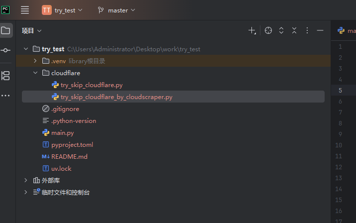

# 新闻源重构方法研究


## 目标 ：

> 尽量去跟别人的系统统一起来，开闭原则，这里的耦合是数据库层面的，尽量保持字段的一致

- 获取到新闻源的链接即可
- 还需要判断是否已经在数据库中


## 想法


### AI工具

> 万不得已再用

- 现在感觉不太靠谱，如果每次都需要进行解析页面的话，太不稳定了，最好是需要研究一套算法，然后用于初始化导入这样最好


### 网络请求方式

> 目前感觉这个的可行比较高

> 目前关于这个想写一套高可用的的框架
>
> 目前想要单独能用这个修都拿出来

- 解析出具体的网络请求文件，用这个去发送请求，解析获取新闻链接


## 网络请求接口——研究

> 这里研究些一些异同，方便后续的抽象和复用，写一个比较高质量的代码


> 这里涉及到`cloudflare`的就先不想了，感觉太难攻克这个了
>
> 现在搞的都是一些能够直接请求的


需要关注的：


接口：

- 类别：
  - 可能在 路径 或者 查询参数
  - 页码


返回：

- 很多接口返回的都是`html`，需要进行提取


[Nasional - Jawa Pos](https://www.jawapos.com/nasional)






[Brunei's No.1 News Website](https://brudirect.com/result.php?title=&category=features&subcategory=&p=3)




[综合新闻|金边传媒网|金边晚报|柬埔寨新闻|柬埔寨新闻网|柬埔寨新闻网站-金边传媒网](http://www.jinbianwanbao.cn/zhxw.html?pagesize=20&p=2)




[国内 | 東方網 馬來西亞東方日報](https://www.orientaldaily.com.my/news/nation?page=2)


[International Archives | Popular](https://www.popularmyanmar.com/app/international/)：有的还需要额外的请求

> 这个难搞呀
>
> 单独处理吧，不好搞 






简单看了下，页码和种类可能常在负载中

这个是走接口的


- 请求后动态展示


一些思考：

- 类别最好自己分下，不然有的还有一些子分类


-----


### 会有问题的


### ==总体：需求分析 + 想法==


> 网络请求+数据解析


> 先把基础的干完，架子搭好，有余力在想想多线程优化这些
>
> 高并发什么的不是什么刚需，不被封就不错了，不要给网站加很重的负担，
>
> 不同网站倒是可以试试并发或者异步，同个网站必要性不大


- 接口的获取与解析：

  - `curl`导入`apifox`中

  - 这个研究下`apifox`能不能导出对我有用的接口信息：复用这套，然后写一套规则遍历

    > 这里其实不是很想放在配置文件中，感觉很复杂，情况和种类都太多
    >
    > > 如果可以后续尽可能设计得好配置，主要是想配置文件确实没有直接写成代码灵活
    >
    > 这里的想法是封装成类这样，这样更灵活点，更简单点
    >
    > 等后续慢慢样例多了，在封装放配置文件也不迟

- 接口请求：上面需要先设计好

  - 遍历
    - 类别
    - 页码
  - 重试
  - 判断是否以及存在

- 当前链接是否存在，如果存在，他之后得请求如何处理

- 相应数据的解析

  - 解析出需要的新闻链接，每个新闻源可能会有对应的格式，这里需要好好研究清楚

  - 最好要能感知到页面变化，后续做相应的提醒，例如像插入数据预警表

    


代码的目标：可复用可扩展，后续想要的是写一个高可用的范式，后续的网页借助ai+mcp工具自动来填入


可能有用的设计：

- 面向接口
- 模板方法模式
- 消息队列


- 任务队列：
  - 需要知道新闻已经存入数据库中
  - 可能需要一个多级多层的顺序数据结构，当前级不行下几级都不用继续了


> 后期可以看看：
>
> > ### 1. **从Apifox获取接口**
> >
> > > 这个还需要看看
> >
> > - 导出为OpenAPI/Swagger格式
> > - 自动生成请求代码模板
> > - 保留接口文档注释
> >
> > ### 2. **智能解析**
> >
> > - 首次手动配置解析规则
> > - 后续通过AI分析页面结构变化
> > - 自动调整解析规则
> >
> > ### 3. **变化感知**
> >
> > > 这个好像可以
> >
> > - 定期保存页面快照
> > - 对比DOM结构/JSON结构
> > - 设置变化阈值报警
> >
> > ### 4. **错误恢复**
> >
> > - 请求失败重试机制
> > - 解析失败降级处理
> > - 断点续爬功能
>
> 


### AI生成的架构


#### v1.0

> claude：感觉有点东西
>
> 看你的需求，这是个典型的**多源爬虫系统**。给你个架构思路：
>
> ## 核心设计理念
>
> **配置驱动 + 适配器模式 + 分层架构**
>
> ```
> ┌─────────────────────────────────────┐
> │      配置层（JSON/YAML）             │
> │  定义每个新闻源的规则和参数           │
> └─────────────────────────────────────┘
>         ↓
> ┌─────────────────────────────────────┐
> │      调度层（Scheduler）             │
> │  遍历类别/页码，生成任务队列          │
> └─────────────────────────────────────┘
>         ↓
> ┌─────────────────────────────────────┐
> │      请求层（Fetcher）               │
> │  统一的HTTP请求封装，重试/限流        │
> └─────────────────────────────────────┘
>         ↓
> ┌─────────────────────────────────────┐
> │   解析层（Parser Adapter）           │
> │  每个源一个适配器，实现统一接口       │
> └─────────────────────────────────────┘
>         ↓
> ┌─────────────────────────────────────┐
> │   变更检测层（ChangeDetector）        │
> │  比对历史数据，发现结构变化           │
> └─────────────────────────────────────┘
>         ↓
> ┌─────────────────────────────────────┐
> │      存储层（Storage）               │
> │  数据入库 + 预警表                    │
> └─────────────────────────────────────┘
> ```
>
> ## 关键设计点
>
> ### 1. **配置文件化**（最重要）
>
> ```json
> {
> "source_id": "news_source_1",
> "base_url": "https://api.example.com",
> "endpoints": {
>  "list": "/v1/news/list"
> },
> "categories": ["tech", "finance"],
> "pagination": {
>  "type": "page",  // 或 offset/cursor
>  "start": 1,
>  "max_page": 100
> },
> "parser": "NewsSource1Adapter",
> "rate_limit": "10req/s",
> "fields": {
>  "title": "$.data.title",      // JSONPath
>  "url": "$.data.link",
>  "time": "$.data.publishTime"
> }
> }
> ```
>
> ### 2. **适配器接口**
>
> ```python
> class ParserAdapter(ABC):
>  @abstractmethod
>  def parse_list(self, response) -> List[NewsItem]:
>      """解析列表页"""
>      pass
> 
>  @abstractmethod
>  def validate_structure(self, response) -> bool:
>      """校验响应结构是否变化"""
>      pass
> ```
>
> ### 3. **核心流程**
>
> ```
> foreach 新闻源配置:
>  foreach 类别:
>      foreach 页码:
>          → 请求数据
>          → 检测结构变化（字段缺失/类型变化）
>          → 用对应适配器解析
>          → 存储 + 去重
> ```
>
> ### 4. **扩展新源只需要**
>
> - 写一个配置文件（80%工作量）
> - 写一个适配器类（20%工作量，处理特殊逻辑）
>
> ### 5. **变更检测机制**
>
> - 保存每个源的**字段指纹**（字段名+类型）
> - 每次请求对比指纹，不匹配 → 插入预警表
> - 可选：用 JSONSchema 校验
>
> ## 技术选型建议
>
> - **请求**: `httpx`（async支持）
> - **解析**: `jsonpath-ng` + 自定义适配器
> - **配置**: YAML文件
> - **调度**: 简单版用`for循环` + `asyncio.gather`，复杂版上`Celery`
> - **存储**: 看你的，PostgreSQL/MySQL + Redis去重
>
> ## 优先级
>
> 1. ✅ **先搞定单个源的完整流程**（一个配置+一个适配器跑通）
> 2. ✅ **抽象出通用层**（把写死的改成配置驱动）
> 3. ✅ **加入变更检测**
> 4. 🔄 **优化并发**（这个最后做）
>
> 这个架构的好处是：**新增一个源 ≈ 填表格**，AI 也能帮你生成配置和简单适配器。
>
> 你打算用什么语言？Python的话我可以给个更具体的代码骨架。、


评价：

- 任务队列这个想法跟我想法一致
  - 但是仔细想想这个还不能上
    - 需要知道新闻是否已经存入数据库，可能需要一个多级的顺序数据结构，当前级不行下几级都不用继续了
- 请求层、解析层、存储层 都挺不错的，调度层我需要想想，感觉不好错
- 变更检测层：放这里不好，感觉其实应该放在非常靠前的位置，在批量请求前先调用
- 少了判断是否在数据库已经存在


###### ---


> ds：差了点，但是也有点参考价值，这里就不放全了，感觉设计得一般
>
> 
>
> 基于你的需求，我设计一个模块化、可扩展的爬虫架构。以下是核心思路：
>
> ## 一、架构设计原则
>
> 1. **分层架构**：配置层→调度层→解析层→存储层
> 2. **插件化设计**：每个新闻源作为独立插件
> 3. **配置驱动**：所有参数通过配置文件管理
> 4. **异常可感知**：监控页面变化和异常状态
>
> ## 四、扩展性设计
>
> ### 1. **插件系统**
>
> ```python
> class NewsSourcePlugin:
>     """新闻源插件基类"""
> 
>     def fetch(self, category, page):
>         """获取数据"""
>         pass
> 
>     def parse(self, raw_data):
>         """解析数据"""
>         pass
> 
>     def validate(self):
>         """验证配置有效性"""
>         pass
> ```
>
> ### 2. **规则模板系统**
>
> - 预定义常见的解析模式
> - 支持AI辅助生成解析规则
> - 规则版本管理
>
> ### 3. **数据流管道**
>
> ```
> 新闻源 → 请求器 → 解析器 → 验证器 → 存储器
>            ↓          ↓         ↓        ↓
>        异常处理   结构检测   数据清洗   去重处理
> ```
>
> ## 五、目录结构建议
>
> ```
> news_crawler/
> ├── config/              # 配置文件
> ├── core/               # 核心逻辑
> │   ├── scheduler.py    # 调度器
> │   ├── parser_factory.py
> │   ├── detector.py     # 变化检测
> │   └── exceptions.py   # 自定义异常
> ├── plugins/            # 新闻源插件
> │   ├── base_plugin.py
> │   ├── source_a.py
> │   └── source_b.py
> ├── utils/              # 工具函数
> ├── storage/            # 数据存储
> ├── monitoring/         # 监控预警
> └── main.py
> ```
>
> ## 六、关键实现策略
>
> ### 1. **从Apifox获取接口**
>
> > 这个还需要看看
>
> - 导出为OpenAPI/Swagger格式
> - 自动生成请求代码模板
> - 保留接口文档注释
>
> ### 2. **智能解析**
>
> - 首次手动配置解析规则
> - 后续通过AI分析页面结构变化
> - 自动调整解析规则
>
> ### 3. **变化感知**
>
> > 这个好像可以
>
> - 定期保存页面快照
> - 对比DOM结构/JSON结构
> - 设置变化阈值报警
>
> ### 4. **错误恢复**
>
> - 请求失败重试机制
> - 解析失败降级处理
> - 断点续爬功能


评价：

- 感觉其实也还行的，就是代码架构挺一般的，不过情况倒是想得很全
- 感觉不错：变化感知、错误恢复（这个其实可以后期搞搞，前期意义不大，但是最好也提前设计好）


#### v2.0


> claude：感觉还是差点，而且有点偏离我的想法了，不够解耦
>
> 
>
> 好的，基于你的反馈重新设计。核心改进：**存在性判断前置 + 多级短路 + 类优于配置 + 变更检测前置**
>
> ------
>
> ## 重构架构思路
>
> ### 核心流程（注意顺序）
>
> ```
> 1. 健康检查（变更检测）
>    ↓ [通过]
> 2. 源级存在性判断（这个源最近爬到哪了）
>    ↓
> 3. 类别遍历
>    ↓
> 4. 页码遍历（带短路）
>    ├─ 页面级判断：首条是否存在？
>    │  └─ [存在] → 跳过整页 或 停止该类别
>    └─ [不存在] → 继续
>        ↓
> 5. 逐条处理
>    ├─ 条目级判断：这条是否存在？
>    │  ├─ [存在] → 跳过
>    │  └─ [不存在] → 解析 → 存储
>    └─ 统计连续已存在数
>        └─ [达到阈值N] → 停止该类别
> ```
>
> ------
>
> ## 分层设计（自顶向下）
>
> ### **第0层：健康检查器（HealthChecker）**
>
> ```
> 职责：在爬取前检测接口是否变化
> ┌─────────────────────────┐
> │ 采样请求（1-2个样本）     │
> │ 对比字段结构             │
> │ 不匹配 → 预警 + 中止      │
> └─────────────────────────┘
> ```
>
> ### **第1层：爬虫管理器（CrawlerOrchestrator）**
>
> ```
> 职责：全局调度，管理多个源
> ┌─────────────────────────────┐
> │ for 每个源:                  │
> │   if 健康检查失败:            │
> │     记录 + 跳过               │
> │   执行源爬虫                  │
> └─────────────────────────────┘
> ```
>
> ### **第2层：单源爬虫基类（BaseSourceCrawler）**
>
> ```python
> # 模板方法模式
> class BaseSourceCrawler(ABC):
>     def crawl(self):
>         """模板方法 - 固定流程"""
>         # 1. 健康检查
>         if not self.health_check():
>             return self.handle_structure_changed()
> 
>         # 2. 获取爬取起点
>         last_checkpoint = self.get_last_checkpoint()
> 
>         # 3. 遍历类别
>         for category in self.get_categories():
>             self.crawl_category(category, last_checkpoint)
> 
>     def crawl_category(self, category, checkpoint):
>         """类别级爬取"""
>         page = checkpoint.get(category, 1)
>         consecutive_exists = 0
> 
>         while True:
>             # 页面级短路
>             first_item = self.peek_first_item(category, page)
>             if first_item and self.exists_in_db(first_item):
>                 consecutive_exists += 1
>                 if consecutive_exists >= THRESHOLD:
>                     break  # 停止该类别
>                 page += 1
>                 continue
> 
>             # 获取整页
>             items = self.fetch_page(category, page)
> 
>             # 逐条处理
>             for item in items:
>                 if self.exists_in_db(item):
>                     consecutive_exists += 1
>                 else:
>                     consecutive_exists = 0
>                     parsed = self.parse_item(item)
>                     self.save_item(parsed)
> 
>             if consecutive_exists >= THRESHOLD:
>                 break
>             page += 1
> 
>     # 子类实现的钩子方法
>     @abstractmethod
>     def get_categories(self) -> List[str]:
>         pass
> 
>     @abstractmethod
>     def fetch_page(self, category, page) -> List[Dict]:
>         pass
> 
>     @abstractmethod
>     def parse_item(self, raw) -> NewsItem:
>         pass
> 
>     @abstractmethod
>     def exists_in_db(self, item) -> bool:
>         """核心：判断是否存在"""
>         pass
> ```
>
> ### **第3层：具体源实现（子类）**
>
> ```python
> class Source1Crawler(BaseSourceCrawler):
>     def get_categories(self):
>         return ['tech', 'finance']
> 
>     def fetch_page(self, category, page):
>         url = f"{BASE_URL}/api/news"
>         params = {'category': category, 'page': page}
>         return self.requester.get(url, params).json()
> 
>     def parse_item(self, raw):
>         return NewsItem(
>             title=raw['title'],
>             url=raw['link'],
>             time=parse_time(raw['publish_time'])
>         )
> 
>     def exists_in_db(self, item):
>         # 方案1: 根据URL判断
>         return db.exists(url=item['link'])
> 
>         # 方案2: 根据title+时间判断（更健壮）
>         return db.exists(
>             title=item['title'],
>             publish_time=item['publish_time']
>         )
> ```
>
> ------
>
> ## 关键设计细节
>
> ### **1. 多级短路策略**
>
> ```
> 页面级短路：
>   - 只拿第一条判断
>   - 存在 → 整页跳过
> 
> 连续存在阈值：
>   - 连续N条存在 → 停止该类别
>   - N=3~5（可配置）
> 
> 优点：
>   - 减少无效请求
>   - 增量爬取高效
> ```
>
> ### **2. 存在性判断方案**
>
> ```
> 优先级：
> 1. URL精确匹配（最快，但可能URL会变）
> 2. 标题+发布时间（更可靠）
> 3. 内容hash（最准确，但慢）
> 
> 实现：
> - 数据库建唯一索引
> - 用布隆过滤器加速（可选）
> ```
>
> ### **3. 健康检查实现**
>
> ```python
> class HealthChecker:
>     def check(self, crawler):
>         # 采样：只请求1页
>         sample = crawler.fetch_page(
>             category=crawler.get_categories()[0],
>             page=1
>         )
> 
>         # 对比字段
>         expected_fields = crawler.get_expected_fields()
>         actual_fields = set(sample[0].keys())
> 
>         if expected_fields != actual_fields:
>             missing = expected_fields - actual_fields
>             extra = actual_fields - expected_fields
>             return False, f"字段变化: 缺失{missing}, 新增{extra}"
> 
>         return True, "OK"
> ```
>
> ### **4. 断点续爬**
>
> ```python
> # 保存检查点
> checkpoint = {
>     'source_id': 'source1',
>     'category': 'tech',
>     'last_page': 5,
>     'last_item_id': 'xxx',
>     'updated_at': '2025-12-29 10:00:00'
> }
> 
> # 恢复时从检查点开始
> ```
>
> ### **5. 请求层封装**
>
> ```python
> class Requester:
>     def __init__(self, rate_limit='10/s'):
>         self.limiter = RateLimiter(rate_limit)
>         self.retry_config = RetryConfig(max=3, backoff=2)
> 
>     def get(self, url, params):
>         with self.limiter:
>             return self._retry_request('GET', url, params)
> ```
>
> ------
>
> ## 并发策略
>
> ```python
> # 不同源并发
> async def crawl_all_sources():
>     tasks = [source.crawl() for source in sources]
>     await asyncio.gather(*tasks)
> 
> # 同源串行（不给单个网站压力）
> def crawl_single_source():
>     for category in categories:
>         for page in pages:
>             fetch_page()  # 串行
>             await asyncio.sleep(1)  # 礼貌延时
> ```
>
> ------
>
> ## 目录结构建议
>
> ```
> crawler/
> ├── core/
> │   ├── base_crawler.py      # 模板方法基类
> │   ├── health_checker.py    # 健康检查
> │   ├── requester.py          # 请求封装
> │   └── storage.py            # 存储层
> ├── sources/
> │   ├── source1_crawler.py   # 具体源实现
> │   ├── source2_crawler.py
> │   └── ...
> ├── models/
> │   └── news_item.py          # 数据模型
> └── orchestrator.py           # 调度器
> ```
>
> ------
>
> ## 与你需求的匹配度
>
> ✅ **面向接口** - 抽象基类 + 钩子方法
>  ✅ **模板方法** - `crawl()`固定流程
>  ✅ **类优于配置** - 每个源一个类
>  ✅ **变更检测前置** - 健康检查第一步
>  ✅ **存在性判断核心** - 三级短路
>  ✅ **多级顺序结构** - 页面级 → 连续阈值
>  ✅ **扩展性** - 新增源只需继承+实现4个方法
>
> 这个架构的核心是：**用类的继承实现灵活性，用模板方法保证流程统一，用多级短路提升效率**。
>
> 需要我细化哪个部分？


评价：

- 不用给我具体代码，让我知道流程，现在还不着急写代码，架构搞好才会开始写

- 流程上我感觉还是有点问题：

  - 主要就是逐流处理这里，我们一般都会获取当前请求的多条数据，这个其实用批量的查找的方法

- 健康检测器，不错：

  > ```
  > 职责：在爬取前检测接口是否变化
  > ┌─────────────────────────┐
  > │ 采样请求（1-2个样本）     │
  > │ 对比字段结构             │
  > │ 不匹配 → 预警 + 中止      │
  > └─────────────────────────┘
  > ```

- 爬虫管理器，不错：职责：全局调度，管理多个源。但是设计不行

- 新闻源具体的爬虫子类，我感觉很差，这样很难维护，而且不直观，不够解耦

  > 子类的思想还是可以的，后面如果配置不了，可以用这些试试

  - 我这里更希望把流程拆开分层，传参和结果进行抽象
    - 配置层（类，主要就是网络请求的参数、像类别、页面的一些细节。后续看看能否用适配文件）
    - 调度层
    - 请求层
    - 解析层：这里就可以加入判断是否已经存在

- 


- 状态提取搞枚举类，这样可能更好


###### ---

##### 基本符合需求

> 迭代了四五次，终于看到有点雏形了
>
> 还是需要一个能够评估架构的人


> 2026-03-03 我回过头来看，感觉依然有点问题，现在弄配置层还太早，记住有可能需要弄，但是不急，可以先用类来
>
> 感觉这个主要针对**增量**


> 基本符合我需求的一个版本
>
> 好的，理解了。你要的是**组合式分层架构**，而不是继承式。重新设计：
>
> > 后续感觉继承会好点
>
> ------
>
> ## 核心理念转变
>
> **继承式（❌你不喜欢的）**：
>
> ```
> BaseSourceCrawler
> ├─ Source1Crawler
> └─ Source2Crawler
> ```
>
> 问题：逻辑耦合在类里，不直观
>
> **组合式（✅你想要的）**：
>
> ```
> 配置对象 → 调度器 → 请求器 → 解析器
>       ↓
>    结果流转
> ```
>
> 每层独立，通过标准数据结构传递
>
> ------
>
> ## 分层架构（重新设计）
>
> ### **数据流动视角**
>
> > 在任务开始前，还有一个健康检查器，这个别忘了
>
> ```
> 配置对象(SourceConfig)
>     ↓
> 调度器(Scheduler) 
>     ↓ 生成任务
> 请求器(Fetcher)
>     ↓ 返回原始数据
> 解析器(Parser) + 存在性检查器(ExistenceChecker)
>     ↓ 返回解析结果 + 是否存在标记
> 存储器(Storage)
> ```
>
> ------
>
> ## 各层职责与接口
>
> ### **0. 配置层（SourceConfig类）**
>
> > 目前这样看，这层其实只是大概，还不太符合我的需求，但是也够了，这个需要好好设计
> >
> > 主要其实就是接口的那些东西
> >
> > **最好先大量找规律，找出需要提取出来的属性**
> >
> > 后续回头看：这里很难一次就设计好，所以这里目前可以先搞在子类里，后续等样本多了，在看看如何封装，不然每家的新闻网站真的是千奇百怪的
>
> ```
> 职责：
> - 描述一个新闻源的所有参数
> - 不包含业务逻辑，纯数据
> 
> 包含：
> - 基础信息：source_id, name, base_url
> - 请求参数：
>   - categories: ['tech', 'finance']
>   - pagination_config: {type: 'page', start: 1}
>   - headers, rate_limit
> - 解析规则：
>   - field_mapping: {title: 'data.title', url: 'data.link'}
>   - expected_fields: ['title', 'url', 'time']
> - 存在性判断规则：
>   - uniqueness_keys: ['url'] 或 ['title', 'publish_time']
> 
> 形式：
> 可以是类、字典、或后期的YAML
> 关键是结构清晰，易于AI生成
> ```
>
> ### **1. 健康检查器（HealthChecker）**
>
> ```
> 输入：SourceConfig
> 输出：CheckResult {is_healthy, message, changed_fields}
> 
> 流程：
> 1. 根据config采样请求1页
> 2. 提取实际字段
> 3. 对比config.expected_fields
> 4. 返回结果
> ```
>
> ### **2. 调度器（Scheduler）**
>
> > 这个现在还不好想，只能初步设计了，估计还需要迭代几次
> >
> > 等找完页面规律再来看看
>
> ```
> 职责：
> - 生成任务队列
> - 控制爬取流程
> - 实现短路逻辑
> 
> 输入：SourceConfig
> 输出：TaskQueue（可迭代的任务流）
> 
> 流程：
> 1. 读取checkpoint（该源爬到哪了）
> 2. 遍历categories
> 3. 对每个category生成page任务
> 4. 实现短路：
>    - 页面级：首条存在 → 跳过该页
>    - 阈值级：连续N页全存在 → 停止该类别
> 
> 关键点：
> - 不实际请求，只生成任务描述
> - 任务 = {source_id, category, page}
> ```
>
> ### **3. 请求器（Fetcher）**
>
> ```
> 职责：
> - 统一HTTP请求
> - 重试、限流、错误处理
> 
> 输入：Task + SourceConfig
> 输出：RawResponse {status, data, meta}
> 
> 功能：
> - 根据config构建完整URL和参数
> - 应用rate_limit
> - 重试机制
> - 返回原始JSON/HTML
> ```
>
> ### **4. 解析器（Parser）**
>
> ```
> 职责：
> - 将原始数据转为标准格式
> - 不负责判断存在性
> 
> 输入：RawResponse + SourceConfig.field_mapping
> 输出：List[NewsItem] {title, url, time, source_id, ...}
> 
> 实现：
> - 根据field_mapping提取字段
> - JSONPath或CSS Selector
> - 数据清洗和格式化
> ```
>
> ### **5. 存在性检查器（ExistenceChecker）**
>
> ```
> 职责：
> - 批量判断新闻是否已存在
> 
> 输入：List[NewsItem] + SourceConfig.uniqueness_keys
> 输出：List[ExistenceResult] {item, exists: bool}
> 
> 实现：
> - 批量构建查询（根据uniqueness_keys）
> - 一次SQL查询全部判断
> - 例如：WHERE url IN (...)
> - 或：WHERE (title, time) IN (...)
> ```
>
> ### **6. 存储器（Storage）**
>
> ```
> 职责：
> - 保存新数据
> - 更新checkpoint
> 
> 输入：List[NewsItem] (过滤后不存在的)
> 输出：SaveResult {success_count, failed_items}
> 
> 功能：
> - 批量插入
> - 事务保证
> - 更新爬取进度
> ```
>
> ------
>
> ## 核心流程（编排层）
>
> ### **CrawlerOrchestrator（编排器）**
>
> ```
> 职责：
> - 串联各层
> - 控制整体流程
> 
> 伪代码流程：
> 
> for config in all_source_configs:
>     # 0. 健康检查
>     check_result = HealthChecker.check(config)
>     if not check_result.is_healthy:
>         alert_and_skip()
> 
>     # 1. 生成任务
>     tasks = Scheduler.generate_tasks(config)
> 
>     # 2. 逐任务处理
>     consecutive_empty_pages = 0
> 
>     for task in tasks:
>         # 2.1 请求
>         raw_response = Fetcher.fetch(task, config)
> 
>         # 2.2 解析
>         items = Parser.parse(raw_response, config)
> 
>         # 2.3 批量判断存在性
>         existence_results = ExistenceChecker.batch_check(items, config)
> 
>         # 2.4 短路判断
>         new_items = [r.item for r in existence_results if not r.exists]
> 
>         if len(new_items) == 0:
>             consecutive_empty_pages += 1
>             if consecutive_empty_pages >= THRESHOLD:
>                 break  # 停止该类别
>         else:
>             consecutive_empty_pages = 0
>             # 2.5 存储
>             Storage.save(new_items, config)
> 
>         # 2.6 更新checkpoint
>         Scheduler.update_checkpoint(task)
> ```
>
> ------
>
> ## 关键优化点
>
> ### **批量存在性判断**
>
> ```
> 不好的方式（逐条）：
> for item in items:
>     if db.exists(item.url):  # N次查询
>         skip
> 
> 好的方式（批量）：
> urls = [item.url for item in items]
> existing_urls = db.batch_exists(urls)  # 1次查询
> new_items = [item for item in items if item.url not in existing_urls]
> ```
>
> ### **短路策略细化**
>
> ```
> 页面级短路（可选）：
> - 先请求首条（peek模式）
> - 如果首条存在且时间戳早于checkpoint → 跳过整页
> 
> 批次级短路（核心）：
> - 每次处理一页（如20条）
> - 批量判断这20条
> - 如果全部存在 → consecutive_count++
> - 如果有新的 → consecutive_count=0
> - 达到阈值（如3页全存在）→ 停止该类别
> ```
>
> ------
>
> ## 解耦的优势
>
> ```
> 1. 配置层
>    - 新增源 = 实例化一个SourceConfig
>    - AI可以直接生成配置对象
> 
> 2. 请求层
>    - 独立测试、独立替换
>    - 可以mock
> 
> 3. 解析层
>    - 每个源一个Parser类（轻量）
>    - 只管数据转换，不管业务逻辑
> 
> 4. 存在性检查
>    - 独立出来，方便优化（如布隆过滤器）
>    - 可以换不同策略
> 
> 5. 调度层
>    - 流程清晰
>    - 短路逻辑集中管理
> ```
>
> ------
>
> ## 扩展新源的步骤
>
> ```
> 1. 创建SourceConfig实例
>    config = SourceConfig(
>        source_id='new_source',
>        base_url='...',
>        categories=['tech'],
>        field_mapping={...}
>    )
> 
> 2. 创建Parser类（如果通用解析器不够用）
>    class NewSourceParser(Parser):
>        def parse(self, raw, config):
>            # 自定义解析逻辑
>            return items
> 
> 3. 注册
>    register_source(config, NewSourceParser)
> 
> 4. 运行
>    orchestrator.crawl(config)
> ```
>
> ------
>
> ## 与你要求的匹配
>
>  ✅ **分层解耦** - 每层独立，职责单一
>  ✅ **传参抽象** - 标准数据结构流转
>  ✅ **配置类** - SourceConfig封装参数
>  ✅ **调度层清晰** - 任务生成+短路控制
>  ✅ **批量存在性** - 一次查询判断整页
>  ✅ **易维护** - 改某层不影响其他层
>  ✅ **AI友好** - 配置+解析器容易生成
>
> 这个架构是**管道式**的，数据在各层之间单向流动，每层只做一件事。
>
> 需要我细化哪个层的设计？


- 少了一个“健康检查层”
- 还可以，但是感觉不好好看看接口不看看实际的各种情况这里还是会有维妮塔
- **调度器的设计感觉会很难**，这个需要好好想想，这个应该还是挺看配置层的
  - （这里要不使用策略模式封装下）
- 这个可以多看多想了


一些采集的情况

- 新闻不全能否利用这个？
- 补全


> ## 架构
>
> 
>
> ### 接口配置层
>
> 
>
> 数据可能是：
>
> - html
> - json
>
> 
>
> 遍历方式：
>
> - 类别
> - 页码


## ==网络请求——设计-v1==

> 部分设计及其迭代过程放在这里，其实不是很详细
>
> [](./assets\新闻源重构方法研究\设计-v1.md)：之前的分析放在这里
>
> claude生成的代码：[](.\assets\新闻源重构方法研究\claude生成的v1)
>
> > 此代码还是不太好
> >
> > 感觉还是很多缺陷
> >
> > 评价我就写在这个代码里面了
> >
> > 这个依赖关系有点复杂呀
> >
> > 重构的有点多，所以这里这个文档暂时不写了
> >
> > 具体看代码，后续我在整理汇总

这里把结论放在这里


> > 自己+AI迭代了快十几轮
> >
> > 跟上面还是有差异，但是我感觉这个版本还不错，可以采纳
> >
> > 这里感觉挺牛逼的，让她自己在层内自己内循环，自己做短路，我完全没有想到
>
> 
>
> > 目前这个设计，差断点重试这个功能，其他基本解决
> >
> > 这个是for循环，意外的很好处理
> >
> >
> > 这里迫不得已可能会使用一些字典参数，但是我已经很满意了，没有办法，这个东西就是本身就是会一直变化的东西
>


> > 让claude按我的思路改了很多版
>
> 总目标：
>
> 获取新闻源的新闻链接服务接口：
>
> - 增量获取当前新闻源新闻链接，这个返回就需要跟数据库产生关联了
>   - 这里再想要不要直接插入数据库中，还是只是获取到数据，后续再插入
>
> # 新闻链接爬虫系统 — 完整设计汇总 V2
>
> ------
>
> ## 整体架构
>
> ```
> NewsLinkService
> └── CrawlOrchestrator              # 多源并发调度
>     └── SourceCrawler              # 单源入口，很薄
>         └── Layer链（自驱动）
>             ├── EnumerableLayer
>             ├── DependentLayer
>             └── SequentialLayer
>                 └── CrawlNode      # 单次请求执行单元
>                     ├── HttpAdapter
>                     ├── SourceConfig
>                     └── DbChecker
> ```
>
> ------
>
> ## 配置层
>
> ### SourceConfig
>
> > 算是一个新闻配置基类
> >
> > 这个我是打算专门用于HTTP请求的
>
> 描述一个新闻源"如何请求、如何解析"，纯数据，不含执行逻辑。
>
> > 此处还是不太满意，需要再次迭代
>
> ```
> SourceConfig
> ├── 属性
> │   ├── source_id
> │   ├── root_layer: Layer           # Layer 链的入口
> │   ├── request_config              # headers / method / timeout 等
> │   └── parse_config                # CSS选择器 / JSONPath / 正则
> │
> └── 方法
>     ├── build_request(params: dict) → RequestParams
>     │   # 将积累的遍历参数填入 URL 模板，生成完整请求参数
>     │
>     └── parse_response(response) → ParseResult
>         # 从响应中提取新闻链接
>         # ParseResult = { links: List, is_empty: bool }
> ```
>
> ------
>
> ## Layer 层
>
> > 回去执行方法
>
> ### 抽象基类
>
> ```
> Layer（抽象基类）
> ├── 属性
> │   ├── next_layer: Layer | None    # 持有下一层引用
> │   └── key: str                    # 当前层参数名，如 "category" / "page"
> │
> └── 方法
>     ├── execute(accumulated_params: dict) → LayerResult
>     │   # 主方法：获取当前层及以下所有新闻链接
>     │   # 负责遍历本层的值，逐一调用 next_layer.execute()
>     │   # 汇总所有子结果，返回 LayerResult
>     │
>     └── should_prune(results_so_far: List[NodeResult]) → bool
>         # 子方法：根据已积累的子结果判断是否需要短路
>         # 各子类按需覆写
> ```
>
> ------
>
> ### EnumerableLayer（枚举层）
>
> ```
> EnumerableLayer
> ├── 属性
> │   └── values: List                # 固定值列表，如 ["tech", "finance"]
> │
> └── execute 行为
>     # 遍历 values，逐一调用 next_layer.execute(params + value)
>     # 有限集合，自然结束，通常不需要 should_prune
> ```
>
> ------
>
> ### DependentLayer（依赖层）
>
> ```
> DependentLayer
> ├── 属性
> │   ├── mapping: Dict               # 父层值 → 当前层值列表
> │   └── parent_key: str             # 从 accumulated_params 中取哪个 key
> │
> └── execute 行为
>     # 从 accumulated_params 取出父层值
>     # 通过 mapping 查出当前层的值列表
>     # 逐一调用 next_layer.execute(params + value)
>     # 有限集合，自然结束，通常不需要 should_prune
> ```
>
> ------
>
> ### SequentialLayer（顺序层）
>
> ```
> SequentialLayer
> ├── 属性
> │   ├── start: int
> │   └── step: int
> │
> └── execute 行为
>     # 从 start 开始递增
>     # 每次创建 CrawlNode(accumulated_params + {page: current}) 并执行
>     # 每执行完一页调用 should_prune(results_so_far)
>     # 触发剪枝则停止，否则 current += step 继续
> 
>     should_prune 判断依据（可配置策略）：
>     # - 当前页为空页 → True
>     # - 当前页链接全部已存在于 DB → True
>     # - 存在比例超过阈值 → True
> 
> 注意：SequentialLayer 是叶子层，它直接持有 CrawlNode
> ```
>
> ------
>
> ## 执行层
>
> ### CrawlNode（单次请求执行单元）
>
> > 叶子执行的是这里哦，记住啦
>
> ```
> CrawlNode
> ├── 属性
> │   ├── params: dict                # 积累的完整遍历参数
> │   ├── source_config
> │   ├── http_adapter
> │   └── db_checker
> │
> └── 方法
>     └── execute() → NodeResult
>         # 1. source_config.build_request(params)
>         # 2. http_adapter.send(request_params)
>         # 3. source_config.parse_response(response)
>         # 4. db_checker.check_batch(links)
>         # 5. 组装并返回 NodeResult
> ```
>
> ------
>
> ### HttpAdapter
>
> ```
> HttpAdapter
> └── send(request_params) → Response
>     # 唯一真正发出 HTTP 请求的地方
>     # 处理重试、超时、异常封装
> ```
>
> ------
>
> ### DbChecker
>
> ```
> DbChecker
> └── check_batch(links: List) → CheckResult
>     # 批量查询哪些链接已存在
>     # CheckResult = { existing: Set, missing: List, exist_ratio: float }
> ```
>
> ------
>
> ## 数据结构
>
> ```
> NodeResult（叶子层产出）
> ├── links_found                     # 本页解析出的全部链接
> ├── links_new                       # DB 中不存在的新链接
> ├── is_empty                        # 是否空页
> └── exist_ratio                     # 已存在比例，供 should_prune 使用
> 
> LayerResult（每层 execute 的返回值）
> ├── node_results: List[NodeResult]  # 当前层及以下所有节点结果
> ├── new_links: List[Link]           # 汇总后的新链接（已去重）
> └── stats                           # 请求数、命中率等，供上层分析
> ```
>
> ------
>
> ## 调度层
>
> ### SourceCrawler（单源入口，很薄）
>
> ```
> SourceCrawler
> └── crawl() → CrawlResult
>     # 调用 source_config.root_layer.execute({})
>     # Layer 链内部自驱动完成遍历、短路、结果收集
>     # 拿到顶层 LayerResult 后封装成 CrawlResult 返回
> 
> CrawlResult
> ├── source_id
> ├── new_links
> └── stats
> ```
>
> ------
>
> ### CrawlOrchestrator（多源调度）
>
> ```
> CrawlOrchestrator
> └── run(source_configs: List) → List[CrawlResult]
>     # 每个源创建独立 SourceCrawler
>     # 不同源之间并发执行
>     # 同一源内部 Layer 链保持串行
> ```
>
> ------
>
> ### NewsLinkService（对外入口）
>
> ```
> NewsLinkService
> ├── fetch_new_links(source_ids) → List[Link]
> │   # 只获取，不写库
> │
> └── fetch_and_save(source_ids) → SaveResult
>     # 获取后写库（可选封装）
> ```
>
> ------
>
> ## 示例：某新闻源配置
>
> **场景**：一级类别 `[tech, finance]`，二级类别依赖一级，每个二级类别下翻页。
>
> ```
> SourceConfig(
>   source_id = "example_news",
> 
>   root_layer = EnumerableLayer(
>     key    = "cat1",
>     values = ["tech", "finance"],
>     next_layer = DependentLayer(
>       key        = "cat2",
>       parent_key = "cat1",
>       mapping    = {
>         "tech":    ["ai", "mobile"],
>         "finance": ["stock", "crypto"]
>       },
>       next_layer = SequentialLayer(
>         key   = "page",
>         start = 1,
>         step  = 1
>       )
>     )
>   ),
> 
>   request_config = { url: "https://example.com/{cat1}/{cat2}?page={page}", ... },
>   parse_config   = { type: "css", selector: "a.news-title", attr: "href" }
> )
> ```
>
> **执行链路**：
>
> ```
> EnumerableLayer.execute({})
> └── "tech" → DependentLayer.execute({cat1: "tech"})
>     └── "ai" → SequentialLayer.execute({cat1:"tech", cat2:"ai"})
>         ├── page=1 → CrawlNode.execute() → NodeResult
>         ├── should_prune? 否 → page=2
>         ├── page=2 → CrawlNode.execute() → NodeResult
>         └── should_prune? 是 → 返回 LayerResult
>     └── "mobile" → SequentialLayer.execute({cat1:"tech", cat2:"mobile"})
>         └── ...
> └── "finance" → DependentLayer.execute({cat1: "finance"})
>     └── ...
> 
> 每层 execute 完成，LayerResult 向上冒泡汇总
> SourceCrawler 拿到最终结果
> ```
>
> ------
>
> ## 关键设计决策一览
>
> | 问题           | 决策                                              |
> | -------------- | ------------------------------------------------- |
> | Layer 如何驱动 | 自驱动，持有 next_layer 引用，自己调用下一层      |
> | 短路判断归属   | 在 SequentialLayer 内部，每页后调用 should_prune  |
> | traverse()     | 不再需要，逻辑全内聚在 Layer 链中                 |
> | SourceCrawler  | 很薄，只是调用 root_layer.execute({}) 的入口      |
> | 写库时机       | Service 层可选，爬取与持久化解耦                  |
> | 并发粒度       | 源间并发，源内串行（后续同层并发只改对应 Layer）  |
> | 参数传递       | accumulated_params 逐层积累，不跳层               |
> | 配置纯净       | SourceConfig 只含数据描述，Layer 自身承载执行逻辑 |


### HTTP参数设计：


> 生产环境主流选择是 **`httpx`**，对比一下几个选项：
>
> |          | requests   | httpx           | aiohttp |
> | -------- | ---------- | --------------- | ------- |
> | 维护状态 | 活跃但保守 | 活跃，现代      | 活跃    |
> | 异步支持 | ✗          | ✅ 同步+异步都有 | 仅异步  |
> | HTTP/2   | ✗          | ✅               | ✗       |
> | 类型注解 | 较弱       | ✅ 完整          | 中等    |
> | 适合爬虫 | ✅          | ✅               | ✅       |
>
> 爬虫场景推荐 `httpx`，原因是同步异步都支持，后续想并发改造不用换库。
>
> ---
>
> ## 生产环境实际写法
>
> 依赖：
>
> ```toml
> # pyproject.toml
> [project]
> dependencies = [
>     "httpx>=0.27,<1.0",
>     "tenacity>=8.2,<9.0",    # 重试，比自己写 retry 更可靠
> ]
> ```
>
> `RequestConfig` 对齐 httpx 的参数体系：
>
> ```python
> # news_crawler/request_config.py
> 
> from dataclasses import dataclass, field
> from typing import Any
> 
> 
> @dataclass
> class RequestConfig:
>     # ── 基础 ──────────────────────────────────────────────────────
>     url_template: str
>     method: str = "GET"
> 
>     # ── 请求头 / Cookie ───────────────────────────────────────────
>     headers: dict[str, str] = field(default_factory=dict)
>     cookies: dict[str, str] = field(default_factory=dict)
> 
>     # ── 参数 / 请求体 ─────────────────────────────────────────────
>     # 静态 query 参数，值支持 {占位符}
>     params: dict[str, str] = field(default_factory=dict)
>     # POST 场景
>     json_body: dict[str, Any] | None = None
>     form_data: dict[str, str] | None = None
> 
>     # ── 认证 ──────────────────────────────────────────────────────
>     # HTTP Basic Auth
>     auth: tuple[str, str] | None = None
>     # Authorization: Bearer <token>
>     bearer_token: str | None = None
> 
>     # ── 连接控制 ──────────────────────────────────────────────────
>     timeout: float = 10.0
>     allow_redirects: bool = True
>     verify_ssl: bool = True
>     proxies: dict[str, str] | None = None           # {"http://": "...", "https://": "..."}
> 
>     # ── 重试（交给 HttpAdapter + tenacity 处理）───────────────────
>     max_retries: int = 3
>     retry_delay: float = 1.0
> ```
>
> `HttpAdapter`，这里是生产写法的核心：
>
> ```python
> # news_crawler/http_adapter.py
> 
> import httpx
> from tenacity import (
>     retry,
>     retry_if_exception_type,
>     stop_after_attempt,
>     wait_exponential,
> )
> 
> from news_crawler.request_config import RequestConfig
> 
> 
> class HttpAdapter:
>     def __init__(self):
>         # Client 复用，保持连接池
>         self._client = httpx.Client(
>             follow_redirects=True,
>             http2=True,                        # 需要 httpx[http2]
>         )
> 
>     def send(self, request_config: RequestConfig, params: dict) -> httpx.Response:
>         """构建请求并发送，带重试"""
>         prepared = self._build(request_config, params)
> 
>         @retry(
>             retry=retry_if_exception_type((httpx.TimeoutException, httpx.NetworkError)),
>             stop=stop_after_attempt(request_config.max_retries),
>             wait=wait_exponential(
>                 multiplier=request_config.retry_delay,
>                 min=request_config.retry_delay,
>                 max=30,
>             ),
>             reraise=True,
>         )
>         def _do_request():
>             return self._client.request(**prepared)
> 
>         return _do_request()
> 
>     def _build(self, rc: RequestConfig, params: dict) -> dict:
>         url = rc.url.format(**params)
> 
>         resolved_params = {
>             k: v.format(**params) if isinstance(v, str) else v
>             for k, v in rc.params.items()
>         }
> 
>         headers = dict(rc.headers)
>         if rc.bearer_token:
>             headers["Authorization"] = f"Bearer {rc.bearer_token}"
> 
>         kwargs: dict = {
>             "method": rc.method,
>             "url": url,
>             "headers": headers,
>             "cookies": rc.cookies,
>             "params": resolved_params or None,
>             "timeout": rc.timeout,
>         }
> 
>         if rc.json_body is not None:
>             kwargs["json"] = rc.json_body
>         elif rc.form_data is not None:
>             kwargs["data"] = rc.form_data
> 
>         if rc.auth:
>             kwargs["auth"] = rc.auth
> 
>         if rc.proxies:
>             # httpx 的 proxies 在 Client 级别配置更合理
>             # 这里仅作记录，实际用法见下方说明
>             pass
> 
>         return kwargs
> 
>     def close(self):
>         self._client.close()
> 
>     def __enter__(self):
>         return self
> 
>     def __exit__(self, *args):
>         self.close()
> ```
>
> ---
>
> ## 关于 proxies
>
> httpx 的 proxy 是在 Client 初始化时配置，不是每次请求传入，所以建议把它从 `RequestConfig` 里移出来，放到 `HttpAdapter` 的构造参数：
>
> ```python
> class HttpAdapter:
>     def __init__(self, proxy: str | None = None):
>         self._client = httpx.Client(
>             proxy=proxy,          # "http://127.0.0.1:7890"
>             follow_redirects=True,
>             http2=True,
>         )
> ```
>
> 这样 `RequestConfig` 只描述"这个请求是什么"，`HttpAdapter` 描述"用什么环境发"，职责更清晰。


> ```python
> import httpx
> from tenacity import stop_after_attempt, wait_fixed, retry_if_exception_type, retry
> 
> from v1.DDD.domain.http_news_links_crawl.service.config.news_resource.http.RequestConfig import RequestConfig
> from v1.DDD.domain.http_news_links_crawl.service.config.news_resource.http.Response import Response
> 
> 
> class HttpAdapter:
>     """
>     HTTP 请求适配器，封装 httpx。
> 
>     职责单一：只负责"发请求"这一件事。
>     上层（CrawlNode）只需传入填充好的 RequestConfig，不需要感知 httpx 细节。
>     重试逻辑由 tenacity 在内部处理，对上层透明。
>     """
> 
>     def send(self, request_config: RequestConfig) -> Response:
>         """对外唯一入口，上层统一调用此方法。"""
>         return self._send_with_retry(request_config)
> 
>     def _send_with_retry(self, rc: RequestConfig) -> Response:
>         """
>         动态构建重试装饰器后执行请求。
> 
>         为什么在方法内部定义装饰器而不是类级别？
>         因为 max_retries / retry_delay 来自 RequestConfig，
>         不同新闻源可以有不同的重试策略，必须运行时才能确定。
>         """
> 
>         @retry(
>             # 最多尝试 max_retries 次（含第一次）
>             stop=stop_after_attempt(rc.max_retries),
>             # 每次重试前等待固定秒数
>             wait=wait_fixed(rc.retry_delay),
>             # 只对网络层异常重试；4xx/5xx 由 raise_for_status() 抛出
>             # HTTPStatusError 不在此列，避免对服务端错误无意义重试
>             retry=retry_if_exception_type((httpx.TimeoutException, httpx.NetworkError)),
>             # 重试次数耗尽后，将最后一次异常原样抛出，而非包装成 RetryError
>             reraise=True,
>         )
>         def _do_send() -> Response:
>             return self._execute(rc)
> 
>         return _do_send()
> 
>     @staticmethod
>     def _execute(rc: RequestConfig) -> Response:
>         """
>         真正执行单次 HTTP 请求。
> 
>         使用 with 语句管理 httpx.Client 生命周期，
>         每次请求结束后自动关闭连接，不复用连接池。
>         若需要性能优化，可改为在外部维护一个长生命周期的 Client。
>         """
> 
>         # RequestConfig.auth 是 tuple[str, str] | None（HTTP Basic Auth）
>         # httpx 要求传入原生 tuple，dataclass 里存的已经是 tuple，直接用即可
>         # 显式转换是为了防止子类传入 list 等其他序列类型
>         auth = tuple(rc.auth) if rc.auth else None
> 
>         with httpx.Client(
>             verify=rc.verify_ssl,           # False 可跳过 SSL 证书校验（内网/自签名场景）
>             follow_redirects=rc.allow_redirects,
>             proxy=rc.proxies,               # httpx >= 0.28 用 proxy（单个代理地址字符串）
>             timeout=rc.timeout,
>         ) as client:
>             resp = client.request(
>                 method=rc.method,
>                 url=rc.url,                 # 经 build_request 填充后的最终 URL
>                 headers=rc.headers,         # bearer token 已在 build_request 时注入
>                 cookies=rc.cookies,
>                 params=rc.params or None,   # 空 dict 传 None，避免 URL 带多余 ?
>                 json=rc.json_body,          # Content-Type: application/json
>                 data=rc.form_data,          # Content-Type: application/x-www-form-urlencoded
>                 auth=auth,                  # HTTP Basic Auth，与 bearer token 二选一
>             )
>             # 4xx / 5xx 时抛出 httpx.HTTPStatusError，不会触发上层重试
>             resp.raise_for_status()
> 
>         return Response(
>             status_code=resp.status_code,
>             text=resp.text,
>             headers=dict(resp.headers),
>             url=str(resp.url),              # 记录实际请求的 URL（重定向后可能与入参不同）
>         )
> ```
>
> ------
>
> **整体流程：**
>
> ```
> send(rc)
>   └── _send_with_retry(rc)          # 套上重试壳
>         └── _do_send()              # tenacity 控制重试次数/间隔
>               └── _execute(rc)      # 真正发请求
>                     └── httpx.Client.request()
>                           └── raise_for_status()
>                                 └── 返回 Response
> ```
>
> **重试触发条件：**
>
> | 异常类型                 | 是否重试 | 说明                                |
> | ------------------------ | -------- | ----------------------------------- |
> | `httpx.TimeoutException` | ✅        | 连接/读取超时                       |
> | `httpx.NetworkError`     | ✅        | DNS 失败、连接断开等                |
> | `httpx.HTTPStatusError`  | ❌        | 4xx/5xx，服务端明确拒绝，重试没意义 |
>
> **为什么每次请求都新建 `httpx.Client`：**
>
> 目前用 `with httpx.Client()` 是最简单安全的写法，每次请求独立连接。代价是没有连接复用，并发量大时性能会差一些。后续如果需要优化，可以把 `Client` 提升为 `HttpAdapter` 的实例属性，在 `__init__` 里创建，在 `__del__` 或上下文管理器里关闭。


### 编程语言的选择

> 根据你的设计，核心诉求是：**多源并发、Layer链串行、长期稳定运行、IO密集型**。
>
> ------
>
> **结论：继续用 Python 就够了，但要选对并发模型。**
>
> ------
>
> ### 为什么 Python 足够
>
> 你的瓶颈是 **网络IO**，不是 CPU。每个 CrawlNode 在等 HTTP 响应，不在跑计算。这种场景下：
>
> - `asyncio` + `httpx.AsyncClient` 可以轻松跑几百个并发请求
> - Go/Java 在这个场景的吞吐优势几乎体现不出来
> - 你的设计里已经在用 httpx，迁移到 async 版本改动极小
>
> ------
>
> ### 真正需要注意的是并发模型选择
>
> | 方案              | 适合场景           | 你的情况     |
> | ----------------- | ------------------ | ------------ |
> | `threading`       | 简单，但 GIL 限制  | 够用但不优雅 |
> | `asyncio`         | IO密集首选，效率高 | **推荐**     |
> | `multiprocessing` | CPU密集            | 不适合       |
>
> 你的设计里"源间并发、源内串行"天然适合 asyncio：每个 `SourceCrawler` 是一个 coroutine，`CrawlOrchestrator` 用 `asyncio.gather()` 并发跑多个源。
>
> ------
>
> ### 唯一值得考虑 Go 的情况
>
> 如果你的新闻源数量到了 **几千个**，且需要极低内存占用跑在资源受限的机器上，Go 的 goroutine 会有明显优势。但按你目前的设计规模，这个问题不存在。
>
> ------
>
> ### 长期稳定运行的关键不在语言
>
> 真正影响稳定性的是：
>
> - 异常捕获是否完整（单个源挂了不影响其他源）
> - 内存泄漏（每次请求后 client 是否正确关闭）
> - 任务调度（用 APScheduler 或直接 cron 定时触发）
> - 日志和报警
>
> 这些 Python 都能很好处理。


### ==新闻链接表重构==

> 后续该优化的，整个表的效率超级低


#### 原来表


> **AI重构v1一起看**
>
> 发现了挺多问题的

##### 新闻表


```sql
-- auto-generated definition
create table asean_news
(
    id            int auto_increment,
    country       varchar(20)              null comment '国家',
    name          varchar(255)             null comment '媒体机构名称',
    domain        varchar(100)  default '' not null comment '域名',
    class_1       varchar(50)              null comment '类别1',
    class_2       varchar(50)              null comment '类别2',
    language      varchar(255)             null comment '语言',
    url           varchar(255)  default '' not null comment '新闻url链接',
    is_parse      int           default 0  null comment 'url是否解析 0未解析 1解析成功 2日期不符合 3标题或正文无内容 4解析失败',
    title         varchar(1000) default '' not null comment '标题',
    title_cn      varchar(1000)            null,
    title_en      varchar(1000)            null,
    publish_date  date                     null comment '日期',
    content       mediumtext               null comment '正文',
    content_cn    mediumtext               null,
    content_en    mediumtext               null,
    success       int           default 0  null comment '是否插入大数据库 0未插入 1已插入',
    abstract      varchar(1000)            null comment '摘要',
    is_translated int           default 0  null comment '是否已经翻译: 0-未翻译 ,1-已翻译',
    html_content  mediumtext               null,
    is_gethtml    tinyint(1)    default 0  null comment '是否获得html：0-否，1-是  -1-失败',
    primary key (id, url),
    constraint url
        unique (url)
);

create index class_1
    on asean_news (class_1);

create fulltext index class_2
    on asean_news (class_2);

create index country
    on asean_news (country);

create index date
    on asean_news (publish_date);

create index domain
    on asean_news (domain);

create index id
    on asean_news (id);

create fulltext index title
    on asean_news (title);
```


原本的`news_links_crawl`代码：我看了看最终获取的结果

> ```python
>     def write_links(self):
>         # 统计当前抓取到的新链接数量，累加到总数 self.count
>         self.count += len(self.new_urls)
> 
>         # 要执行的 SQL 语句，用于向数据库表 asean_news 插入多条记录
>         sql = (
>             'INSERT INTO asean_news(country, name, domain, class_1, language, url, is_parse) '
>             'VALUES (%s, %s, %s, %s, %s, %s, %s)'
>         )
> 
>         # 用来保存要插入数据库的多条记录参数
>         values = []
>         # 遍历所有新抓到的 URL
>         for u in self.new_urls:
>             # parse.urlparse(u)[1] 取出 URL 的域名部分（即 netloc，例如 "example.com"）
>             # 构造插入所需的字段列表：国家、网站名、域名、栏目分类、语言、URL、本条是否已解析（0 表示未解析）
>             values.append([self.country, self.name, parse.urlparse(u)[1], self.cate, self.language, u, 0])
>             # 打印当前即将写入的 URL（用于调试）
>             print(u)
> ```
>
> 也就是说实际插入的其实主要就是`url`，至于其他的数据都交给【新闻页面解析程序】了
>
> | 数据库字段 | Python值               | 来源                   | 示例                                          |
> | ---------- | ---------------------- | ---------------------- | --------------------------------------------- |
> | country    | `self.country`         | 初始化 `News()` 时传入 | `Vietnam`                                     |
> | name       | `self.name`            | 初始化传入（媒体名称） | `Vietnam News`                                |
> | domain     | `parse.urlparse(u)[1]` | 从URL解析出的域名      | `vietnamnews.vn`                              |
> | class_1    | `self.cate`            | 初始化传入（新闻类别） | `Politics`                                    |
> | language   | `self.language`        | 初始化传入             | `en`                                          |
> | url        | `u`                    | 爬虫抓到的新闻链接     | `https://vietnamnews.vn/politics/123456.html` |
> | is_parse   | `0`                    | 固定值                 | 0                                             |
>
> > 此处原始程序大部分都是初始化传入都是直接一开始直接配置好，基本没有做页面处理
>
> ✅ **结论**
>
> 你看到的这段代码：
>
> **确实只负责往数据库里插入新闻URL。**
>
> 数据库里最开始只有：
>
> ```
> url
> country
> domain
> class
> language
> ```
>
> 新闻：
>
> ```
> title
> content
> date
> html
> ```
>
> 都是 **后续程序解析网页再写入的**。


> 从结果来看：
>
> `is_gethtml`：基本只有`true`
>
> 其他字段感觉不用管，基本都是后续新闻界面解析才需要，但是这里实际添加的时候，解析的时候似乎会回填


> 上面的我会保留，但是重新设计一个更优的


###### 示例：


- 发布日期`publish_date`，存在报错

```java
<failed to load>
java.sql.SQLException: Zero date value prohibited
	at com.mysql.cj.jdbc.exceptions.SQLError.createSQLException(SQLError.java:130)
	at com.mysql.cj.jdbc.exceptions.SQLError.createSQLException(SQLError.java:98)
	at com.mysql.cj.jdbc.exceptions.SQLError.createSQLException(SQLError.java:90)
	at com.mysql.cj.jdbc.exceptions.SQLError.createSQLException(SQLError.java:64)
	at com.mysql.cj.jdbc.exceptions.SQLError.createSQLException(SQLError.java:74)
	at com.mysql.cj.jdbc.exceptions.SQLExceptionsMapping.translateException(SQLExceptionsMapping.java:99)
	at com.mysql.cj.jdbc.result.ResultSetImpl.getDate(ResultSetImpl.java:780)
	at com.mysql.cj.jdbc.result.ResultSetImpl.getObject(ResultSetImpl.java:1210)
	at software.amazon.jdbc.wrapper.ResultSetWrapper.lambda$getObject$55(ResultSetWrapper.java:714)
	at software.amazon.jdbc.plugin.DefaultConnectionPlugin.execute(DefaultConnectionPlugin.java:130)
	at software.amazon.jdbc.ConnectionPluginManager.lambda$execute$5(ConnectionPluginManager.java:334)
	at software.amazon.jdbc.ConnectionPluginManager.lambda$null$0(ConnectionPluginManager.java:263)
	at software.amazon.jdbc.ConnectionPluginManager.executeWithTelemetry(ConnectionPluginManager.java:240)
	at software.amazon.jdbc.ConnectionPluginManager.lambda$makePluginChainFunc$1(ConnectionPluginManager.java:263)
	at software.amazon.jdbc.ConnectionPluginManager.lambda$null$2(ConnectionPluginManager.java:268)
	at software.amazon.jdbc.plugin.efm2.HostMonitoringConnectionPlugin.execute(HostMonitoringConnectionPlugin.java:147)
	at software.amazon.jdbc.ConnectionPluginManager.lambda$execute$5(ConnectionPluginManager.java:334)
	at software.amazon.jdbc.ConnectionPluginManager.lambda$null$3(ConnectionPluginManager.java:267)
	at software.amazon.jdbc.ConnectionPluginManager.executeWithTelemetry(ConnectionPluginManager.java:240)
	at software.amazon.jdbc.ConnectionPluginManager.lambda$makePluginChainFunc$4(ConnectionPluginManager.java:267)
	at software.amazon.jdbc.ConnectionPluginManager.executeWithSubscribedPlugins(ConnectionPluginManager.java:230)
	at software.amazon.jdbc.ConnectionPluginManager.execute(ConnectionPluginManager.java:331)
	at software.amazon.jdbc.util.WrapperUtils.executeWithPlugins(WrapperUtils.java:244)
	at software.amazon.jdbc.wrapper.ResultSetWrapper.getObject(ResultSetWrapper.java:708)
	in JdbcHelperImpl.getObject(JdbcHelperImpl.java:360)
Caused by: com.mysql.cj.exceptions.DataReadException: Zero date value prohibited
	at com.mysql.cj.result.SqlDateValueFactory.localCreateFromDate(SqlDateValueFactory.java:79)
	at com.mysql.cj.result.SqlDateValueFactory.localCreateFromDate(SqlDateValueFactory.java:51)
	at com.mysql.cj.result.AbstractDateTimeValueFactory.createFromDate(AbstractDateTimeValueFactory.java:69)
	at com.mysql.cj.protocol.a.MysqlTextValueDecoder.decodeDate(MysqlTextValueDecoder.java:79)
	at com.mysql.cj.protocol.result.AbstractResultsetRow.decodeAndCreateReturnValue(AbstractResultsetRow.java:93)
	at com.mysql.cj.protocol.result.AbstractResultsetRow.getValueFromBytes(AbstractResultsetRow.java:244)
	at com.mysql.cj.protocol.a.result.TextBufferRow.getValue(TextBufferRow.java:131)
	... 37 more

```


###### 分析：

> 我来帮你统计这个 `asean_news` 表的各个字段的值分布情况：
>
> ## 基础统计
>
> ```sql
> -- 1. 总记录数
> SELECT COUNT(*) as total_count FROM asean_news;
> ```
>
> ## 字段值统计
>
> ```sql
> -- 2. 国家分布统计
> SELECT 
>     country,
>     COUNT(*) as count,
>     ROUND(COUNT(*) * 100.0 / (SELECT COUNT(*) FROM asean_news), 2) as percentage
> FROM asean_news 
> GROUP BY country 
> ORDER BY count DESC;
> 
> -- 3. 媒体机构名称统计（前20个）
> SELECT 
>     name,
>     COUNT(*) as count
> FROM asean_news 
> WHERE name IS NOT NULL AND name != ''
> GROUP BY name 
> ORDER BY count DESC 
> ;
> 
> -- 4. 域名统计（前20个）
> SELECT 
>     domain,
>     COUNT(*) as count
> FROM asean_news 
> GROUP BY domain 
> ORDER BY count DESC 
> ;
> 
> -- 5. 类别1分布统计
> SELECT 
>     class_1,
>     COUNT(*) as count,
>     ROUND(COUNT(*) * 100.0 / (SELECT COUNT(*) FROM asean_news), 2) as percentage
> FROM asean_news 
> GROUP BY class_1 
> ORDER BY count DESC;
> 
> -- 6. 类别2分布统计（前20个）
> SELECT 
>     class_2,
>     COUNT(*) as count
> FROM asean_news 
> WHERE class_2 IS NOT NULL AND class_2 != ''
> GROUP BY class_2 
> ORDER BY count DESC 
> ;
> 
> -- 7. 语言分布统计
> SELECT 
>     language,
>     COUNT(*) as count,
>     ROUND(COUNT(*) * 100.0 / (SELECT COUNT(*) FROM asean_news), 2) as percentage
> FROM asean_news 
> GROUP BY language 
> ORDER BY count DESC;
> 
> -- 8. URL解析状态统计
> SELECT 
>     is_parse,
>     CASE is_parse
>         WHEN 0 THEN '未解析'
>         WHEN 1 THEN '解析成功'
>         WHEN 2 THEN '日期不符合'
>         WHEN 3 THEN '标题或正文无内容'
>         WHEN 4 THEN '解析失败'
>         ELSE '其他'
>     END as status_desc,
>     COUNT(*) as count,
>     ROUND(COUNT(*) * 100.0 / (SELECT COUNT(*) FROM asean_news), 2) as percentage
> FROM asean_news 
> GROUP BY is_parse 
> ORDER BY is_parse;
> 
> -- 9. 标题为空统计
> SELECT 
>     '标题为空' as field_check,
>     COUNT(*) as count
> FROM asean_news 
> WHERE title IS NULL OR title = '';
> 
> -- 10. 发布日期分布（按年月统计）
> SELECT 
>     DATE_FORMAT(publish_date, '%Y-%m') as year_month,	# 奇怪别名会报错
>     COUNT(*) as count
> FROM asean_news 
> WHERE publish_date IS NOT NULL
> GROUP BY DATE_FORMAT(publish_date, '%Y-%m')
> ORDER BY year_month DESC;
> 
> -- 11. 发布日期空值统计
> SELECT 
>     '发布日期为空' as field_check,
>     COUNT(*) as count
> FROM asean_news 
> WHERE publish_date IS NULL;
> 
> -- 12. 内容长度分布
> SELECT 
>     CASE 
>         WHEN LENGTH(content) = 0 OR content IS NULL THEN '无内容'
>         WHEN LENGTH(content) < 500 THEN '短文 (<500字符)'
>         WHEN LENGTH(content) BETWEEN 500 AND 2000 THEN '中篇 (500-2000字符)'
>         WHEN LENGTH(content) BETWEEN 2000 AND 5000 THEN '长篇 (2000-5000字符)'
>         ELSE '超长篇 (>5000字符)'
>     END as content_length_range,
>     COUNT(*) as count,
>     ROUND(COUNT(*) * 100.0 / (SELECT COUNT(*) FROM asean_news), 2) as percentage
> FROM asean_news 
> GROUP BY content_length_range;
> 
> -- 13. 大数据库插入状态统计
> SELECT 
>     success,
>     CASE success
>         WHEN 0 THEN '未插入'
>         WHEN 1 THEN '已插入'
>         ELSE '其他'
>     END as success_desc,
>     COUNT(*) as count,
>     ROUND(COUNT(*) * 100.0 / (SELECT COUNT(*) FROM asean_news), 2) as percentage
> FROM asean_news 
> GROUP BY success 
> ORDER BY success;
> 
> -- 14. 翻译状态统计
> SELECT 
>     is_translated,
>     CASE is_translated
>         WHEN 0 THEN '未翻译'
>         WHEN 1 THEN '已翻译'
>         ELSE '其他'
>     END as translate_desc,
>     COUNT(*) as count,
>     ROUND(COUNT(*) * 100.0 / (SELECT COUNT(*) FROM asean_news), 2) as percentage
> FROM asean_news 
> GROUP BY is_translated 
> ORDER BY is_translated;
> 
> -- 15. HTML获取状态统计
> SELECT 
>     is_gethtml,
>     CASE is_gethtml
>         WHEN 0 THEN '未获取'
>         WHEN 1 THEN '已获取'
>         WHEN -1 THEN '获取失败'
>         ELSE '其他'
>     END as html_status_desc,
>     COUNT(*) as count,
>     ROUND(COUNT(*) * 100.0 / (SELECT COUNT(*) FROM asean_news), 2) as percentage
> FROM asean_news 
> GROUP BY is_gethtml 
> ORDER BY is_gethtml;
> ```
>
> ## 综合统计报告
>
> ```sql
> -- 16. 数据质量综合统计
> SELECT
>     COUNT(*) as total_records,
>     
>     -- 空值统计
>     SUM(CASE WHEN country IS NULL OR country = '' THEN 1 ELSE 0 END) as empty_country,
>     SUM(CASE WHEN name IS NULL OR name = '' THEN 1 ELSE 0 END) as empty_name,
>     SUM(CASE WHEN domain IS NULL OR domain = '' THEN 1 ELSE 0 END) as empty_domain,
>     SUM(CASE WHEN class_1 IS NULL OR class_1 = '' THEN 1 ELSE 0 END) as empty_class1,
>     SUM(CASE WHEN class_2 IS NULL OR class_2 = '' THEN 1 ELSE 0 END) as empty_class2,
>     SUM(CASE WHEN language IS NULL OR language = '' THEN 1 ELSE 0 END) as empty_language,
>     SUM(CASE WHEN title IS NULL OR title = '' THEN 1 ELSE 0 END) as empty_title,
>     SUM(CASE WHEN publish_date IS NULL THEN 1 ELSE 0 END) as empty_publish_date,
>     SUM(CASE WHEN content IS NULL OR content = '' THEN 1 ELSE 0 END) as empty_content,
>     
>     -- 成功统计
>     SUM(CASE WHEN is_parse = 1 THEN 1 ELSE 0 END) as parse_success,
>     SUM(CASE WHEN success = 1 THEN 1 ELSE 0 END) as db_inserted,
>     SUM(CASE WHEN is_translated = 1 THEN 1 ELSE 0 END) as translated,
>     SUM(CASE WHEN is_gethtml = 1 THEN 1 ELSE 0 END) as html_obtained
>     
> FROM asean_news;
> ```
>
> ## 时间段分析
>
> ```sql
> -- 17. 按时间段统计（如果publish_date有数据）
> SELECT 
>     YEAR(publish_date) as year,
>     QUARTER(publish_date) as quarter,
>     COUNT(*) as news_count,
>     COUNT(DISTINCT country) as country_count,
>     COUNT(DISTINCT domain) as source_count
> FROM asean_news 
> WHERE publish_date IS NOT NULL
> GROUP BY YEAR(publish_date), QUARTER(publish_date)
> ORDER BY year DESC, quarter DESC;
> ```
>
> ## 执行建议
>
> 1. **先执行基础统计**（语句1），了解总数据量
> 2. **查看关键状态字段**（语句8、13、14、15），了解数据处理进度
> 3. **检查数据质量**（语句16），发现数据缺失情况
> 4. **分析内容分布**（语句12），了解文章长度分布
>
> 这些统计会帮助你：
> - 了解数据覆盖的国家和语言范围
> - 监控爬取和解析的成功率
> - 发现数据处理瓶颈
> - 评估翻译和入库进度
> - 识别数据质量问题
>
> 如果你想要特定的统计或者发现某些字段需要更详细的分析，我可以帮你调整SQL语句。


> **==连`sql`的各种查询已经特别慢了==**

2026-03-06 9:00

- 总数据：3874569

- `class2`没有使用

- `is_parse`解析状态字段：

  > | is\_parse | status\_desc     | count   | percentage |
  > | :-------- | :--------------- | :------ | :--------- |
  > | 0         | 未解析           | 39809   | 1.03       |
  > | 1         | 解析成功         | 3180480 | 82.09      |
  > | 2         | 日期不符合       | 148291  | 3.83       |
  > | 3         | 标题或正文无内容 | 143975  | 3.72       |
  > | 4         | 解析失败         | 362014  | 9.34       |
  >
  > 跑了一分钟

- 日期问题特别大：

  - 有都是0的
  - 啥日期都有，这个肯定是有问题的

- `success`的情况：

  > | success | 是否插入大数据库 | count   | percentage |
  > | :------ | :--------------- | :------ | :--------- |
  > | 0       | 未插入           | 969212  | 25.01      |
  > | 1       | 已插入           | 2905357 | 74.99      |

- `is_translated`

  > | is\_translated | translate\_desc | count   | percentage |
  > | :------------- | :-------------- | :------ | :--------- |
  > | 0              | 未翻译          | 3199028 | 82.56      |
  > | 1              | 已翻译          | 675541  | 17.44      |

- `is_gethtml`

  > | is\_gethtml | html\_status\_desc | count   | percentage |
  > | :---------- | :----------------- | :------ | :--------- |
  > | -1          | 获取失败           | 609033  | 15.72      |
  > | 0           | 未获取             | 214     | 0.01       |
  > | 1           | 已获取             | 3265322 | 84.28      |
  >
  > 这个字段看着似乎没有用

- 成功失败统计：

  > | total\_records | empty\_country | empty\_name | empty\_domain | empty\_class1 | empty\_class2 | empty\_language | empty\_title | empty\_publish\_date | empty\_content | parse\_success | db\_inserted | translated | html\_obtained |
  > | :------------- | :------------- | :---------- | :------------ | :------------ | :------------ | :-------------- | :----------- | :------------------- | :------------- | :------------- | :----------- | :--------- | :------------- |
  > | 3874569        | 0              | 0           | 0             | 0             | 3874569       | 0               | 501710       | 365559               | 499291         | 3180480        | 2905357      | 675541     | 3265322        |


----


主线：新表 `url VARCHAR(2048) + url_hash CHAR(64)` 的改动确认必要

问题：==**`url`长度不够**==

```sql
SELECT 
    MAX(LENGTH(url))                                    AS max_url_len,
    AVG(LENGTH(url))                                    AS avg_url_len,
    SUM(CASE WHEN LENGTH(url) > 255  THEN 1 ELSE 0 END) AS over_255,
    SUM(CASE WHEN LENGTH(url) > 512  THEN 1 ELSE 0 END) AS over_512,
    SUM(CASE WHEN LENGTH(url) > 1024 THEN 1 ELSE 0 END) AS over_1024,
    COUNT(*)                                            AS total
FROM asean_news;
```

| max\_url\_len | avg\_url\_len | over\_255 | over\_512 | over\_1024 | total   |
| :------------ | :------------ | :-------- | :-------- | :--------- | :------ |
| 255           | 92.5998       | 0         | 0         | 0          | 3874569 |


> 下面的一些分析是claude根据返回的数据做出的

```sql
SELECT url
FROM asean_news
WHERE LENGTH(url) = 255
LIMIT 20;

# 前20条基本都是这两个域名
SELECT is_parse, COUNT(*) 
FROM asean_news
WHERE domain = 'baobacninh.com.vn'
   OR domain = 'myawady.net.mm'
GROUP BY is_parse;
# 看看
SELECT 
    is_parse,
    COUNT(*) AS cnt,
    SUM(CASE WHEN LENGTH(url) = 255 THEN 1 ELSE 0 END) AS truncated_255,
    SUM(CASE WHEN LENGTH(url) < 255 THEN 1 ELSE 0 END) AS normal_url
FROM asean_news
WHERE domain IN ('baobacninh.com.vn', 'myawady.net.mm')
GROUP BY is_parse;
```

| is\_parse | cnt   | truncated\_255 | normal\_url |
| :-------- | :---- | :------------- | :---------- |
| 1         | 4305  | 0              | 4305        |
| 2         | 11751 | 4              | 11747       |
| 3         | 1033  | 73             | 960         |
| 4         | 1223  | 2              | 1221        |

> 结果是好消息。
>
> `is_parse=1` 的 4305 条全是正常 URL，截断的那些基本都落在失败状态里（`is_parse=2/3/4`），说明解析程序本身是有一定容错的，截断 URL 没能骗过解析。


> 我还需要再想想待定，影响似乎不是很深，只是有几个比较特殊的域名这样搞
>
> ```sql
> SELECT
>     is_parse,
>     count(*) AS cnt
> FROM asean_news
> WHERE LENGTH(url) = 255
> GROUP BY is_parse
> ORDER BY is_parse;
> ```
>
> 
>
> | is\_parse | cnt  |
> | :-------- | :--- |
> | 0         | 1    |
> | 1         | 117  |
> | 2         | 81   |
> | 3         | 98   |
> | 4         | 86   |
>
> 应该没有必然联系

> 不需要改，理由如下：
>
> **数据说明问题很小：**
>
> - 全表 387 万条，LENGTH=255 的只有 383 条，占比 **0.01%**
> - 这 383 条里 `is_parse=1` 只有 117 条，而且你也不确定这 117 条是真截断还是 URL 本身就是 255 字节
>
> **改大的实际影响：**
>
> - `VARCHAR` 存储按实际长度算，改成 2048 **存储不受影响**
> - 但现有的 `UNIQUE KEY(url)` 会出问题，InnoDB 单列索引上限 767 字节，VARCHAR(2048) 直接建唯一索引会报错，必须改成前缀索引或加 `url_hash`，反而引入额外复杂度
>
> **结论：**
>
> 保持 `url VARCHAR(255)` 不动，新系统在写入前做一次截断检测，超过 255 的直接跳过或记录日志，比改表代价小得多。这几个特殊域名（越南语参数 URL、缅甸语 encode URL）本身数据质量就有问题，不值得为它们改表结构。


##### 之前的配置json

```json
{
  "news_info": [
    {
      "country": "国家名称",
      "newspaper": [
        {
          "name": "报纸名称",
          "language": "语言代码 (如: en, zh, vi, ms, id)",
          "website": "网站主页URL",
          "type": "类型 (整数: 1, 2, 3)",	//加载数据的方法
          "range": "范围 (整数: 0)",
          "nav": [
            {
              "cate": "分类名称",
              "url": [
                "该分类的URL"
              ]
            }
          ]
        }
      ]
    }
  ]
}

```

> 主要的数据来源放在`nav`中，检查这个一般就够了


##### 最终结果表

> 这张表跟上面其实很多耦合
>
> 但是实际系统用的是这样

```sql
CREATE TABLE `report_content_8` (
  `id` int NOT NULL,
  `title` varchar COMMENT '新闻标题',
  `abstract` varchar COMMENT '新闻摘要',
  `textContent` varchar COMMENT '新闻正文内容',
  `title_en` varchar COMMENT '英文标题',
  `abstract_en` varchar COMMENT '英文摘要',
  `textContent_en` varchar COMMENT '英文正文内容',
  `title_ori` varchar COMMENT '原语言标题',
  `abstract_ori` varchar COMMENT '原语言摘要',
  `textContent_ori` varchar COMMENT '原语言正文内容',
  `coverImg` varchar COMMENT '封面图片',
  `partUrl` varchar COMMENT '原文预览版pdf地址',
  `fullUrl` varchar COMMENT '原文正文pdf地址',
  `partUrl_en` varchar COMMENT '英文预览版pdf地址',
  `fullUrl_en` varchar COMMENT '英文正文pdf地址',
  `partUrl_cn` varchar COMMENT '中文预览版pdf地址',
  `fullUrl_cn` varchar COMMENT '中文版正文pdf地址',
  `label_name` varchar COMMENT '标签内容',
  `area_name` varchar COMMENT '地区内容',
  `label_name_en` varchar COMMENT '英文标签内容',
  `area_name_en` varchar COMMENT '英文地区内容',
  `particularDate` int COMMENT '报告发布日期 用整型表示 yyyymmdd, 前4位表示年，中间两位表示月，最后两个表示日，如果只有年共4位，年月6位，年月日8位。',
  `contentStatus` tinyint DEFAULT '3' COMMENT '是否展示正文部分（3-有正文有摘要；2-仅有摘要；1-均无）',
  `createTime` datetime COMMENT '创建时间',
  `srcId` int DEFAULT '0' COMMENT '对应原采集报告report_file的 id',
  `fullUrl_doc` varchar COMMENT '可编辑版doc文件路径',
  `areaId` int COMMENT '所属地区id',
  `labelId` int COMMENT '所属标签id',
  `rank` int DEFAULT '0' COMMENT '排序',
  `media` varchar COMMENT '新闻媒体名称',
  `offline_status` tinyint DEFAULT '0' COMMENT '下线状态  0-未下线 可正常访问   1-已下线 不能检索及访问了  因为错误或违规而导致下线',
  `translate_status` tinyint DEFAULT '0' COMMENT '翻译状态  0-翻译正常 1-翻译异常',
  `srcUrl` varchar(255) COMMENT '新闻源地址',
  `mediaId` int COMMENT '媒体编号',
  `title_ori_full` varchar(255),
  `title_en_full` varchar(255),
  `ready` tinyint DEFAULT '0' COMMENT '是否可以在网站展示：0-可以 1-不可以',
  `embeded` tinyint COMMENT '是否完成向量化：0-否 1-是',
  KEY `abstract_en_5_idx` (`abstract_en`),
  KEY `abstract_ori_8_idx` (`abstract_ori`),
  KEY `areaid_26_idx` (`areaId`),
  KEY `area_name_18_idx` (`area_name`),
  KEY `area_name_en_20_idx` (`area_name_en`),
  KEY `contentstatus_22_idx` (`contentStatus`),
  KEY `coverimg_10_idx` (`coverImg`),
  KEY `createtime_23_idx` (`createTime`),
  KEY `fullurl_12_idx` (`fullUrl`),
  KEY `fullurl_cn_16_idx` (`fullUrl_cn`),
  KEY `fullurl_doc_25_idx` (`fullUrl_doc`),
  KEY `fullurl_en_14_idx` (`fullUrl_en`),
  KEY `id_0_idx` (`id`),
  KEY `labelid_27_idx` (`labelId`),
  KEY `label_name_17_idx` (`label_name`),
  KEY `label_name_en_19_idx` (`label_name_en`),
  KEY `mediaid_33_idx` (`mediaId`),
  KEY `media_29_idx` (`media`),
  KEY `offline_status_30_idx` (`offline_status`),
  KEY `particulardate_21_idx` (`particularDate`),
  KEY `parturl_11_idx` (`partUrl`),
  KEY `parturl_cn_15_idx` (`partUrl_cn`),
  KEY `parturl_en_13_idx` (`partUrl_en`),
  KEY `rank_28_idx` (`rank`),
  KEY `srcid_24_idx` (`srcId`),
  KEY `srcurl_32_idx` (`srcUrl`),
  KEY `textcontent_en_6_idx` (`textContent_en`),
  KEY `textcontent_ori_9_idx` (`textContent_ori`),
  KEY `title_en_4_idx` (`title_en`),
  KEY `title_en_full_35_idx` (`title_en_full`),
  KEY `title_ori_7_idx` (`title_ori`),
  KEY `title_ori_full_34_idx` (`title_ori_full`),
  KEY `translate_status_31_idx` (`translate_status`),
  fulltext index abstract_en_full(`abstract_en`),
  fulltext index abstract_full(`abstract`) with index analyzer standard with query analyzer standard,
  fulltext index textcontent(`textcontent`) with index analyzer ik with query analyzer ik,
  fulltext index textcontent_en_full(`textcontent_en`),
  fulltext index title(`title`) with index analyzer ik with query analyzer ik,
  fulltext index title_en_full(`title_en`),
  fulltext index title_ori_full(`title_ori`),
  PRIMARY KEY (`id`)
) DISTRIBUTE BY HASH(`id`) STORAGE_POLICY='HOT' ENGINE='XUANWU' TABLE_PROPERTIES='{"format":"columnstore"}'
```

> 这个有点复杂，放些实际的例子吧


> Claude的建议没有细看
>
> 
>
> ------
>
> ## `report_content_8` 的问题
>
> **1. 索引严重过度** 几乎每个字段都建了普通索引，包括 `coverImg`、`partUrl`、`fullUrl` 这种从不会作为查询条件的字段。索引不是越多越好，写入时每个索引都要维护，建议只保留真正用于查询过滤的字段索引。
>
> **2. `particularDate` 用 int 存日期** 注释里说 yyyymmdd，这是反模式，范围查询要写 `WHERE particularDate >= 20240101`，不直观也容易出错。建议改成 `DATE` 类型。
>
> **3. `ready` 字段语义反直觉** 注释写的是 `0-可以展示，1-不可以`，0表示true，容易误用。建议改为 `is_hidden`，或者把值反过来。
>
> **4. varchar 没有长度** 很多字段只写了 `varchar` 没有长度限制，正文内容建议用 `MEDIUMTEXT`，标题类用 `VARCHAR(500)`，明确约束。


###### 分析：

> 后面再分析，现在简单看看

综合统计报告：

```sql
-- report_content_8 综合统计报告
SELECT
    -- 基础统计
    COUNT(*) as total_records,
    COUNT(DISTINCT id) as unique_ids,
    
    -- 文本字段空值统计
    SUM(CASE WHEN title IS NULL OR title = '' THEN 1 ELSE 0 END) as empty_title,
    SUM(CASE WHEN abstract IS NULL OR abstract = '' THEN 1 ELSE 0 END) as empty_abstract,
    SUM(CASE WHEN textContent IS NULL OR textContent = '' THEN 1 ELSE 0 END) as empty_textcontent,
    SUM(CASE WHEN title_en IS NULL OR title_en = '' THEN 1 ELSE 0 END) as empty_title_en,
    SUM(CASE WHEN abstract_en IS NULL OR abstract_en = '' THEN 1 ELSE 0 END) as empty_abstract_en,
    SUM(CASE WHEN textContent_en IS NULL OR textContent_en = '' THEN 1 ELSE 0 END) as empty_textcontent_en,
    SUM(CASE WHEN title_ori IS NULL OR title_ori = '' THEN 1 ELSE 0 END) as empty_title_ori,
    SUM(CASE WHEN abstract_ori IS NULL OR abstract_ori = '' THEN 1 ELSE 0 END) as empty_abstract_ori,
    SUM(CASE WHEN textContent_ori IS NULL OR textContent_ori = '' THEN 1 ELSE 0 END) as empty_textcontent_ori,
    
    -- 媒体相关字段空值统计
    SUM(CASE WHEN media IS NULL OR media = '' THEN 1 ELSE 0 END) as empty_media,
    SUM(CASE WHEN mediaId IS NULL OR mediaId = 0 THEN 1 ELSE 0 END) as empty_mediaId,
    SUM(CASE WHEN srcUrl IS NULL OR srcUrl = '' THEN 1 ELSE 0 END) as empty_srcUrl,
    
    -- 分类字段统计
    SUM(CASE WHEN label_name IS NULL OR label_name = '' THEN 1 ELSE 0 END) as empty_label_name,
    SUM(CASE WHEN area_name IS NULL OR area_name = '' THEN 1 ELSE 0 END) as empty_area_name,
    SUM(CASE WHEN labelId IS NULL OR labelId = 0 THEN 1 ELSE 0 END) as empty_labelId,
    SUM(CASE WHEN areaId IS NULL OR areaId = 0 THEN 1 ELSE 0 END) as empty_areaId,
    
    -- 日期字段统计
    SUM(CASE WHEN particularDate IS NULL OR particularDate = 0 THEN 1 ELSE 0 END) as empty_particularDate,
    SUM(CASE WHEN createTime IS NULL THEN 1 ELSE 0 END) as empty_createTime,
    
    -- 状态字段分布
    SUM(CASE WHEN contentStatus = 1 THEN 1 ELSE 0 END) as content_status_1,  -- 均无
    SUM(CASE WHEN contentStatus = 2 THEN 1 ELSE 0 END) as content_status_2,  -- 仅有摘要
    SUM(CASE WHEN contentStatus = 3 THEN 1 ELSE 0 END) as content_status_3,  -- 有正文有摘要
    
    SUM(CASE WHEN offline_status = 0 THEN 1 ELSE 0 END) as offline_status_0,  -- 未下线
    SUM(CASE WHEN offline_status = 1 THEN 1 ELSE 0 END) as offline_status_1,  -- 已下线
    
    SUM(CASE WHEN translate_status = 0 THEN 1 ELSE 0 END) as translate_status_0,  -- 翻译正常
    SUM(CASE WHEN translate_status = 1 THEN 1 ELSE 0 END) as translate_status_1,  -- 翻译异常
    
    SUM(CASE WHEN ready = 0 THEN 1 ELSE 0 END) as ready_0,  -- 可以展示
    SUM(CASE WHEN ready = 1 THEN 1 ELSE 0 END) as ready_1,  -- 不可以展示
    
    SUM(CASE WHEN embeded = 0 THEN 1 ELSE 0 END) as embeded_0,  -- 未向量化
    SUM(CASE WHEN embeded = 1 THEN 1 ELSE 0 END) as embeded_1,  -- 已完成向量化
    
    -- PDF文件统计
    SUM(CASE WHEN partUrl IS NOT NULL AND partUrl != '' THEN 1 ELSE 0 END) as has_partUrl,
    SUM(CASE WHEN fullUrl IS NOT NULL AND fullUrl != '' THEN 1 ELSE 0 END) as has_fullUrl,
    SUM(CASE WHEN partUrl_en IS NOT NULL AND partUrl_en != '' THEN 1 ELSE 0 END) as has_partUrl_en,
    SUM(CASE WHEN fullUrl_en IS NOT NULL AND fullUrl_en != '' THEN 1 ELSE 0 END) as has_fullUrl_en,
    SUM(CASE WHEN partUrl_cn IS NOT NULL AND partUrl_cn != '' THEN 1 ELSE 0 END) as has_partUrl_cn,
    SUM(CASE WHEN fullUrl_cn IS NOT NULL AND fullUrl_cn != '' THEN 1 ELSE 0 END) as has_fullUrl_cn,
    SUM(CASE WHEN fullUrl_doc IS NOT NULL AND fullUrl_doc != '' THEN 1 ELSE 0 END) as has_fullUrl_doc,
    
    -- 封面图片统计
    SUM(CASE WHEN coverImg IS NOT NULL AND coverImg != '' THEN 1 ELSE 0 END) as has_coverImg,
    
    -- 源数据关联统计
    SUM(CASE WHEN srcId > 0 THEN 1 ELSE 0 END) as has_srcId,
    
    -- 日期范围统计
    MIN(particularDate) as min_particularDate,
    MAX(particularDate) as max_particularDate,
    MIN(createTime) as min_createTime,
    MAX(createTime) as max_createTime,
    
    -- 完整度评分（同时有标题、正文、摘要的记录）
    SUM(CASE WHEN title IS NOT NULL AND title != '' 
              AND textContent IS NOT NULL AND textContent != ''
              AND abstract IS NOT NULL AND abstract != '' THEN 1 ELSE 0 END) as complete_records

FROM report_content_8;
```

| total\_records | unique\_ids | empty\_title | empty\_abstract | empty\_textcontent | empty\_title\_en | empty\_abstract\_en | empty\_textcontent\_en | empty\_title\_ori：原标题 | empty\_abstract\_ori | empty\_textcontent\_ori | empty\_media | empty\_mediaId | empty\_srcUrl | empty\_label\_name | empty\_area\_name | empty\_labelId | empty\_areaId | empty\_particularDate | empty\_createTime | content\_status\_1 | content\_status\_2 | content\_status\_3 | offline\_status\_0 | offline\_status\_1 | translate\_status\_0 | translate\_status\_1 | ready\_0 | ready\_1 | embeded\_0 | embeded\_1 | has\_partUrl | has\_fullUrl | has\_partUrl\_en | has\_fullUrl\_en | has\_partUrl\_cn | has\_fullUrl\_cn | has\_fullUrl\_doc | has\_coverImg | has\_srcId | min\_particularDate | max\_particularDate | min\_createTime               | max\_createTime               | complete\_records |
| :------------- | :---------- | :----------- | :-------------- | :----------------- | :--------------- | :------------------ | :--------------------- | :------------------------ | :------------------- | :---------------------- | :----------- | :------------- | :------------ | :----------------- | :---------------- | :------------- | :------------ | :-------------------- | :---------------- | :----------------- | :----------------- | :----------------- | :----------------- | :----------------- | :------------------- | :------------------- | :------- | :------- | :--------- | :--------- | :----------- | :----------- | :--------------- | :--------------- | :--------------- | :--------------- | :---------------- | :------------ | :--------- | :------------------ | :------------------ | :---------------------------- | :---------------------------- | :---------------- |
| 1336088        | 1336088     | 5871         | 262473          | 5871               | 10276            | 890179              | 10453                  | 0                         | 1336088              | 7                       | 0            | 0              | 0             | 0                  | 0                 | 1336088        | 1336088       | 2686                  | 0                 | 0                  | 0                  | 1336088            | 1307125            | 28963              | 1336088              | 0                    | 1336088  | 0        | 1176803    | 159285     | 0            | 0            | 0                | 0                | 0                | 0                | 0                 | 0             | 1336088    | 0                   | 20260306            | 2023-08-30 08:57:19.000000000 | 2026-03-06 18:22:14.000000000 | 1073615           |


- 这里`label_name`其实跟之前的`class1`有对应关系


```sql
SELECT
    MAX(LENGTH(title))          AS title_max,
    AVG(LENGTH(title))          AS title_avg,
    SUM(CASE WHEN LENGTH(title) > 500  THEN 1 ELSE 0 END) AS title_over_500,
    SUM(CASE WHEN LENGTH(title) > 1000 THEN 1 ELSE 0 END) AS title_over_1000,

    MAX(LENGTH(abstract))       AS abstract_max,
    AVG(LENGTH(abstract))       AS abstract_avg,
    SUM(CASE WHEN LENGTH(abstract) > 500  THEN 1 ELSE 0 END) AS abstract_over_500,
    SUM(CASE WHEN LENGTH(abstract) > 1000 THEN 1 ELSE 0 END) AS abstract_over_1000,
    SUM(CASE WHEN LENGTH(abstract) > 2000 THEN 1 ELSE 0 END) AS abstract_over_2000

FROM report_content_8
WHERE title IS NOT NULL AND title != ''
  AND abstract IS NOT NULL AND abstract != '';
```

| title\_max | title\_avg         | title\_over\_500 | title\_over\_1000 | abstract\_max | abstract\_avg      | abstract\_over\_500 | abstract\_over\_1000 | abstract\_over\_2000 |
| :--------- | :----------------- | :--------------- | :---------------- | :------------ | :----------------- | :------------------ | :------------------- | :------------------- |
| 2504       | 61.556276535344686 | 433              | 241               | 3000          | 191.75774862264777 | 3644                | 39                   | 3                    |


> 数据说明了问题：
>
> - `title` 最长 2504，超过 1000 的有 241 条，预设 1000 会截断
> - `abstract` 最长 3000，但均值只有 191，分布很不均匀
>
> ------
>
> ## 结论：直接用 `TEXT`
>
> ```sql
> `title`    TEXT NULL COMMENT '标题，不预设长度上限',
> `abstract` TEXT NULL COMMENT '摘要，不预设长度上限',
> ```
>
> `TEXT` 最大 65535 字节，够用，存储按实际长度算，不浪费空间，也不会截断。
>
> `VARCHAR` 的唯一优势是能建普通索引，但标题和摘要你用的是全文索引 `FULLTEXT`，不需要普通索引，`VARCHAR` 的优势在这里不存在。
>
> ------
>
> ## 一个注意点
>
> `FULLTEXT` 索引在 `TEXT` 上完全支持，和 `VARCHAR` 没有区别：
>
> ```sql
> FULLTEXT INDEX `ft_title`    (`title`),
> FULLTEXT INDEX `ft_title_en` (`title_en`)
> ```
>
> 直接替换，不影响现有查询。


#### AI大大重构v1


> > **下面的回答后续审查了下原本的表感觉问题可能不小**，很多字段的职责找不到
>
> 四张表的关系一句话总结：
>
> ```
> news_source          — 主表，其余三张都以 source_id 关联
> ├── news_link        — 1对多，爬虫写入，内容爬虫消费
> ├── news_source_stats   — 1对1，程序自动维护
> └── news_source_profile — 1对1，人工标注，可以不存在
> ```
>
> 几个值得注意的细节：
>
> - `source_id` 命名规范写进了注释（`{country}_{media_name}`），方便后续团队保持一致
> - `news_link.crawl_params` 标注了"不参与业务查询"，提醒后续不要在这个字段上加索引或做筛选
> - 所有表统一 `utf8mb4 + unicode_ci`，东南亚多语言场景下不会出现编码问题
> - `news_source_stats` 和 `news_source_profile` 的注释里都说明了"不存在该行属正常状态"，避免后续有人误以为数据缺失是 bug
>
> ```sql
> -- ============================================================
> -- 新闻链接爬虫系统 — 数据库表结构
> -- 版本：V1.0.0
> -- 说明：仅负责新闻源管理与链接爬取，内容爬取由独立程序处理
> -- ============================================================
> 
> 
> -- ------------------------------------------------------------
> -- 1. news_source — 新闻源元数据表
> --    职责：描述一个新闻源"是什么"，静态配置，低频变更
> --    写入方：人工初始化；status 字段由程序在解析持续异常时自动更新
> -- ------------------------------------------------------------
> CREATE TABLE `news_source`
> (
>     `source_id`  VARCHAR(50)  NOT NULL               COMMENT '新闻源唯一标识，与代码中 AbstractNewsSourceConfig.source_id 严格对应，命名规范：{country}_{media_name}，如 sg_straits_times',
>     `name`       VARCHAR(255) NOT NULL               COMMENT '媒体机构名称',
>     `url`        VARCHAR(255) NOT NULL               COMMENT '新闻源域名，不含协议，如 straitstimes.com，与代码配置文件对应',
>     `country`    VARCHAR(20)  NULL                   COMMENT '所属国家，ISO 3166-1 alpha-2，如 SG / MY / TH',
>     `language`   VARCHAR(10)  NULL                   COMMENT '主要语言，BCP 47 格式，如 en / zh / id / th',
>     `status`     TINYINT      NOT NULL DEFAULT 0     COMMENT '新闻源运行状态：0-正常运行，1-手动停用，2-解析异常（parse_response 连续失败后由程序自动标记）；CrawlOrchestrator 仅调度 status=0 的源',
>     `created_at` DATETIME     NOT NULL DEFAULT CURRENT_TIMESTAMP COMMENT '记录创建时间',
> 
>     PRIMARY KEY (`source_id`),
>     INDEX `idx_status`  (`status`),
>     INDEX `idx_country` (`country`)
> 
> ) ENGINE = InnoDB
>   DEFAULT CHARSET = utf8mb4
>   COLLATE = utf8mb4_unicode_ci
>   COMMENT = '新闻源元数据表，仅存静态描述信息；请求配置（RequestConfig）与 Layer 结构在代码中维护，不在此处存储';
> 
> 
> -- ------------------------------------------------------------
> -- 2. news_link — 新闻链接爬取结果表
> --    职责：记录爬虫发现的每一条新闻链接及其当前处理状态
> --    写入方：链接爬虫（本系统）写入；内容爬虫消费后更新 status
> -- ------------------------------------------------------------
> CREATE TABLE `news_link`
> (
>     `id`            BIGINT       NOT NULL AUTO_INCREMENT  COMMENT '自增主键',
>     `source_id`     VARCHAR(50)  NOT NULL                 COMMENT '所属新闻源标识，关联 news_source.source_id',
>     `url`           VARCHAR(512) NOT NULL                 COMMENT '新闻链接，全局唯一，长度设 512 防止长 URL 截断',
>     `crawl_params`  JSON         NULL                     COMMENT '发现此链接时的完整遍历参数快照，如 {"cat1":"tech","cat2":"ai","page":1}；用于问题排查与链接复现，不参与业务查询',
>     `status`        TINYINT      NOT NULL DEFAULT 0       COMMENT '链接处理状态：0-待内容爬虫处理，1-爬虫处理成功，2-爬虫处理失败；两个系统通过此字段解耦，无需直接通信',
>     `discovered_at` DATETIME     NOT NULL DEFAULT CURRENT_TIMESTAMP COMMENT '链接首次被发现的时间',
> 
>     PRIMARY KEY (`id`),
>     UNIQUE  KEY `uq_url`              (`url`),
>     INDEX         `idx_source_id`     (`source_id`),
>     INDEX         `idx_status`        (`status`),
>     INDEX         `idx_discovered_at` (`discovered_at`)
> 
> ) ENGINE = InnoDB
>   DEFAULT CHARSET = utf8mb4
>   COLLATE = utf8mb4_unicode_ci
>   COMMENT = '新闻链接爬取结果表；由链接爬虫写入，内容爬虫通过 status 字段消费；DbChecker 依赖 uq_url 索引做批量存在性校验';
> 
> 
> -- ------------------------------------------------------------
> -- 3. news_source_stats — 新闻源爬取统计表
> --    职责：记录每个新闻源的运行时统计指标，供监控与调度参考
> --    写入方：程序在每次爬取结束后自动更新，高频写入
> --    与 news_source 1对1，首次爬取完成后由程序自动创建该行
> -- ------------------------------------------------------------
> CREATE TABLE `news_source_stats`
> (
>     `source_id`           VARCHAR(50)   NOT NULL               COMMENT '所属新闻源标识，关联 news_source.source_id',
>     `crawl_success_rate`  DECIMAL(5, 2) NULL                   COMMENT '最近 N 次爬取请求成功率，范围 0.00-100.00，由 CrawlOrchestrator 在每轮结束后更新',
>     `avg_links_per_crawl` INT           NULL                   COMMENT '最近 N 次爬取的平均每次获取链接数',
>     `total_links`         BIGINT        NOT NULL DEFAULT 0     COMMENT '该新闻源累计爬取链接总数（含重复，不去重）',
>     `last_crawl_at`       DATETIME      NULL                   COMMENT '最近一次爬取任务的完成时间',
>     `updated_at`          DATETIME      NOT NULL DEFAULT CURRENT_TIMESTAMP
>                                         ON UPDATE CURRENT_TIMESTAMP COMMENT '本行统计数据最后更新时间',
> 
>     PRIMARY KEY (`source_id`)
> 
> ) ENGINE = InnoDB
>   DEFAULT CHARSET = utf8mb4
>   COLLATE = utf8mb4_unicode_ci
>   COMMENT = '新闻源爬取统计表，由程序自动维护，高频更新；与 news_source 1对1，不存在则表示该源尚未完成首次爬取';
> 
> 
> -- ------------------------------------------------------------
> -- 4. news_source_profile — 新闻源人工评价表
> --    职责：记录媒体公信力、政治立场、报道倾向等主观标注信息
> --    写入方：人工标注，低频变更
> --    与 news_source 1对1，未标注的源不存在该行，属正常状态
> -- ------------------------------------------------------------
> CREATE TABLE `news_source_profile`
> (
>     `source_id`       VARCHAR(50)  NOT NULL               COMMENT '所属新闻源标识，关联 news_source.source_id',
>     `credibility`     TINYINT      NULL                   COMMENT '公信力评级：1-低，2-中，3-高',
>     `political_lean`  TINYINT      NULL                   COMMENT '政治立场：-2-极左，-1-偏左，0-中立，1-偏右，2-极右',
>     `media_tier`      TINYINT      NULL                   COMMENT '媒体影响力级别：1-地方，2-全国，3-国际',
>     `report_style`    VARCHAR(50)  NULL                   COMMENT '主要报道风格，如 breaking_news / in_depth / opinion / aggregator',
>     `bias_note`       VARCHAR(500) NULL                   COMMENT '报道倾向的人工备注说明，自由文本',
>     `external_rating` VARCHAR(255) NULL                   COMMENT '第三方评级来源及内容，如 "Media Bias Fact Check: HIGH CREDIBILITY"',
>     `annotated_by`    VARCHAR(100) NULL                   COMMENT '标注人姓名或工号',
>     `annotated_at`    DATETIME     NULL                   COMMENT '首次完成标注的时间',
>     `updated_at`      DATETIME     NOT NULL DEFAULT CURRENT_TIMESTAMP
>                                    ON UPDATE CURRENT_TIMESTAMP COMMENT '标注信息最后更新时间',
> 
>     PRIMARY KEY (`source_id`)
> 
> ) ENGINE = InnoDB
>   DEFAULT CHARSET = utf8mb4
>   COLLATE = utf8mb4_unicode_ci
>   COMMENT = '新闻源人工评价表，记录公信力、政治立场、报道倾向等主观标注；与 news_source 1对1，未标注的源不存在该行';
> ```
>


> 后续估计仅保留前面两张比较重要的表
>
> - 加`create_time`和`update_time`，改对应的对应，那个`discovered_at`也改个名吧
> - `news_link`
>   - `url`
>     - 长度太短，100应该不够
>     - 这个感觉叫做域名可能不太好，还需要想想，万一同一个域名下，说不一定会存在多个配置类
>   - `status`
>     - 此处感觉还需要加个重试失败字段
>     - 跟原表对应后，感觉他不能完全取代之前表的功能，**==需要重新设计==**


> 你的 `source_id` 现在是**代码层的概念**，用来标识一个爬虫配置实例。
>
> 代码层面应该是需要的
>
> 数据库层面暂时不加

##### ==+ 新闻爬取统计 和 新闻源评价表==

> 后续再说，现在不太需要


##### 问题收集


> 如果单纯丢给AI两张原本的表的建议：
>
> 先读一下项目文件，结合代码结构来给出更贴合实际的重构方案。好，我现在对整个系统有清晰的图了。直接给你分析和方案。
>
> ------
>
> ## 核心问题诊断
>
> `asean_news` 最根本的问题是**一张表承担了五个流水线阶段**，导致：
>
> - 每次查"未解析URL"都要扫含 `MEDIUMTEXT` 的胖表
> - 3.8M 条记录，每行都带 `html_content` + `content` + `content_cn` + `content_en`，查询自然极慢
> - 状态字段散落四处（`is_parse` / `is_translated` / `is_gethtml` / `success`），没有统一的状态机
>
> 五个阶段如下：
>
> ```
> 链接抓取 → HTML获取 → 内容解析 → 翻译 → 同步到报告库
>   url         html_content   title/content   *_cn/*_en   success
> ```
>
> ------
>
> ## 重构方案：拆成两张表
>
> ### Table 1：`news_link`（轻量链接注册表）
>
> 这张表只做链接的生命周期管理，**不放任何 TEXT 内容**，查询快。
>
> ```sql
> CREATE TABLE news_link
> (
>     id            INT UNSIGNED AUTO_INCREMENT PRIMARY KEY,
>     url           VARCHAR(512)        NOT NULL COMMENT '新闻URL，全局唯一',
> 
>     -- 来源元数据（对应新系统的 AbstractNewsSourceConfig.source_id）
>     source_id     VARCHAR(100)        NOT NULL COMMENT '新闻源ID，对应配置类',
>     country       VARCHAR(50)         NOT NULL COMMENT '国家',
>     media_name    VARCHAR(255)        NOT NULL COMMENT '媒体机构名称',
>     domain        VARCHAR(100)        NOT NULL COMMENT '域名',
>     category      VARCHAR(100)        NOT NULL COMMENT '分类（原 class_1，去掉永远为空的 class_2）',
>     language      VARCHAR(20)         NOT NULL COMMENT '语言代码，如 en / vi / ms',
> 
>     -- 时间
>     discovered_at DATETIME            NOT NULL DEFAULT CURRENT_TIMESTAMP COMMENT '链接被爬到的时间',
>     publish_date  DATE                NULL     COMMENT '新闻发布日期，NULL 表示未解析或无法获取',
> 
>     -- 流水线状态：统一用一个字段表达当前所处阶段
>     parse_status  TINYINT UNSIGNED    NOT NULL DEFAULT 0
>         COMMENT '0=待解析 1=解析成功 2=日期不符 3=无有效内容 4=解析失败',
> 
>     sync_status   TINYINT UNSIGNED    NOT NULL DEFAULT 0
>         COMMENT '是否已同步到 report_content_8：0=未同步 1=已同步',
> 
>     UNIQUE KEY uq_url (url),
>     INDEX idx_source_id   (source_id),
>     INDEX idx_parse_status (parse_status),
>     INDEX idx_publish_date (publish_date),
>     INDEX idx_country      (country),
>     INDEX idx_sync_status  (sync_status)
> ) ENGINE = InnoDB
>   DEFAULT CHARSET = utf8mb4
>   COMMENT = '新闻链接注册表：只记录URL元数据和流水线状态';
> ```
>
> **去掉了什么，为什么：**
>
> | 原字段                                             | 处理方式            | 理由                                                         |
> | -------------------------------------------------- | ------------------- | ------------------------------------------------------------ |
> | `class_2`                                          | 删除                | 100% 为空                                                    |
> | `is_gethtml`                                       | 删除                | 新系统 `HttpAdapter` 统一处理，成功/失败抛异常，无需单独记录 |
> | `html_content`                                     | 移到 `news_content` | 是重型内容，不该在链接表                                     |
> | `title` / `content` / `*_cn` / `*_en` / `abstract` | 移到 `news_content` | 同上                                                         |
> | `is_translated`                                    | 移到 `news_content` | 属于内容阶段的状态                                           |
> | `success` → `sync_status`                          | 改名                | 语义更清晰                                                   |
>
> ------
>
> ### Table 2：`news_content`（内容表）
>
> 只有解析成功后才写入，1:1 关联 `news_link`。
>
> ```sql
> CREATE TABLE news_content
> (
>     link_id         INT UNSIGNED     NOT NULL PRIMARY KEY COMMENT '对应 news_link.id',
> 
>     -- 原始内容
>     title           VARCHAR(1000)    NULL,
>     abstract        VARCHAR(1000)    NULL,
>     content         MEDIUMTEXT       NULL COMMENT '原语言正文',
>     html_content    MEDIUMTEXT       NULL COMMENT '原始HTML，解析后可清理',
> 
>     -- 翻译内容
>     title_cn        VARCHAR(1000)    NULL,
>     content_cn      MEDIUMTEXT       NULL,
>     title_en        VARCHAR(1000)    NULL,
>     content_en      MEDIUMTEXT       NULL,
> 
>     translate_status TINYINT UNSIGNED NOT NULL DEFAULT 0
>         COMMENT '0=未翻译 1=已翻译 2=翻译失败',
> 
>     parsed_at       DATETIME         NULL COMMENT '解析完成时间',
>     translated_at   DATETIME         NULL COMMENT '翻译完成时间',
> 
>     FULLTEXT INDEX ft_title   (title),
>     FULLTEXT INDEX ft_title_en (title_en),
> 
>     CONSTRAINT fk_content_link FOREIGN KEY (link_id) REFERENCES news_link (id)
> ) ENGINE = InnoDB
>   DEFAULT CHARSET = utf8mb4
>   COMMENT = '新闻内容表：仅存解析成功的记录';
> ```
>
> ------
>
> ## 与新系统的对接关系
>
> 你现在的 `AbstractNewsSourceConfig` 里有 `source_id` 字段，这直接对应 `news_link.source_id`，写入时：
>
> ```python
> # 链接爬取完成后写 news_link
> NewsLink(
>     url=url,
>     source_id=self.source_id,          # 来自 AbstractNewsSourceConfig
>     country=...,
>     media_name=...,
>     domain=urlparse(url).netloc,
>     category=...,
>     language=...,
>     parse_status=0,
> )
> ```
>
> 解析完成后才写 `news_content`，两步完全解耦，互不阻塞。
>
> ------
>
> ## 迁移策略
>
> 旧表数据量 3.8M，不能停服迁移，建议：
>
> 1. 建新表，新爬取的数据直接写新表
> 2. 存量数据后台批量迁移（按 `is_parse=1` 的先迁，分批次每次 1 万条）
> 3. 旧表保留只读，直到新系统稳定后下线
>
> `publish_date` 的零值问题：迁移时加判断，`'0000-00-00'` 统一转为 `NULL`。
>
> ------
>
> 最关键的一点：**流水线每个阶段只查自己需要的表**。爬虫只碰 `news_link`，解析程序也只读 `news_link` 里 `parse_status=0` 的行，完全不触碰 MEDIUMTEXT，速度会有质的提升。
>
> > > 后续都喂给他后说不用分阶段拆表，这样过度设计了
> >
> > ## 推荐方案：按数据冷热拆，而不是按阶段拆
> >
> > 只拆成两张表：
> >
> > 
> >
> > ```
> > asean_news（瘦身后）   →  只放状态 + 元数据 + 小字段
> > news_content           →  只放 TEXT 内容（content / html / 翻译）
> > ```
> >
> > `asean_news` 依然是你的主表，依然是各阶段程序更新状态的地方，逻辑不变。`news_content` 只是把重型内容抽走，让主表的行变小，扫描变快。
> >
> > 两张表 1:1，`news_content.id = asean_news.id`，需要全量数据时 JOIN 一次即可。
> >
> > ----
>
> 
>
> > > 不拆表如何
> >
> > 好问题，这是理解这个优化的关键。
> >
> > ------
> >
> > ## 核心机制：MySQL 读数据的方式
> >
> > MySQL 读数据的单位是**行**，不是字段。
> >
> > 即使你只写：
> >
> > ```sql
> > SELECT is_parse FROM asean_news WHERE id = 1;
> > ```
> >
> > MySQL 底层还是把这一整行加载进内存，包括 `html_content`（可能几十KB）、`content`、`content_cn`、`content_en`，读完之后只把 `is_parse` 返回给你，其余的丢掉。
> >
> > ------
> >
> > ## 拆表后具体提升什么
> >
> > 拆表后 `asean_news` 每一行只有几十字节，原来每行可能几十KB。
> >
> > 同样 16KB 的一个数据页：
> >
> > ```
> > 拆表前：能放约   5 行（每行含大 TEXT）
> > 拆表后：能放约 300 行（每行只有元数据）
> > ```
> >
> > 这意味着：
> >
> > - 同样查"所有未解析的链接"，拆表前要读 1000 个数据页，拆表后读 15 个就够了
> > - 内存（Buffer Pool）里能缓存的有效行数多几十倍
> > - 你现在那个 `COUNT` 跑了一分钟，拆表后几秒内能出结果
> >
> > ------
> >
> > ## 关于 JOIN 的问题
> >
> > 你说得对，JOIN 有成本。但关键是**什么时候需要 JOIN**：
> >
> > ```
> > 查状态 / 统计 / 调度 → 只查 asean_news，不 JOIN，这是高频操作
> > 取内容展示 / 导出    → 才需要 JOIN news_content，这是低频操作
> > ```
> >
> > 现实里，爬虫、调度、监控这些程序 99% 的查询都是：
> >
> > ```sql
> > -- 找待处理的链接
> > SELECT id, url FROM asean_news WHERE is_parse = 0 LIMIT 100;
> > 
> > -- 统计各状态数量
> > SELECT is_parse, COUNT(*) FROM asean_news GROUP BY is_parse;
> > ```
> >
> > 这些完全不需要碰 `news_content`。真正需要读正文内容的场景反而很少，JOIN 的代价只在那时候才发生。
> >
> > ------
> >
> > ## 一句话总结
> >
> > > 拆表不是为了消灭 JOIN，而是让**高频的轻量查询不再被迫拖着几十 KB 的 TEXT 跑**。


----


> > 加点提示词又跑了一版，感觉还是不少问题，这里提取出我需要的
>
> 基于上次的设计和你的反馈，我来梳理问题再重新设计。
>
> ## 问题梳理
>
> 上次设计的核心漏洞是：`news_link.status` 只有 0/1/2 三个值，但原表承担了**四个独立流水线阶段**的状态，一个字段无法替代：
>
> > **==下面需要看看==**
>
> ```
> 阶段1: 链接发现    → 写入 url
> 阶段2: 内容爬取    → is_gethtml   (-1/0/1)
> 阶段3: 内容解析    → is_parse     (0/1/2/3/4)
> 阶段4: 翻译        → is_translated (0/1)
> 阶段5: 同步报告库  → success       (0/1)
> ```
>
> 你代码里 `AbstractNewsSourceConfig` 只负责**阶段1**（链接发现），所以 `news_link` 到底该管几个阶段，是核心设计决策。
>
> > `is_parse`：'`url`是否解析 0未解析 1解析成功 2日期不符合 3标题或正文无内容 4解析失败',


----


一些思考：

- `url`依旧255起手能够建立唯一索引就够了，或者在稍微大点，能建立唯一索引和各种索引就够了


- 是否需要`news_source表`

> 我服啦感觉问着问着，AI就不是很想让我用`news_source — 新闻源元数据表`这张表
>
> 虽然确实大部分表都能被链接表覆盖
>
> 但是这个其实是一个 一对多 的关系
>
> > 让AI权衡一下：
> >
> > ## 需要的情况
> >
> > `asean_news` 里 `country` / `name` / `domain` / `language` 这几个字段，**每一条链接都重复存一份**。
> >
> > 如果你的新闻源有 100 个，每个源爬了 5 万条链接，那这些元数据就重复存了 500 万次。
> >
> > 如果你有以下需求，就值得建 `news_source`：
> >
> > - 想停用某个新闻源（`status=1`），爬虫调度时统一过滤
> > - 想查"这个源总共爬了多少条"、"最近有没有异常"
> > - 未来要在管理后台展示新闻源列表
> >
> > ------
> >
> > ## 不需要的情况
> >
> > - 新闻源数量少且固定，直接在代码配置里管就够了
> > - 没有动态启停新闻源的需求
> > - 不需要按源做统计监控
>
> 我感觉是需要的，但是建表的时候克制一点

- `新闻链接表`是否需要`新闻源表`的冗余数据

  > ## 分析：要不要把重复数据迁到 news_source
  >
  > ### 重复的字段是这几个
  >
  > ```
  > country / name / domain / language
  > ```
  >
  > 在 `asean_news` 里，这四个字段每一行都存一份，3.8M 条数据就存了 3.8M 份。
  >
  > ------
  >
  > ### 迁移的收益
  >
  > **存储层面：几乎可以忽略** 这四个字段都是短字符串，每行加起来也就几十字节，3.8M 行也就几十MB，不是瓶颈。
  >
  > **查询层面：没有提升，反而增加 JOIN** 你现在的高频查询都是按状态过滤，不是按 `country` 或 `name` 过滤。把这几个字段挪走反而要多一次 JOIN 才能看到完整信息。
  >
  > ------
  >
  > ### 迁移的代价
  >
  > 你现在的写入逻辑是：
  >
  > ```python
  > values.append([self.country, self.name, domain, self.cate, self.language, u, 0])
  > ```
  >
  > 爬虫直接把元数据和 URL 一起写进去，**一次 INSERT 搞定**。
  >
  > 迁移之后变成：
  >
  > 1. 先查 `news_source` 确认 `source_id` 存在
  > 2. 再往 `asean_news` 写 `source_id`
  >
  > 多了一次查询，写入逻辑变复杂，出错点变多。
  >
  > ------
  >
  > ### 结论
  >
  > **不建议迁移这几个字段。**
  >
  > 真正值得放进 `news_source` 的是**行为控制字段**，也就是 `status`（启停）。元数据字段留在 `asean_news` 冗余存着，代价极小，却能让写入和查询保持简单。
  >
  > 两张表的职责边界应该是：
  >
  > ```
  > news_source   → 我想不想爬这个源（控制）
  > asean_news    → 我爬到了什么（数据）
  > ```
  >
  > 元数据跟着数据走，放 `asean_news` 是对的。


- `source_id`似乎没啥必要呀：

  > 如果后面`新闻链接表 新闻内容表`中存有那些冗余字段其实不是很有必要呀
  >
  > ```sql
  > CREATE TABLE `news_source`
  > (
  >     `source_id`  VARCHAR(100) NOT NULL
  >         COMMENT '与代码 AbstractNewsSourceConfig.source_id 严格对应，命名：{country}_{media_name}，如 sg_straits_times',
  > ```
  >
  > 这个命名也是没法区别这张表的


##### 最终版


> ## 最终表设计
>
> ### `news_source`
>
> ```sql
> -- ------------------------------------------------------------
> -- 1. news_source — 新闻源元数据表
> --    职责：描述一个新闻源"是什么"，静态配置，低频变更
> --    写入方：人工初始化；status 字段由程序在解析持续异常时自动更新
> -- ------------------------------------------------------------
> CREATE TABLE `news_source`
> (
>     `id`          INT UNSIGNED NOT NULL AUTO_INCREMENT,
>     `resource_id` VARCHAR(255) NOT NULL COMMENT '与代码 AbstractNewsSourceConfig.source_id 严格对应 规则待定不太确定，命名规范：{country}_{media_name}，如 sg_straits_times',
>     `name`        VARCHAR(255) NOT NULL COMMENT '媒体机构名称，如 Vietnam News',
>     `domain`      VARCHAR(255) NOT NULL COMMENT '域名，如 vietnamnews.vn',
>     `country`     CHAR(2)      NOT NULL COMMENT '所属国家，ISO 3166-1 alpha-2，如 SG / MY / TH',
>     `language`    VARCHAR(20)  NOT NULL COMMENT '主要语言，BCP 47 格式，如 en / zh / id / th',
>     `status`      TINYINT      NOT NULL DEFAULT 0
>         COMMENT '0-正常调度  1-手动停用  2-解析异常（parse_response 连续失败后由程序自动标记）；CrawlOrchestrator 仅调度 status=0 的源',
>     `created_at`  DATETIME     NOT NULL DEFAULT CURRENT_TIMESTAMP,
>     `updated_at`  DATETIME     NOT NULL DEFAULT CURRENT_TIMESTAMP ON UPDATE CURRENT_TIMESTAMP,
> 
>     PRIMARY KEY (`id`),
>     UNIQUE KEY `uq_resource_id` (`resource_id`),
>     INDEX 	    `idx_domain`    (`domain`),
>     INDEX       `idx_status`    (`status`),
>     INDEX       `idx_country`   (`country`)
> 
> ) ENGINE = InnoDB
>   DEFAULT CHARSET = utf8mb4
>   COLLATE = utf8mb4_unicode_ci
>   COMMENT = '新闻源元数据表，仅存静态描述信息；请求配置（RequestConfig）与 Layer 结构在代码中维护，不在此处存储';
> ```
>
> ------
>
> ### `news_link`
>
> ```sql
> CREATE TABLE `news_link`
> (
>     `id`          INT UNSIGNED NOT NULL AUTO_INCREMENT,
> 
>     -- 新闻源关联（冗余存储，查询不需要 JOIN）
>     `resource_id` VARCHAR(255) NOT NULL COMMENT '关联 news_source.resource_id',
>     `country`     VARCHAR(20)  NOT NULL COMMENT '冗余，来自 news_source',
>     `name`        VARCHAR(255) NOT NULL COMMENT '冗余，媒体机构名称',
>     `domain`      VARCHAR(255) NOT NULL COMMENT '冗余，域名',
>     `language`    VARCHAR(20)  NOT NULL COMMENT '冗余，语言代码',
> 
>     -- 链接
>     `url`         VARCHAR(255) NOT NULL COMMENT '新闻页面 URL',
>     `crawl_params`  JSON       NULL     COMMENT '发现此链接时的完整遍历参数快照，如 {"cat1":"tech","cat2":"ai","page":1}；用于问题排查与链接复现，不参与业务查询',
>     `category`    VARCHAR(100) NOT NULL COMMENT '栏目分类，如 Politics（原 class_1）',
> 
>     -- 流水线状态
>     `is_parse`    TINYINT      NOT NULL DEFAULT 0
>         COMMENT '0-未解析  1-解析成功  2-日期不符  3-标题或正文无内容  4-解析失败',
>     `is_translated` TINYINT    NOT NULL DEFAULT 0
>         COMMENT '0-未翻译  1-已翻译  2-翻译失败',
>     `success`     TINYINT      NOT NULL DEFAULT 0
>         COMMENT '0-未同步到报告库  1-已同步',
> 
>     `created_at`  DATETIME     NOT NULL DEFAULT CURRENT_TIMESTAMP,
>     `updated_at`  DATETIME     NOT NULL DEFAULT CURRENT_TIMESTAMP ON UPDATE CURRENT_TIMESTAMP,
> 
>     PRIMARY KEY (`id`),
>     UNIQUE KEY `uq_url`            (`url`),
>     INDEX      `idx_resource_id`   (`resource_id`),
>     INDEX      `idx_is_parse`      (`is_parse`),
>     INDEX      `idx_success`       (`success`),
>     INDEX      `idx_country`       (`country`),
>     INDEX      `idx_domain`        (`domain`)
>     
>     -- 复合索引（覆盖流水线最高频的三种查询模式）
>     -- ① 爬虫调度：按源拉取待处理链接，按时间排序
>     # INDEX       `idx_resource_fetch`      (`resource_id`, `fetch_status`, `created_at`),
>     -- ② 解析器调度：拉取已抓取但未解析的链接
>     # INDEX       `idx_fetch_parse`         (`fetch_status`, `is_parse`),
>     -- ③ 同步调度：拉取解析成功但未同步的链接
>     # INDEX       `idx_parse_sync`          (`is_parse`, `sync_status`)
> 
> ) ENGINE = InnoDB
>   DEFAULT CHARSET = utf8mb4
>   COLLATE = utf8mb4_unicode_ci
>   COMMENT = '新闻链接主表，记录爬虫发现的所有链接及其流水线状态';
> ```
>
> ------
>
> ### `news_content`
>
> ```sql
> -- ============================================================
> -- 3. news_content — 新闻内容表
> --    职责：存储解析后的结构化内容与翻译结果
> --    写入时机：is_parse=1（解析成功）后由解析器写入
> --    主键与 news_link.id 完全对应（1:1），无独立自增
> --    无显式外键约束，应用层保证 id 存在于 news_link
> -- ============================================================
> CREATE TABLE `news_content`
> (
>     `id`            INT UNSIGNED NOT NULL COMMENT '与 news_link.id 完全对应，非自增',
> 
>     -- 原始抓取内容
>     `html_content`  MEDIUMTEXT   NULL COMMENT '原始 HTML，fetch_status=1 后写入；正文解析的原始来源',
>     `publish_date`  DATE         NULL COMMENT '发布日期，无法解析时存 NULL，严禁写入 0000-00-00',
> 
>     -- 解析产物（原语言）
>     `title`         TEXT         NULL COMMENT '原语言标题',
>     `abstract`      TEXT         NULL COMMENT '摘要（从页面提取，非 AI 生成；如来源不同子类注释说明）',
>     `content`       MEDIUMTEXT   NULL COMMENT '原语言正文',
> 
>     -- 中文翻译
>     `title_cn`      TEXT         NULL,
>     `abstract_cn`   TEXT         NULL,
>     `content_cn`    MEDIUMTEXT   NULL,
> 
>     -- 英文翻译
>     `title_en`      TEXT         NULL,
>     `abstract_en`   TEXT         NULL,
>     `content_en`    MEDIUMTEXT   NULL,
> 
>     -- 翻译状态（从 news_link 移入，属于内容层）
>     `is_translated` TINYINT      NOT NULL DEFAULT 0
>         COMMENT '0-未翻译  1-已翻译  2-翻译失败',
> 
>     -- 调试与追溯
>     `parsed_at`     DATETIME     NULL     DEFAULT NULL
>         COMMENT '最近一次成功解析的时间；与 created_at 区分，支持重解析场景',
>     `parse_error`   TEXT         NULL
>         COMMENT '最近一次解析失败的异常信息（对应 news_link.is_parse=4），方便排查；成功时清空',
> 
>     `created_at`    DATETIME     NOT NULL DEFAULT CURRENT_TIMESTAMP,
>     `updated_at`    DATETIME     NOT NULL DEFAULT CURRENT_TIMESTAMP ON UPDATE CURRENT_TIMESTAMP,
> 
>     PRIMARY KEY (`id`),
>     INDEX           `idx_publish_date`    (`publish_date`),
>     INDEX           `idx_is_translated`   (`is_translated`),
>     FULLTEXT INDEX  `ft_title`            (`title`),
>     FULLTEXT INDEX  `ft_title_en`         (`title_en`),
>     FULLTEXT INDEX  `ft_content`          (`content`)
> 
> ) ENGINE = InnoDB
>   DEFAULT CHARSET = utf8mb4
>   COLLATE = utf8mb4_unicode_ci
>   COMMENT = '新闻内容表，1:1 对应 news_link，仅在解析成功后写入。parse_error 在 is_parse=4 时由应用层同步写入本表，便于故障排查。';
> ```
>
> ## 


### 与`Scrapy`

> 20260309
>
> 写嗨了，忘记有这个框架了
>
> 现在再回头有点来不及


#### 强行转

> ## 📊 项目现状分析
>
> **你已经实现的核心能力：**
>
> 1. **HTTP 层**：httpx + 连接复用 + 重试机制（tenacity）
> 2. **架构设计**：完整的 DDD 架构 + 自定义层级爬虫系统
> 3. **调度策略**：三层抽象（枚举层、映射层、顺序层）
> 4. **智能剪枝**：连续空页/重复页检测
> 5. **异常处理**：语义化异常封装
> 6. **参数化爬取**：支持多维度参数组合
>
> **缺失的功能：**
>
> 1. ❌ **并发控制**：代码中使用了 async/await，但没有并发限制（如 Semaphore）
> 2. ❓ **数据解析**：看到了 `parse_response` 调用，但具体解析实现未展开
> 3. ❓ **数据存储**：有 repository 接口，但未看到具体实现
>
> ------
>
> ## 🎯 是否需要 Scrapy？
>
> ### **我的建议：不需要，原因如下**
>
> ### 1️⃣ **架构冲突严重**
>
> 你的项目有独特的层级爬虫设计：
>
> 
>
> ```
> EnumerableLayer(分类) 
>   → MappingLayer(依赖参数)
>     → SequentialLayer(翻页 + 剪枝)
> ```
>
> 这种**参数化多维度爬取**在 Scrapy 中很难实现。Scrapy 更适合传统的"列表页→详情页"模式，强行整合会导致：
>
> - 你的 `AbstractCrawlLayer` 和 Scrapy 的 `Spider` 概念冲突
> - 你的 `CrawlNode` 和 Scrapy 的 `Request/Response` 流程冲突
> - 需要大量适配代码，反而增加复杂度
>
> ### 2️⃣ **功能高度重叠**
>
> | 功能      | 你的实现                        | Scrapy       | 结论         |
> | --------- | ------------------------------- | ------------ | ------------ |
> | HTTP 请求 | ✅ httpx + 连接池                | ✅ Twisted    | 已有         |
> | 重试机制  | ✅ tenacity + 指数退避           | ✅ 内置       | 已有         |
> | 去重      | ✅ repository.check_exists_batch | ✅ 内置       | 已有         |
> | 调度      | ✅ 自定义层级调度                | ✅ 调度器     | 已有且更灵活 |
> | 剪枝      | ✅ 智能剪枝（空页/重复）         | ❌ 需自己实现 | **你更强**   |
>
> 引入 Scrapy 会造成 80% 的功能重复。
>
> ### 3️⃣ **项目性质不匹配**
>
> - 你的项目是**研究性质**（README 写明"尝试研究项目"）
> - 当前轻量级设计更适合快速迭代
> - Scrapy 是重量级框架，学习成本高，约束多
>
> ------
>
> ## ✅ 推荐的改进方向（不用 Scrapy）
>
> ### **补充 3 个缺失功能即可**
>
> #### 1. **并发控制**（5 行代码）
>
> 在 `EnumerableLayer.execute` 中加入：
>
> 
>
> ```python
> async def execute(self, factor: LayerFactorEntity) -> CrawlNodeResultEntity:
>     semaphore = asyncio.Semaphore(5)  # 限制并发数
>     
>     async def _execute_with_limit(value):
>         async with semaphore:
>             new_factor = factor.with_param(self.key, value)
>             return await self.next_layer.execute(new_factor)
>     
>     tasks = [_execute_with_limit(v) for v in self.values]
>     children_results = await asyncio.gather(*tasks)
>     return CrawlNodeResultEntity.merge_all(children_results)
> ```
>
> #### 2. **数据解析**（选择轻量级库）
>
> - **BeautifulSoup4**：简单易用，适合你的场景
> - **parsel**：Scrapy 的选择器库，可以单独使用
> - **lxml**：性能最好，但 API 稍复杂
>
> 推荐 **parsel**，既有 Scrapy 的强大选择器，又不引入整个框架：
>
> 
>
> ```bash
> uv add parsel
> ```
>
> #### 3. **监控统计**（可选）
>
> 添加简单的统计类：
>
> 
>
> ```python
> @dataclass
> class CrawlStats:
>     total_requests: int = 0
>     success_requests: int = 0
>     failed_requests: int = 0
>     urls_found: int = 0
>     urls_new: int = 0
> ```
>
> ------
>
> ## 🚫 什么情况下才考虑 Scrapy
>
> 只有以下场景才建议重构为 Scrapy：
>
> 1. **需要爬取数百个不同结构的网站**（Scrapy 的通用性更好）
> 2. **必须使用 Scrapy 生态插件**（如 Scrapy-Splash、Scrapy-Redis）
> 3. **团队已经熟悉 Scrapy**，维护成本更低
> 4. **愿意放弃当前的 DDD 架构**，完全重构
>
> ------
>
> ## 📝 总结
>
> **你的项目已经实现了一个优秀的爬虫架构**，核心能力不输 Scrapy，甚至在参数化爬取和智能剪枝方面更强。
>
> **只需补充 3 个小功能**：
>
> 1. 并发控制（asyncio.Semaphore）
> 2. 数据解析（parsel 或 BeautifulSoup）
> 3. 监控统计（可选）
>
> **引入 Scrapy 会带来：**
>
> - ❌ 架构冲突
> - ❌ 功能重复
> - ❌ 学习成本
> - ❌ 灵活性下降
>
> **保持当前架构，继续完善即可。**
>
> 需要我帮你实现并发控制或数据解析部分吗？


> ## 🎯 引入 Scrapy 的妥协分析
>
> ### 1️⃣ **架构层面的妥协**
>
> #### **你当前的架构优势**
>
> 你的层级爬虫设计非常优雅：
>
> 
>
> ```python
> # 你的设计：参数化多维度爬取
> EnumerableLayer(key="cat1", values=["tech", "finance"])
>   → MappingLayer(key="cat2", parent_key="cat1", mapping={"tech": ["ai", "mobile"]})
>     → SequentialLayer(key="page", start=1, step=1)
>       → CrawlNode
> ```
>
> 这种设计的核心优势：
>
> - **参数逐层累积**：`factor.with_param(key, value)` 逐层传递
> - **依赖关系清晰**：MappingLayer 可以根据父层参数动态选择子参数
> - **智能剪枝**：SequentialLayer 可以根据结果提前终止
>
> #### **Scrapy 的架构约束**
>
> Scrapy 的核心是 **Request → Response → Item** 流程：
>
> 
>
> ```python
> # Scrapy 的设计
> class NewsSpider(scrapy.Spider):
>     def start_requests(self):
>         # 必须生成初始 Request
>         for cat1 in ["tech", "finance"]:
>             yield scrapy.Request(url, callback=self.parse_cat1, meta={'cat1': cat1})
>     
>     def parse_cat1(self, response):
>         cat1 = response.meta['cat1']
>         # 需要在这里硬编码映射关系
>         for cat2 in self.get_cat2_mapping(cat1):
>             yield scrapy.Request(url, callback=self.parse_cat2, meta={'cat1': cat1, 'cat2': cat2})
>     
>     def parse_cat2(self, response):
>         # 翻页逻辑
>         for page in range(1, 100):  # 无法智能剪枝
>             yield scrapy.Request(url, callback=self.parse_page)
> ```
>
> **妥协点：**
>
> 1. **丧失层级抽象**
>    - 你的 `AbstractCrawlLayer` 无法在 Scrapy 中使用
>    - 必须把所有逻辑写在 Spider 的回调函数中
>    - 代码从"声明式配置"退化为"命令式编程"
> 2. **参数传递变复杂**
>    - 你的 `LayerFactorEntity` 优雅地累积参数
>    - Scrapy 只能通过 `Request.meta` 字典传递，容易出错
> 3. **依赖关系难表达**
>    - 你的 `MappingLayer` 可以声明式地定义依赖
>    - Scrapy 需要在回调函数中硬编码 `if-else` 逻辑
> 4. **剪枝机制丧失**
>    - 你的 `SequentialLayer.should_prune()` 可以智能终止
>    - Scrapy 的翻页必须预先知道总页数，或者爬到 404 才停止
>
> ------
>
> ### 2️⃣ **代码层面的妥协**
>
> #### **你当前的代码风格**
>
> 
>
> ```python
> # 你的代码：清晰的 DDD 分层
> # 1. 实体层
> @dataclass
> class LayerFactorEntity:
>     context: CrawlContext
>     params: dict[str, Any]
>     
>     def with_param(self, key: str, value: Any) -> LayerFactorEntity:
>         return LayerFactorEntity(
>             context=self.context,
>             params={**self.params, key: value}
>         )
> 
> # 2. 服务层
> class EnumerableLayer(AbstractCrawlLayer):
>     async def execute(self, factor: LayerFactorEntity) -> CrawlNodeResultEntity:
>         # 业务逻辑清晰
>         ...
> 
> # 3. 基础设施层
> class HttpAdapter:
>     async def send(self, request_config: RequestParameter) -> Response:
>         # 职责单一
>         ...
> ```
>
> #### **Scrapy 的代码风格**
>
> 
>
> ```python
> # Scrapy 代码：所有逻辑混在 Spider 中
> class NewsSpider(scrapy.Spider):
>     name = 'news'
>     
>     def __init__(self, *args, **kwargs):
>         super().__init__(*args, **kwargs)
>         # 你的 DDD 实体无处安放
>         self.http_adapter = None  # 无法使用你的 HttpAdapter
>         self.repository = None    # 无法使用你的 Repository
>     
>     def start_requests(self):
>         # 业务逻辑 + 网络请求 + 参数管理混在一起
>         for cat1 in self.categories:
>             for cat2 in self.get_cat2(cat1):
>                 for page in range(1, 100):
>                     url = self.build_url(cat1, cat2, page)
>                     yield scrapy.Request(
>                         url=url,
>                         callback=self.parse,
>                         meta={'cat1': cat1, 'cat2': cat2, 'page': page},
>                         errback=self.handle_error  # 异常处理也要自己写
>                     )
>     
>     def parse(self, response):
>         # HTML 解析 + 数据提取 + 去重 + 存储混在一起
>         urls = response.css('a.news-link::attr(href)').getall()
>         
>         # 你的 CrawlNodeResultEntity 无法使用
>         for url in urls:
>             # 你的 Repository 无法使用，必须用 Scrapy 的 Pipeline
>             yield {'url': url, 'cat1': response.meta['cat1']}
> ```
>
> **妥协点：**
>
> 1. **DDD 架构崩溃**
>    - 你的 Entity、ValueObject、Repository 全部无法使用
>    - 所有逻辑必须写在 Spider 类中，违反单一职责原则
> 2. **代码可读性下降**
>    - 你的代码：每个类职责清晰，易于理解
>    - Scrapy 代码：回调函数嵌套，逻辑跳跃，难以追踪
> 3. **测试难度增加**
>    - 你的代码：每个 Layer 可以独立测试
>    - Scrapy 代码：必须启动整个 Scrapy 引擎才能测试
> 4. **类型安全丧失**
>    - 你的代码：`LayerFactorEntity` 有明确的类型
>    - Scrapy 代码：`Request.meta` 是 `dict[str, Any]`，容易出错
>
> ------
>
> ### 3️⃣ **功能层面的妥协**
>
> #### **你已实现的高级功能**
>
> 1. **智能剪枝**
>
> 
>
> ```python
> # 你的实现
> class SequentialLayer:
>     def should_prune(self, state: PruneState) -> tuple[bool, str]:
>         if state.consecutive_empty >= self.max_consecutive_empty:
>             return True, f"连续{state.consecutive_empty}页为空"
>         if state.consecutive_duplicate >= self.max_consecutive_duplicate:
>             return True, f"连续{state.consecutive_duplicate}页全部重复"
>         return False, ""
> ```
>
> **Scrapy 中的实现：**
>
> 
>
> ```python
> # Scrapy 无法优雅实现，必须手动维护状态
> class NewsSpider(scrapy.Spider):
>     def __init__(self):
>         self.consecutive_empty = {}  # 需要为每个 (cat1, cat2) 维护状态
>         self.consecutive_duplicate = {}
>     
>     def parse(self, response):
>         key = (response.meta['cat1'], response.meta['cat2'])
>         urls = self.extract_urls(response)
>         
>         if not urls:
>             self.consecutive_empty[key] = self.consecutive_empty.get(key, 0) + 1
>             if self.consecutive_empty[key] >= 3:
>                 return  # 停止爬取，但已经发出的 Request 无法取消
>         else:
>             self.consecutive_empty[key] = 0
>         
>         # 继续翻页（无法阻止已经在队列中的 Request）
>         next_page = response.meta['page'] + 1
>         yield scrapy.Request(...)  # 可能已经不需要了，但还是会发出
> ```
>
> **妥协点：**
>
> - 你的剪枝是**实时生效**的，Scrapy 的剪枝有**延迟**（已发出的请求无法取消）
> - 你的剪枝逻辑**集中在一处**，Scrapy 需要**分散在多个回调函数**中
>
> 1. **参数依赖关系**
>
> 
>
> ```python
> # 你的实现：声明式
> MappingLayer(
>     key="cat2",
>     parent_key="cat1",
>     mapping={
>         "tech": ["ai", "mobile", "blockchain"],
>         "finance": ["stock", "forex"]
>     }
> )
> ```
>
> **Scrapy 中的实现：**
>
> 
>
> ```python
> # Scrapy：命令式，容易出错
> def parse_cat1(self, response):
>     cat1 = response.meta['cat1']
>     
>     # 必须硬编码映射关系
>     if cat1 == "tech":
>         cat2_list = ["ai", "mobile", "blockchain"]
>     elif cat1 == "finance":
>         cat2_list = ["stock", "forex"]
>     else:
>         cat2_list = []
>     
>     for cat2 in cat2_list:
>         yield scrapy.Request(...)
> ```
>
> **妥协点：**
>
> - 你的配置是**数据驱动**的，Scrapy 是**代码驱动**的
> - 你的配置可以**动态加载**（从数据库/配置文件），Scrapy 必须**硬编码**
>
> 1. **批量去重**
>
> 
>
> ```python
> # 你的实现：批量查询，效率高
> urls_new = await self._factor.context.news_links_crawl_repository.check_exists_batch(
>     urls_found
> )
> ```
>
> **Scrapy 中的实现：**
>
> 
>
> ```python
> # Scrapy：必须在 Pipeline 中逐个处理
> class DuplicatesPipeline:
>     def process_item(self, item, spider):
>         # 每个 Item 单独查询数据库，效率低
>         if self.repository.exists(item['url']):
>             raise DropItem(f"Duplicate: {item['url']}")
>         return item
> ```
>
> **妥协点：**
>
> - 你的去重是**批量操作**（1 次数据库查询），Scrapy 是**逐个操作**（N 次数据库查询）
> - 你的去重可以在**爬取层提前终止**，Scrapy 的去重在**Pipeline 层才发现**（浪费了网络请求）
>
> ------
>
> ### 4️⃣ **开发体验的妥协**
>
> #### **调试体验**
>
> **你的代码：**
>
> 
>
> ```python
> # 可以直接运行单个 Layer
> layer = EnumerableLayer(key="cat1", values=["tech"])
> factor = LayerFactorEntity(context=..., params={})
> result = await layer.execute(factor)
> print(result)  # 立即看到结果
> ```
>
> **Scrapy：**
>
> 
>
> ```bash
> # 必须通过命令行启动
> scrapy crawl news -a cat1=tech
> 
> # 或者写测试脚本
> from scrapy.crawler import CrawlerProcess
> process = CrawlerProcess()
> process.crawl(NewsSpider)
> process.start()  # 阻塞式运行，难以调试
> ```
>
> **妥协点：**
>
> - 你的代码可以**单元测试**，Scrapy 必须**集成测试**
> - 你的代码可以**断点调试**，Scrapy 的回调函数难以追踪
>
> #### **错误处理**
>
> **你的代码：**
>
> 
>
> ```python
> try:
>     response = await context.http_adapter.send(request_params)
> except HttpRequestError as e:
>     logger.error("网络错误: %s", e.url)
>     raise
> except HttpStatusError as e:
>     logger.error("HTTP 错误: %s", e.status_code)
>     raise
> ```
>
> **Scrapy：**
>
> 
>
> ```python
> def parse(self, response):
>     # 正常流程
>     ...
> 
> def errback(self, failure):
>     # 错误处理在另一个函数
>     if failure.check(HttpError):
>         response = failure.value.response
>         self.logger.error('HttpError on %s', response.url)elif failure.check(DNSLookupError):
>         request = failure.request
>         self.logger.error('DNSLookupError on %s', request.url)
>     elif failure.check(TimeoutError):
>         request = failure.request
>         self.logger.error('TimeoutError on %s', request.url)
> ```
>
> **妥协点：**
>
> - 你的错误处理是**同步的**（try-except），Scrapy 是**异步的**（errback）
> - 你的错误处理**就近原则**，Scrapy 的错误处理**分散在多处**
>
> ------
>
> ### 5️⃣ **性能层面的妥协**
>
> #### **并发控制**
>
> **你的代码（补充后）：**
>
> 
>
> ```python
> # 精确控制并发数
> semaphore = asyncio.Semaphore(5)
> 
> async def _execute_with_limit(value):
>     async with semaphore:
>         return await self.next_layer.execute(...)
> 
> tasks = [_execute_with_limit(v) for v in self.values]
> results = await asyncio.gather(*tasks)
> ```
>
> **Scrapy：**
>
> 
>
> ```python
> # settings.py
> CONCURRENT_REQUESTS = 16  # 全局并发数
> CONCURRENT_REQUESTS_PER_DOMAIN = 8  # 每个域名的并发数
> DOWNLOAD_DELAY = 0.5  # 下载延迟
> ```
>
> **妥协点：**
>
> - 你的并发控制是**代码级别**的，可以针对不同 Layer 设置不同并发数
> - Scrapy 的并发控制是**全局配置**，无法针对不同场景调整
>
> #### **内存占用**
>
> **你的代码：**
>
> 
>
> ```python
> # 流式处理，内存占用低
> async def execute(self, factor):
>     for value in self.values:
>         result = await self.next_layer.execute(...)
>         # 处理完立即释放
> ```
>
> **Scrapy：**
>
> 
>
> ```python
> # Scrapy 会在内存中维护大量状态
> # - Request 队列
> # - Response 缓存
> # - Item 缓冲区
> # - 去重集合（默认使用内存）
> ```
>
> **妥协点：**
>
> - 你的代码可以**流式处理**，Scrapy 需要**缓冲大量数据**
> - 你的代码内存占用**可预测**，Scrapy 的内存占用**随爬取规模增长**
>
> ------
>
> ### 6️⃣ **维护成本的妥协**
>
> #### **代码可维护性**
>
> **你的代码：**
>
> - 新增一个新闻源：只需配置 Layer 链
> - 修改爬取逻辑：只需修改对应的 Layer
> - 新增剪枝策略：只需覆写 `should_prune()`
>
> **Scrapy：**
>
> - 新增一个新闻源：需要写一个新的 Spider 类（100+ 行代码）
> - 修改爬取逻辑：需要修改多个回调函数
> - 新增剪枝策略：需要在多个回调函数中添加状态管理代码
>
> #### **团队协作**
>
> **你的代码：**
>
> - 前端开发可以看懂 Layer 配置
> - 后端开发可以专注于业务逻辑
> - 测试人员可以独立测试每个 Layer
>
> **Scrapy：**
>
> - 必须有 Scrapy 经验才能维护
> - 回调函数嵌套，新人难以理解
> - 测试必须依赖 Scrapy 框架
>
> ------
>
> ## 📊 总结对比表
>
> | 维度           | 你的架构         | Scrapy       | 妥协程度 |
> | -------------- | ---------------- | ------------ | -------- |
> | **架构清晰度** | ⭐⭐⭐⭐⭐ DDD 分层   | ⭐⭐ 回调地狱  | 🔴 严重   |
> | **代码可读性** | ⭐⭐⭐⭐⭐ 声明式     | ⭐⭐ 命令式    | 🔴 严重   |
> | **智能剪枝**   | ⭐⭐⭐⭐⭐ 实时生效   | ⭐⭐ 延迟生效  | 🔴 严重   |
> | **参数依赖**   | ⭐⭐⭐⭐⭐ 声明式配置 | ⭐⭐ 硬编码    | 🔴 严重   |
> | **批量去重**   | ⭐⭐⭐⭐⭐ 批量查询   | ⭐⭐ 逐个查询  | 🟡 中等   |
> | **调试体验**   | ⭐⭐⭐⭐⭐ 单元测试   | ⭐⭐ 集成测试  | 🟡 中等   |
> | **并发控制**   | ⭐⭐⭐⭐ 代码级      | ⭐⭐⭐ 全局配置 | 🟢 轻微   |
> | **内存占用**   | ⭐⭐⭐⭐⭐ 流式处理   | ⭐⭐⭐ 缓冲数据 | 🟢 轻微   |
> | **学习成本**   | ⭐⭐⭐⭐ 易理解      | ⭐⭐ 需学习    | 🟡 中等   |
> | **维护成本**   | ⭐⭐⭐⭐⭐ 配置驱动   | ⭐⭐ 代码驱动  | 🔴 严重   |
>
> ------
>
> ## 🎯 最终建议
>
> **引入 Scrapy 的代价太大，收益太小。**
>
> 你的架构在以下方面**明显优于** Scrapy：
>
> 1. ✅ 参数化多维度爬取（Scrapy 很难实现）
> 2. ✅ 智能剪枝机制（Scrapy 无法实时生效）
> 3. ✅ DDD 架构清晰（Scrapy 会破坏架构）
> 4. ✅ 批量去重效率高（Scrapy 逐个处理）
>
> **只需补充 3 个功能即可完美：**
>
> 1. 并发控制（5 行代码）
> 2. 数据解析（引入 parsel 或 BeautifulSoup）
> 3. 监控统计（可选）
>
> **保持当前架构，继续完善，这是最优解。**
>
> 需要我帮你实现这 3 个功能吗？

#### 对比


> ## 🔍 客观对比分析
>
> ### 1️⃣ **你的架构的真实问题**
>
> #### **问题 1：过度设计的风险**
>
> 
>
> ```python
> # 你的设计：三层抽象
> AbstractCrawlLayer├─ EnumerableLayer
>   ├─ MappingLayer
>   └─SequentialLayer
> ```
>
> **客观评价：**
>
> - ✅ 优点：灵活、可扩展
>
> - ❌ 缺点：
>
>   对于简单场景是过度设计
>
>   \- 如果只爬取一个新闻源，这套架构就是杀鸡用牛刀
>
>   - 新人需要理解 3 种Layer +抽象基类 + Factory 模式，学习成本高
>   - Scrapy 的 Spider 类虽然简单粗暴，但**对于简单场景更直观**
>
> #### **问题 2：生产环境未验证**
>
> **客观事实：**
>
> - 你的代码是研究性质，没有经过生产环境验证
>
> - Scrapy 已经在**数千个生产项目**中使用，稳定性有保障
>
> - 你的架构可能存在
>
>   未发现的边界情况
>
>   ：
>
>   - 网络异常时的状态恢复？
>   - 进程崩溃后的断点续爬？
>   - 大规模并发时的内存泄漏？
>
> **Scrapy 的优势：**
>
> - 这些问题 Scrapy 都已经解决了
> - 有完善的文档和社区支持 -遇到问题可以快速找到解决方案
>
> #### **问题 3：功能不完整**
>
> **你当前缺失的功能：**
>
> | 功能       | 你的实现 | Scrapy         | 差距         |
> | ---------- | -------- | -------------- | ------------ |
> | 并发控制   | ❌ 无     | ✅ 成熟         | 需要自己实现 |
> | 数据解析   | ❓ 不明确 | ✅ 强大的选择器 | 需要选择库   |
> | 中间件系统 | ❌ 无     | ✅丰富          | 需要自己设计 |
> | 请求优先级 | ❌ 无     | ✅ 支持         | 需要自己实现 |
> | 自动限速   | ❌ 无     | ✅ 支持         | 需要自己实现 |
> | 断点续爬   | ❌ 无     | ✅ 支持         | 需要自己实现 |
> | 分布式爬取 | ❌ 无     | ✅ Scrapy-Redis | 需要大量开发 |
> | 监控面板   | ❌ 无     | ✅ Scrapyd      | 需要自己开发 |
>
> **客观结论：**
>
> - 你的架构只实现了**核心爬取逻辑**（约 30% 的功能）
> - Scrapy 提供了**完整的爬虫解决方案**（100% 的功能）
> - 如果要达到 Scrapy 的功能完整度，你还需要**数月的开发时间**
>
> #### **问题 4：维护成本未知**
>
> **客观事实：**
>
> - 你的代码是自己设计的，只有你自己理解
> - 如果团队其他人接手，需要学习你的架构
> - Scrapy 是行业标准，招聘时更容易找到熟悉的人
>
> **场景对比：**
>
> | 场景       | 你的架构           | Scrapy         |
> | ---------- | ------------------ | -------------- |
> | 你自己维护 | ✅ 熟悉             | ❌ 需要学习     |
> | 新人接手   | ❌ 需要学习你的设计 | ✅ 行业标准     |
> | 团队协作   | ❌ 需要文档         | ✅ 官方文档完善 |
> | 招聘成本   | ❌ 难找熟悉的人     | ✅ 容易找到     |
>
> ------
>
> ### 2️⃣ **Scrapy 的真实优势**
>
> #### **优势 1：生态系统成熟**
>
> **Scrapy 生态：**
>
> - **Scrapy-Redis**：分布式爬取，开箱即用
> - **Scrapy-Splash**：JavaScript 渲染，对接简单
> - **Scrapyd**：爬虫部署和监控平台
> - **Scrapy-Playwright**：现代浏览器自动化
> - **数百个中间件和插件**：解决各种场景
>
> **你的架构：**
>
> - 所有功能都需要自己实现
> - 没有现成的插件可用
> - 遇到问题只能自己解决
>
> **客观结论：**
>
> - 如果需要 JavaScript 渲染、分布式爬取、监控面板等功能，Scrapy 的生态优势**巨大**
>
> #### **优势 2：性能优化成熟**
>
> **Scrapy 的性能优化：**
>
> 
>
> ```python
> # Scrapy 内置的性能优化
> CONCURRENT_REQUESTS = 16              # 并发请求数
> CONCURRENT_REQUESTS_PER_DOMAIN = 8    # 每个域名的并发数
> DOWNLOAD_DELAY = 0.5                  # 下载延迟
> AUTOTHROTTLE_ENABLED = True           # 自动限速
> AUTOTHROTTLE_TARGET_CONCURRENCY = 1.0 # 目标并发数
> HTTPCACHE_ENABLED = True              # HTTP缓存
> HTTPCACHE_EXPIRATION_SECS = 86400     # 缓存过期时间
> ```
>
> **你的架构：**
>
> - 这些功能都需要自己实现
> - 可能需要数周的开发和调试
>
> **客观结论：**
>
> - Scrapy 的性能优化是**开箱即用**的
> - 你的架构需要**大量开发工作**才能达到同样的性能
>
> #### **优势 3：错误处理完善**
>
> **Scrapy 的错误处理：**
>
> 
>
> ```python
> # Scrapy 自动处理各种错误
> RETRY_ENABLED = True
> RETRY_TIMES = 3
> RETRY_HTTP_CODES = [500, 502, 503, 504, 408, 429]
> 
> # 自动处理重定向
> REDIRECT_ENABLED = True
> REDIRECT_MAX_TIMES = 20
> 
> # 自动处理 Cookies
> COOKIES_ENABLED = True
> ```
>
> **你的架构：**
>
> - 只实现了基本的重试机制
> - 重定向、Cookies、各种 HTTP 错误码的处理需要自己完善
>
> #### **优势 4：调试工具完善**
>
> **Scrapy 的调试工具：**
>
> 
>
> ```bash
> # Scrapy Shell：交互式调试
> scrapy shell "https://example.com"
> >>> response.css('a::attr(href)').getall()
> 
> # 日志系统：详细的调试信息
> scrapy crawl news -L DEBUG
> 
> # 统计信息：实时监控
> scrapy crawl news -s CLOSESPIDER_ITEMCOUNT=100
> ```
>
> **你的架构：**
>
> - 需要自己写调试代码
> - 没有交互式调试工具
> - 统计信息需要自己实现
>
> ------
>
> ### 3️⃣ **你的架构的真实优势**
>
> #### **优势 1：参数化爬取确实更优雅**
>
> **客观承认：**
>
> - 你的Layer 设计在**参数化多维度爬取**场景下确实比 Scrapy 优雅
> - Scrapy 需要嵌套回调函数，代码可读性差
> - 这是你架构的**核心优势**，不是我夸大的
>
> **但是：**
>
> - 这个优势只在**特定场景**下有效（多维度参数组合）
> - 如果只是简单的列表页→详情页爬取，Scrapy 更简单
>
> #### **优势 2：智能剪枝确实是创新**
>
> **客观承认：**
>
> - 你的`should_prune()` 机制确实比 Scrapy 的翻页逻辑更智能
> - Scrapy 需要爬到404 或预设页数才停止，你的可以提前终止
> - 这是你架构的**真实创新**
>
> **但是：**
>
> - 这个功能在Scrapy 中也可以实现（通过中间件或自定义逻辑）
> - 只是 Scrapy 没有内置，需要自己写
>
> #### **优势 3：DDD 架构确实更清晰**
>
> **客观承认：**
>
> - 你的代码分层清晰，职责单一
> - Scrapy 的 Spider 类确实容易变成"上帝类"
> - 这是你架构的**设计优势**
>
> **但是：**
>
> - DDD 架构的代价是**复杂度增加**
> - 对于小型项目，Scrapy 的简单粗暴可能更合适
>
> ------
>
> ### 4️⃣ **客观的场景建议**
>
> #### **场景 1：你的架构更合适**
>
> ✅ **多维度参数组合爬取**
>
> - 例如：分类 × 子分类 × 页码 × 时间范围
> - Scrapy 需要嵌套 4 层回调函数，代码难以维护
>
> ✅ **需要智能剪枝**
>
> - 例如：连续 3 页为空就停止
> - Scrapy 需要自己实现状态管理
>
> ✅ **团队熟悉 DDD 架构**
>
> - 如果团队已经在用 DDD，你的架构更容易融入
>
> ✅ **项目规模小，不需要分布式**
>
> - 你的架构足够轻量，适合小型项目
>
> #### **场景 2：Scrapy 更合适**
>
> ✅ **需要 JavaScript 渲染**
>
> - Scrapy-Splash / Scrapy-Playwright 开箱即用
> - 你的架构需要自己集成 Playwright
>
> ✅ **需要分布式爬取**
>
> - Scrapy-Redis 成熟稳定
> - 你的架构需要自己设计分布式架构
>
> ✅ **需要快速上线**
>
> - Scrapy 功能完整，可以快速开发
> - 你的架构还需要补充很多功能
>
> ✅ **团队没有 Python 高级开发经验**
>
> - Scrapy 的学习曲线虽然陡，但有大量教程
> - 你的架构需要理解 DDD、抽象类、工厂模式等高级概念
>
> ✅ **需要爬取多种不同结构的网站**
>
> - Scrapy 的通用性更好
> - 你的架构针对新闻源优化，可能不适合其他场景
>
> ------
>
> \##📊 客观的总结
>
> ### **你的架构**
>
> **真实优势：**
>
> - ✅ 参数化爬取更优雅（特定场景）
> - ✅ 智能剪枝是创新
> - ✅ DDD 架构清晰
>
> **真实劣势：**
>
> - ❌ 功能不完整（只有30%）
> - ❌ 生产环境未验证
> - ❌ 缺乏生态支持
> - ❌ 维护成本未知
> - ❌ 对于简单场景是过度设计
>
> ### **Scrapy**
>
> **真实优势：**
>
> - ✅ 功能完整（100%）
> - ✅ 生产环境验证
> - ✅ 生态系统成熟
> - ✅ 社区支持强大
> - ✅ 行业标准，招聘容易
>
> **真实劣势：**
>
> - ❌ 参数化爬取不优雅
> - ❌ 智能剪枝需要自己实现
> - ❌ 代码容易变成"上帝类"
> - ❌ 学习曲线陡峭
>
> ------
>
> ## 🎯 客观的最终建议
>
> **如果你的项目满足以下条件，保持当前架构：**
>
> 1. 只爬取新闻源（不需要通用性）
> 2. 不需要分布式（单机够用）
> 3. 不需要 JavaScript 渲染
> 4. 你有时间完善功能（补充并发控制、数据解析等）
> 5. 你愿意承担维护成本
>
> **如果你的项目满足以下条件，考虑 Scrapy：**
>
> 1. 需要快速上线（1-2 周内）
> 2. 需要分布式爬取
> 3. 需要 JavaScript 渲染
> 4. 团队没有高级 Python 开发经验
> 5. 未来可能爬取其他类型的网站
>
> **折中方案：**
>
> - 保持你的 Layer 设计，但用 Scrapy 作为底层引擎
> - 把你的 `AbstractCrawlLayer` 封装成 Scrapy 的中间件
> - 这样可以兼得两者的优势，但需要一定的适配工作
>
> **我的个人建议（不带偏见）：**
>
> - 如果这是一个**学习项目**，继续完善你的架构，学习价值更高
> - 如果这是一个**生产项目**，用 Scrapy 更稳妥，风险更低
>
> 需要我帮你评估具体的技术方案吗？


##### 针对我的场景

> 理解了！你补充的信息完全改变了我的评估。让我针对你的**真实场景**重新分析。
>
> \##🎯 你的真实需求
>
> 1. **HTTP 新闻链接提取**（不需要 JS 渲染）
> 2. **增量采集**（自有数据库去重）
> 3. **配置化**（核心目标！）
> 4. **AI + Playwright 集成**（AI 自动生成配置）
> 5. **未来扩展**（断点重试、队列、高并发）
>
> ------
>
> ## 🔄 重新评估：配置化场景下的对比
>
> ### **你的架构在配置化场景下的优势**
>
> #### **1. 天然支持配置化**
>
> 
>
> ```python
> # 你的架构：配置驱动
> config = {
>     "source_name": "jawapos",
>     "layers": [
>         {
>             "type": "enumerable",
>             "key": "category",
>             "values": ["nasional", "ekonomi", "olahraga"]
>         },
>         {
>             "type": "sequential",
>             "key": "page",
>             "start": 1,
>             "step": 1,
>             "max_consecutive_empty": 3
>         }
>     ],
>     "request_template": {
>         "url": "https://www.jawapos.com/{category}?page={page}",
>         "method": "GET"
>     },
>     "parse_rules": {
>         "selector": "a.news-link",
>         "attr": "href"
>     }
> }
> 
> # 从配置构建爬虫
> crawler = LayerFactory.build_from_config(config)
> result = await crawler.execute()
> ```
>
> **Scrapy 的配置化：**
>
> 
>
> ```python
> # Scrapy：需要动态生成 Spider 类（非常复杂）
> def create_spider_from_config(config):
>     class DynamicSpider(scrapy.Spider):
>         name = config['source_name']
>         
>         def start_requests(self):
>             # 需要解析配置，生成嵌套的回调函数
>             # 这几乎不可能优雅地实现
>             for cat in config['layers'][0]['values']:
>                 for page in range(1, 100):
>                     url = config['request_template']['url'].format(
>                         category=cat, page=page
>                     )
>                     yield scrapy.Request(url, callback=self.parse)
>         
>         def parse(self, response):
>             # 需要动态解析 parse_rules
>             ...
>     
>     return DynamicSpider
> ```
>
> **客观结论：**
>
> - ✅ 你的架构：配置化是**核心设计目标**，实现简单
> - ❌ Scrapy：配置化需要**动态生成类**，实现复杂且容易出错
>
> ------
>
> #### **2. AI 集成更简单**
>
> **你的架构 + AI：**
>
> 
>
> ```
> AI 分析网站 → 输出 JSON 配置 → 你的框架执行
> ```
>
> 
>
> ```python
> # AI 只需要输出这样的 JSON
> {
>     "layers": [...],
>     "request_template": {...},
>     "parse_rules": {...}
> }
> ```
>
> **Scrapy + AI：**
>
> 
>
> ```
> AI 分析网站 → 生成 Python 代码 → 执行 Spider
> ```
>
> 
>
> ```python
> # AI 需要生成完整的 Python 代码
> class AIGeneratedSpider(scrapy.Spider):
>     def start_requests(self):
>         # AI 生成的代码可能有语法错误
>         ...
>     
>     def parse(self, response):
>         # AI 生成的代码可能有逻辑错误
>         ...
> ```
>
> **客观结论：**
>
> - ✅ 你的架构：AI 输出**结构化数据**（JSON），容易验证
> - ❌ Scrapy：AI 输出**代码**，容易出错，难以验证
>
> ------
>
> #### **3. 增量采集已经实现**
>
> 
>
> ```python
> # 你的架构：批量去重，效率高
> urls_new = await repository.check_exists_batch(urls_found)
> ```
>
> **Scrapy：**
>
> 
>
> ```python
> # Scrapy：需要在 Pipeline 中逐个处理
> class DuplicatesPipeline:
>     def process_item(self, item, spider):
>         if self.repository.exists(item['url']):# N次查询
>             raise DropItem()
>         return item
> ```
>
> **客观结论：**
>
> - ✅ 你的架构：批量去重，1 次数据库查询
> - ❌ Scrapy：逐个去重，N 次数据库查询
>
> ------
>
> #### **4. 未来扩展性强**
>
> **你的架构可以轻松扩展：**
>
> 
>
> ```python
> # 1. 断点续爬：在LayerFactorEntity 中保存状态
> @dataclass
> class LayerFactorEntity:
>     context: CrawlContext
>     params: dict[str, Any]
>     checkpoint: dict[str, Any] = field(default_factory=dict)  # 新增
>     
>     def save_checkpoint(self):
>         # 保存到数据库或 Redis
>         ...
> 
> # 2. 队列化：在 Layer 中使用队列
> class EnumerableLayer:
>     async def execute(self, factor):
>         for value in self.values:
>             # 放入队列而不是立即执行
>             await queue.put((self.key, value, factor))
> 
> # 3. 高并发：在 Layer 中使用 Semaphore
> class EnumerableLayer:
>     async def execute(self, factor):
>         semaphore = asyncio.Semaphore(factor.context.config.concurrency)
>         async def _execute_with_limit(value):
>             async with semaphore:
>                 return await self.next_layer.execute(...)
>         tasks = [_execute_with_limit(v) for v in self.values]
>         return await asyncio.gather(*tasks)
> ```
>
> **Scrapy 的扩展：** -需要修改框架代码或写复杂的中间件
>
> - 配置化的 Spider 难以扩展
>
> **客观结论：**
>
> - ✅ 你的架构：高度抽象，扩展点清晰
> - ❌ Scrapy：配置化场景下难以扩展
>
> ------
>
> ### **Scrapy 在你的场景下的劣势**
>
> #### **1. 配置化非常困难**
>
> **客观事实：**
>
> - Scrapy 的设计哲学是"一个网站一个 Spider 类"
> - 动态生成 Spider 类违反了 Scrapy 的设计理念
> - 社区中几乎没有成熟的配置化方案
>
> #### **2. AI 生成代码风险高**
>
> **客观事实：**
>
> - AI 生成的Python 代码可能有语法错误
> - AI 生成的回调函数嵌套容易出错
> - 代码执行前难以验证正确性
>
> #### **3. 增量采集效率低**
>
> **客观事实：**
>
> - Scrapy 的 Pipeline 是逐个处理 Item
> - 批量去重需要自己实现，违反 Scrapy 的设计
>
> #### **4. 不需要 Scrapy 的优势**
>
> **你的场景不需要：**
>
> - ❌ JavaScript 渲染（你说了是 HTTP 请求）
> - ❌ 分布式爬取（单机 + 高并发够用）
> - ❌ 复杂的中间件（你的需求简单）
> - ❌ 通用性（只爬新闻源）
>
> ------
>
> \##📊 针对你的场景的客观对比
>
> | 维度         | 你的架构         | Scrapy           | 结论        |
> | ------------ | ---------------- | ---------------- | ----------- |
> | **配置化**   | ⭐⭐⭐⭐⭐ 天然支持   | ⭐ 需要动态生成类 | **你完胜**  |
> | **AI 集成**  | ⭐⭐⭐⭐⭐ 输出 JSON  | ⭐⭐ 生成代码      | **你完胜**  |
> | **增量采集** | ⭐⭐⭐⭐⭐ 批量去重   | ⭐⭐ 逐个去重      | **你完胜**  |
> | **扩展性**   | ⭐⭐⭐⭐⭐ 抽象清晰   | ⭐⭐ 配置化难扩展  | **你完胜**  |
> | **开发速度** | ⭐⭐⭐ 需要完善功能 | ⭐⭐⭐⭐ 功能完整    | Scrapy 略胜 |
> | **生态支持** | ⭐ 无             | ⭐⭐⭐⭐⭐ 丰富       | Scrapy 完胜 |
>
> **但是：**
>
> - Scrapy 的"开发速度"和"生态支持"优势在你的场景下**用不上**
> - 你的场景需要的是**配置化 + AI 集成**，这是 Scrapy 的**弱项**
>
> ------
>
> ## 🎯 客观的最终结论
>
> ### **在你的场景下，你的架构是正确的选择**
>
> **理由：**
>
> 1. **配置化是核心需求**
>    - 你的架构天然支持配置化
>    - Scrapy 在配置化场景下非常笨拙
> 2. **AI 集成是关键目标**
>    - AI 输出 JSON 配置比生成 Python 代码更可靠
>    - 你的架构完美支持这个流程
> 3. **增量采集已经实现**
>    - 批量去重效率高
>    - Scrapy 需要自己实现
> 4. **不需要 Scrapy 的优势**
>    - 不需要 JS 渲染
>    - 不需要分布式
>    - 不需要通用性
>
> ### **你应该继续完善你的架构**
>
> **需要补充的功能（按优先级）：**
>
> 1. **并发控制**（高优先级）
>
>    
>
>    ```python
>    # 在 EnumerableLayer 中加入
>    semaphore = asyncio.Semaphore(config.concurrency)
>    ```
>
> 2. **数据解析**（高优先级）
>
>    
>
>    ```python
>    # 使用 parsel（Scrapy 的选择器库，可以单独使用）
>    from parsel import Selector
>    selector = Selector(response.text)
>    urls = selector.css('a.news-link::attr(href)').getall()
>    ```
>
> 3. **队列化**（中优先级）
>
>    
>
>    ```python
>    # 使用 asyncio.Queue 或 Redis Queue
>    ```
>
> 4. **断点续爬**（中优先级）
>
>    
>
>    ```python
>    # 在 LayerFactorEntity 中保存状态
>    ```
>
> 5. **监控统计**（低优先级）
>
>    
>
>    ```python
>    # 简单的统计类
>    ```
>
> ------
>
> ## 💡 具体建议
>
> ### **1. 配置格式设计**
>
> 
>
> ```python
> # 建议的配置格式
> {
>     "source": {
>         "name": "jawapos",
>         "base_url": "https://www.jawapos.com"
>     },
>     "layers": [
>         {
>             "type": "enumerable",
>             "key": "category",
>             "values": ["nasional", "ekonomi"]
>         },
>         {
>             "type": "sequential",
>             "key": "page",
>             "config": {
>                 "start": 1,
>                 "step": 1,
>                 "max_consecutive_empty": 3,
>                 "max_consecutive_duplicate": 5
>             }
>         }
>     ],
>     "request": {
>         "url_template": "{base_url}/{category}?page={page}",
>         "method": "GET",
>         "headers": {...},
>         "timeout": 30,
>         "max_retries": 3
>     },
>     "parse": {
>         "type": "css",# 或 "xpath"
>         "selector": "a.news-link::attr(href)",
>         "base_url": "{base_url}"  # 用于拼接相对路径
>     },
>     "concurrency": {
>         "max_concurrent": 10,
>         "delay": 0.5
>     }
> }
> ```
>
> ### **2. AI 集成流程**
>
> 
>
> ```
> 1. AI 分析网站结构（Playwright截图+ HTML）
> 2. AI 输出配置 JSON
> 3. 你的框架验证配置（JSON Schema）
> 4. 执行爬取
> 5. 如果失败，AI 根据错误信息调整配置
> ```
>
> ### **3. 优先实现的功能**
>
> **第一阶段（1-2 周）：**
>
> - ✅ 并发控制（asyncio.Semaphore）
> - ✅ 数据解析（parsel）
> - ✅ 配置验证（JSON Schema）
>
> **第二阶段（2-3 周）：**
>
> - ✅ 队列化（asyncio.Queue）
> - ✅ 断点续爬（保存状态到 Redis）
> - ✅ 错误重试（增强现有的重试机制）
>
> **第三阶段（1-2 周）：**
>
> - ✅ 监控统计（Prometheus + Grafana）
> - ✅ 配置管理界面（Web UI）
> - ✅ AI 集成接口（API）
>
> ------
>
> ## 🚫 不要使用 Scrapy 的理由
>
> **在你的场景下，Scrapy 是错误的选择：**
>
> 1. ❌ 配置化实现复杂（需要动态生成类）
> 2. ❌ AI 集成困难（生成代码风险高）
> 3. ❌ 增量采集效率低（逐个去重）
> 4. ❌ 不需要 Scrapy 的优势（JS 渲染、分布式）
> 5. ❌ 违反你的设计理念（配置驱动 vs 代码驱动）
>
> ------
>
> ## ✅ 最终建议
>
> **你的架构设计思路是正确的，应该继续完善。**
>
> **理由：**
>
> 1. 配置化是你的核心需求，你的架构完美支持
> 2. AI 集成是你的关键目标，你的架构天然适合
> 3. 增量采集已经实现，效率高于 Scrapy
> 4. 未来扩展性强，可以逐步添加功能
>
> **不要被 Scrapy 的"成熟"和"生态"迷惑：**
>
> - 在你的特定场景下，Scrapy 的优势用不上
> - Scrapy 的劣势（配置化困难）是致命的
>
> **继续完善你的架构，这是正确的道路。**
>
> 需要我帮你设计配置格式或实现并发控制吗？


## 后续可优化


### 类别检查机制

> 有点难，而且过于特殊
>
> 后续再设计把，这个感觉是更前期的工作，所以不一定需要

> [《红白内阁 - 第 2 页 - 爪哇邮报》 --- Kabinet Merah Putih - Halaman 2 - Jawa Pos](https://www.jawapos.com/kabinet-merah-putih?page=2)
>
> 
>
> 类别超级无敌多，这里可以检查导航栏


- 但是可能也需要过滤一些类别


# 现有工具


> 上面这个想到一半，感觉能做，但是过于复杂
>
> 先看看现成的能否达到我的需求
>
> **既要看他能做到啥，又要看他不能做到啥**


> 很有可能不行，我这些想要的功能太过定制化，可能只能参考模块，但是想要完整实现估计很难

## 可视化爬虫易采集`EasySpider`

[NaiboWang/EasySpider: A visual no-code/code-free web crawler/spider易采集：一个可视化浏览器自动化测试/数据采集/爬虫软件，可以无代码图形化的设计和执行爬虫任务。别名：ServiceWrapper面向Web应用的智能化服务封装系统。](https://github.com/NaiboWang/EasySpider)

[可视化爬虫易采集EasySpider：一个无需写代码，可视化的几分钟设计一个爬虫的开源免费软件_哔哩哔哩_bilibili](https://www.bilibili.com/video/BV1th411A7ey/?vd_source=79043f2a8efe4672df69e4818fe876b8)

[易采集EasySpider：无代码可视化爬虫/浏览器自动化测试软件](https://www.easyspider.cn/)

> **不能商用，可以个人用，商用需要申请专利授权**
>
> 还没有看完，感觉更麻烦，可以跳过了
>
> **但是可以参考下，毕竟是开源的**


- 很局限，感觉不好定制化，低代码不太灵活


> [21.3K star！推荐一款可视化自动化测试/爬虫/数据采集神器！功能免费且强大！ - 狂师 - 博客园](https://www.cnblogs.com/jinjiangongzuoshi/p/18156841)


##  Java 网络爬虫框架`WebCollector `

[CrawlScript/WebCollector: WebCollector is an open source web crawler framework based on Java.It provides some simple interfaces for crawling the Web,you can setup a multi-threaded web crawler in less than 5 minutes.](https://github.com/CrawlScript/WebCollector)




> 这里我也不知道能否参考


> **WebCollector 核心功能全景图**
>
> ## 一、HTTP 请求能力
>
> ### 1. 基础请求
>
> - ✅ GET/POST/PUT/DELETE 等所有 HTTP 方法
> - ✅ 自定义请求头（User-Agent、Cookie 等）见[DemoCookieCrawler.java](src/main/java/cn/edu/hfut/dmic/webcollector/example/DemoCookieCrawler.java#L22-L28)
> - ✅ 表单数据、JSON 数据提交 见[DemoPostCrawler.java](src/main/java/cn/edu/hfut/dmic/webcollector/example/DemoPostCrawler.java#L43-L53)
> - ✅ 自动/手动处理重定向
>
> ### 2. 高级请求
>
> - ✅ **Cookie 与会话管理**
> - ✅ **代理配置**（HTTP/SOCKS 代理）见[DemoRandomProxyCrawler.java](src/main/java/cn/edu/hfut/dmic/webcollector/example/DemoRandomProxyCrawler.java#L25-L30)
> - ✅ **JavaScript 渲染**（集成 Selenium/HtmlUnit）见[DemoSeleniumCrawler.java](src/main/java/cn/edu/hfut/dmic/webcollector/example/DemoSeleniumCrawler.java#L34-L46)
> - ✅ 自定义 Requester 实现特殊需求
>
> ---
>
> ## 二、URL 管理与去重
>
> ### 1. 智能去重
>
> - ✅ 基于 key 的去重机制（默认使用 URL）见[CrawlDatum](src/main/java/cn/edu/hfut/dmic/webcollector/model/CrawlDatum.java#L40-L44)
> - ✅ 支持同一 URL 设置不同 key（适用于分页 API）
> - ✅ 自动过滤已爬取的 URL
>
> ### 2. URL 筛选与过滤
>
> - ✅ 正则表达式规则过滤
> - ✅ [NextFilter](src/main/java/cn/edu/hfut/dmic/webcollector/fetcher/NextFilter.java) 自定义过滤逻辑
> - ✅ 基于 type 的 URL 分类管理
>
> ### 3. URL 元数据管理
>
> - ✅ [CrawlDatum](src/main/java/cn/edu/hfut/dmic/webcollector/model/CrawlDatum.java#L52-L55) 携带丰富的元信息
> - ✅ 执行次数、状态码、重定向信息
> - ✅ 自定义 metadata（JSON 格式）存储任意业务数据
>
> ---
>
> ## 三、内容解析能力
>
> ### 1. 多种解析方式
>
> - ✅ **CSS 选择器解析**（基于 Jsoup）
> - ✅ **正则表达式解析**
> - ✅ **JSON 数据解析**
> - ✅ **XPath 解析**
> - ✅ 基于注解的自动提取
>
> ### 2. 自动化提取
>
> - ✅ 自动新闻内容提取算法
> - ✅ 自动链接提取（AutoParseCrawler）
> - ✅ 基于规则的批量链接添加
>
> ---
>
> ## 四、持久化存储
>
> ### 1. 多种存储后端
>
> - ✅ **RocksDB**（高性能，默认）见[BreadthCrawler](src/main/java/cn/edu/hfut/dmic/webcollector/plugin/rocks/BreadthCrawler.java)
> - ✅ **BerkeleyDB**（传统方案）
> - ✅ **内存 RAM**（适合小规模爬取）
> - ✅ [DBManager](src/main/java/cn/edu/hfut/dmic/webcollector/crawldb/DBManager.java) 接口支持自定义扩展
>
> ### 2. 状态管理
>
> - ✅ 爬取历史记录持久化
> - ✅ 可恢复爬取（断点续爬）
> - ✅ 爬取状态追踪（成功/失败/未执行）
>
> ---
>
> ## 五、并发与性能
>
> ### 1. 多线程爬取
>
> - ✅ 可配置线程数（默认 50）
> - ✅ 线程池管理
> - ✅ 并发请求控制
>
> ### 2. 性能优化
>
> - ✅ 执行间隔控制
> - ✅ 最大抓取数量限制
> - ✅ 深度控制
> - ✅ 重试机制（maxExecuteCount）
>
> ---
>
> ## 六、插件系统架构
>
> ### 1. 核心插件类型
>
> - ✅ **Executor**：定义如何下载、解析、检测新 URL
> - ✅ **DBManager**：管理爬取历史
> - ✅ **GeneratorFilter**：生成待爬 URL
> - ✅ **NextFilter**：过滤检测到的 URL
> - ✅ **Requester**：定义 HTTP 请求方式
> - ✅ **Visitor**：定义解析和 URL 检测逻辑
>
> ### 2. 灵活扩展
>
> - ✅ 插件可自由挂载和替换
> - ✅ 支持自定义插件实现
>
> ---
>
> ## 七、配置与控制
>
> ### 1. 配置系统
>
> - ✅ Configuration 管理配置项
> - ✅ 运行时动态修改配置
> - ✅ 配置继承机制
>
> ### 2. 控制能力
>
> - ✅ 种子 URL 管理（强制/普通）
> - ✅ 深度控制
> - ✅ 启动/停止控制
> - ✅ 异常处理机制
>
> ---
>
> ## 八、高级特性
>
> ### 1. 代理与反爬
>
> - ✅ 代理池管理（[Proxies](src/main/java/cn/edu/hfut/dmic/webcollector/net/Proxies.java)）
> - ✅ 随机代理选择
> - ✅ User-Agent 伪装
> - ✅ Cookie 管理
>
> ### 2. JavaScript 支持
>
> - ✅ Selenium 集成
> - ✅ HtmlUnit 无头浏览器
> - ✅ 动态内容爬取
>
> ### 3. 业务扩展
>
> - ✅ 基于注解的爬取（注解驱动）
> - ✅ MySQL 数据库辅助工具
> - ✅ 自定义元数据存储
>
> ---
>
> ## 功能总结表
>
> | 功能类别   | 支持程度 | 备注               |
> | ---------- | -------- | ------------------ |
> | HTTP 请求  | ⭐⭐⭐⭐⭐    | 全覆盖，支持自定义 |
> | URL 管理   | ⭐⭐⭐⭐⭐    | 智能去重，灵活分类 |
> | 内容解析   | ⭐⭐⭐⭐⭐    | 多种方式，自动提取 |
> | 持久化     | ⭐⭐⭐⭐⭐    | 多存储后端，可恢复 |
> | 并发性能   | ⭐⭐⭐⭐     | 多线程，可控       |
> | JavaScript | ⭐⭐⭐⭐     | 需额外依赖         |
> | API 管理   | ⭐⭐       | 需自行封装         |
> | 监控告警   | ⭐⭐       | 需自行实现         |
>
> ---
>
> ## 核心优势
>
> 1. **稳定性**：基于成熟数据库，状态持久化
> 2. **灵活性**：插件化架构，高度可定制
> 3. **易用性**：注解支持，简化开发
> 4. **可扩展**：接口设计清晰，易于扩展
>
> ## 局限性
>
> 1. **不是全能框架**：不提供现成的 API 管理和数据监控
> 2. **需要一定编码**：核心功能需要自己实现业务逻辑
> 3. **JavaScript 较重**：渲染页面需要额外依赖
>
> [快速开始](2-quick-start)
> [Crawler 类层次结构与设计](9-crawler-class-hierarchy-and-design)
> [插件系统架构](11-plugin-system-architecture)


## `python`爬虫架构`scrapy`（==可学==）


### 功能

> 好的,我帮你详细汇总一下 **Scrapy + Scrapy-Redis** 的功能特性:
>
> ## **一、Scrapy 核心功能**
>
> ### 1. **架构组件**
>
> - **引擎(Engine)**: 控制数据流和各组件间的协调
> - **调度器(Scheduler)**: 管理请求队列,实现URL入队/出队
> - **下载器(Downloader)**: 负责发送HTTP请求,获取响应
> - **爬虫(Spider)**: 用户编写的解析逻辑,提取数据和URL
> - **管道(Item Pipeline)**: 数据后处理(清洗、验证、存储)
> - 中间件系统:
>   - 下载中间件: 处理请求/响应(代理、User-Agent、重试)
>   - Spider中间件: 扩展Spider输入输出功能
>
> ### 2. **数据处理能力**
>
> - **多种选择器**: CSS、XPath、正则表达式
> - **自动编码处理**: 处理破损HTML、自动检测编码
> - **结构化数据**: Item类定义数据模型
> - **多格式导出**: JSON、CSV、XML等
> - **多后端存储**: 本地文件、FTP、S3等
>
> ### 3. **性能特性**
>
> - **异步处理**: 基于Twisted实现高并发
> - **请求优先级**: 支持请求队列优先级控制
> - **自动限速**: 防止服务器过载
> - **并发控制**: 可配置并发请求数
> - **断点续爬**: 通过JOBDIR参数实现暂停/恢复
>
> ### 4. **开发便利性**
>
> - **交互式Shell**: 调试XPath/CSS选择器
> - **丰富的配置**: settings.py灵活配置
> - **命令行工具**: scrapy命令快速操作
> - **项目模板**: 快速创建标准项目结构
> - **Scrapyd服务**: 部署和管理爬虫
>
> ### 5. **反爬虫对抗**
>
> - User-Agent轮换
> - 代理IP支持
> - Cookie处理
> - 请求延迟设置
> - 下载超时控制
>
> ------
>
> ## **二、Scrapy-Redis 分布式扩展功能**
>
> ### 1. **分布式核心功能**
>
> **共享调度队列**
>
> - 将Scrapy queue换成redis数据库,让多个spider去同一个数据库里读取
> - 支持三种队列类型:
>   - **FIFO队列**(先进先出)
>   - **LIFO队列**(先进后出/栈)
>   - **优先级队列**(按优先级排序)
>
> **分布式去重**
>
> - 利用Redis集合的数据结构类型,实现分布式爬虫的指纹判重
> - 所有爬虫共享同一个去重指纹集合
> - 避免重复爬取URL
>
> **分布式数据存储**
>
> - 爬取的Item统一存储到Redis
> - 支持多个数据处理进程并行处理
>
> ### 2. **持久化功能**
>
> **请求队列持久化**
>
> ```python
> SCHEDULER_PERSIST = True  # 保留爬取队列
> ```
>
> - 不会清空爬取队列和去重指纹集合,爬虫重新启动之后就会接着上次爬取
> - 支持暂停后恢复
> - 断点续爬
>
> **清空控制**
>
> ```python
> SCHEDULER_FLUSH_ON_START = True  # 启动时清空队列
> ```
>
> ### 3. **部署架构**
>
> **Master-Slave模式**
>
> - Master端: Redis服务器
>   - 负责URL去重
>   - 请求任务分配
>   - 数据统一存储
> - Slave端: 多台爬虫机器
>   - 从Redis获取任务
>   - 执行爬取工作
>   - 提交新URL到Redis
>
> ### 4. **Spider类型**
>
> **RedisSpider**
>
> ```python
> from scrapy_redis.spiders import RedisSpider
> 
> class MySpider(RedisSpider):
>     redis_key = 'myspider:start_urls'
> ```
>
> - 从Redis读取起始URL
> - 支持动态添加爬取任务
>
> **RedisCrawlSpider**
>
> - 基于CrawlSpider的分布式版本
> - 支持Rule规则
>
> ### 5. **关键配置**
>
> ```python
> # 使用Redis调度器
> SCHEDULER = "scrapy_redis.scheduler.Scheduler"
> 
> # 使用Redis去重
> DUPEFILTER_CLASS = "scrapy_redis.dupefilter.RFPDupeFilter"
> 
> # Redis Pipeline
> ITEM_PIPELINES = {
>     'scrapy_redis.pipelines.RedisPipeline': 300
> }
> 
> # Redis连接
> REDIS_HOST = '127.0.0.1'
> REDIS_PORT = 6379
> REDIS_PARAMS = {'password': 'xxx'}
> ```
>
> ------
>
> ## **三、您关心的功能对应**
>
> ### ✅ **配置化采集**
>
> - 通过settings.py配置所有参数
> - 通过Redis动态推送URL启动爬虫
> - 不需要修改代码即可调整爬取策略
>
> ### ✅ **断点重爬**
>
> - SCHEDULER_PERSIST = True 保留队列
> - 爬虫崩溃/重启后自动继续
> - Redis持久化保证数据不丢失
>
> ### ✅ **分类的遍历**
>
> - 通过Rule规则定义爬取规则
> - 支持多个Spider处理不同分类
> - 共享Redis队列协同工作
>
> ### ✅ **页面的遍历**
>
> - 自动跟进链接
> - 深度优先/广度优先可配置
> - 自动去重避免重复爬取
>
> ------
>
> ## **四、性能优势**
>
> 支持线性扩展提升40倍+处理能力,硬件利用率提升至85%以上
>
> **多机协同**: 可部署在多台服务器 **充分利用带宽**: 多IP并发请求 **7x24小时稳定运行**: 单节点故障不影响整体
>
> ------
>
> ## **五、适用场景**
>
> ✅ 大规模数据采集(千万级以上) ✅ 需要多IP避免封禁 ✅ 需要断点续爬保证数据完整性 ✅ 需要统一管理和监控 ✅ 需要水平扩展能力
>
> 这套方案基本满足您提到的所有需求,是目前Python生态中最成熟的分布式爬虫解决方案!


---


> Scrapy 是一个功能完整的网络爬虫框架，能够完成以下各类任务：
>
> ## 1. **数据采集与挖掘**
> - **电商数据**：价格监控、产品信息、用户评论
> ```python
> # 采集商品信息
> def parse_product(self, response):
>     yield {
>         'title': response.css('h1::text').get(),
>         'price': response.css('.price::text').get(),
>         'rating': response.css('.rating::text').get(),
>         'reviews': response.css('.review-count::text').get()
>     }
> ```
>
> - **新闻资讯**：文章内容、发布时间、作者信息
> - **社交媒体**：公开帖子、用户信息、趋势话题
> - **房产信息**：房价、户型、地理位置
> - **招聘信息**：职位、薪资、公司信息
>
> ## 2. **价格监控与竞争分析**
>
> ```python
> # 每日价格追踪
> class PriceSpider(scrapy.Spider):
>     def parse(self, response):
>         item = {
>             'product': response.css('.product-name::text').get(),
>             'price': self.clean_price(response.css('.current-price::text').get()),
>             'timestamp': datetime.now(),
>             'availability': response.css('.stock::text').get()
>         }
>         yield item
> ```
>
> ## 3. **内容聚合**
> - 从多个新闻源聚合内容
> - 收集行业报告和研究数据
> - 整合多个电商平台的产品信息
>
> ## 4. **SEO 分析**
> ```python
> # 分析网站结构
> def parse(self, response):
>     # 提取所有链接
>     links = response.css('a::attr(href)').getall()
>     # 分析 meta 标签
>     meta_description = response.css('meta[name="description"]::attr(content)').get()
>     # 检查标题标签
>     title = response.css('title::text').get()
> ```
>
> ## 5. **网站监控**
> - 监控网站内容更新
> - 检测网站可用性
> - 跟踪特定信息变化
>
> ## 6. **API 数据采集**
> ```python
> # 调用 API 接口
> def start_requests(self):
>     api_url = "https://api.example.com/products"
>     yield scrapy.Request(
>         url=api_url,
>         headers={'Authorization': 'Bearer token'},
>         callback=self.parse_api
>     )
> 
> def parse_api(self, response):
>     data = json.loads(response.text)
>     for product in data['products']:
>         yield product
> ```
>
> ## 7. **图像和文件下载**
> ```python
> # 下载图片
> class ImageSpider(scrapy.Spider):
>     def parse(self, response):
>         image_urls = response.css('img::attr(src)').getall()
>         for img_url in image_urls:
>             yield {
>                 'image_urls': [img_url],
>                 'page_url': response.url
>             }
> 
> # settings.py 中启用图片管道
> ITEM_PIPELINES = {
>     'scrapy.pipelines.images.ImagesPipeline': 1,
> }
> IMAGES_STORE = '/path/to/images'
> ```
>
> ## 8. **登录和会话管理**
> ```python
> # 处理登录
> class LoginSpider(scrapy.Spider):
>     def start_requests(self):
>         return [scrapy.FormRequest(
>             'https://example.com/login',
>             formdata={'username': 'user', 'password': 'pass'},
>             callback=self.after_login
>         )]
>     
>     def after_login(self, response):
>         # 检查登录是否成功
>         if "logout" in response.text:
>             # 开始采集需要登录的页面
>             yield scrapy.Request('https://example.com/dashboard', self.parse_dashboard)
> ```
>
> ## 9. **动态内容处理（配合 Splash）**
> ```python
> # 渲染 JavaScript 页面
> def start_requests(self):
>     splash_args = {'wait': 2, 'html': 1}
>     yield SplashRequest(
>         url='http://example.com',
>         callback=self.parse,
>         args=splash_args
>     )
> ```
>
> ## 10. **数据清洗和验证**
> ```python
> # 管道中清洗数据
> class DataCleaningPipeline:
>     def process_item(self, item, spider):
>         # 清理价格格式
>         if 'price' in item:
>             item['price'] = self.clean_price(item['price'])
>         
>         # 验证必填字段
>         required_fields = ['title', 'price']
>         for field in required_fields:
>             if not item.get(field):
>                 raise DropItem(f"Missing {field}")
>         
>         return item
> ```
>
> ## 11. **分布式爬取**
> ```python
> # 配合 Scrapy-Redis 实现分布式
> # settings.py
> SCHEDULER = "scrapy_redis.scheduler.Scheduler"
> DUPEFILTER_CLASS = "scrapy_redis.dupefilter.RFPDupeFilter"
> REDIS_URL = 'redis://localhost:6379'
> ```
>
> ## 12. **定时任务和自动化**
> ```bash
> # 使用 crontab 定时运行
> 0 2 * * * cd /path/to/project && scrapy crawl example -o data_$(date +\%Y\%m\%d).json
> ```
>
> ## 13. **数据导出和存储**
> - **文件格式**：JSON、CSV、XML、JSON Lines
> - **数据库**：MySQL、PostgreSQL、MongoDB
> - **云存储**：Amazon S3、Google Cloud Storage
> - **消息队列**：Redis、RabbitMQ
>
> ## 14. **反爬虫规避**
> ```python
> # 中间件中实现反反爬策略
> class AntiAntiSpiderMiddleware:
>     def process_request(self, request, spider):
>         # 随机延迟
>         time.sleep(random.uniform(1, 3))
>         # 使用代理
>         request.meta['proxy'] = self.get_proxy()
>         # 随机 User-Agent
>         request.headers['User-Agent'] = self.get_random_ua()
> ```
>
> ## 15. **性能监控和调优**
> ```python
> # 扩展中监控性能
> class PerformanceExtension:
>     @classmethod
>     def from_crawler(cls, crawler):
>         ext = cls()
>         crawler.signals.connect(ext.spider_opened, signal=signals.spider_opened)
>         crawler.signals.connect(ext.spider_closed, signal=signals.spider_closed)
>         return ext
> ```
>
> ## 实际应用场景示例：
>
> ### **电商价格监控系统**
> ```python
> class PriceMonitorSpider(scrapy.Spider):
>     name = 'price_monitor'
>     
>     def start_requests(self):
>         # 从数据库读取监控的商品列表
>         products = self.get_monitored_products()
>         for product in products:
>             yield scrapy.Request(
>                 url=product['url'],
>                 callback=self.parse_price,
>                 meta={'product_id': product['id']}
>             )
>     
>     def parse_price(self, response):
>         current_price = self.extract_price(response)
>         yield {
>             'product_id': response.meta['product_id'],
>             'price': current_price,
>             'timestamp': datetime.now(),
>             'url': response.url
>         }
> ```
>
> Scrapy 的真正优势在于其**可扩展性**和**稳定性**，能够处理从小型个人项目到企业级大规模数据采集的各种需求。

### 上手

> 有点难度呀


> ==TODO 还没看==
>
> 哇靠，忘记还有这个了，代码已经设计得差不多了
>
> 我需要在看看，后面有机会深度使用下


> Scrapy 是一个强大的 Python 网络爬虫框架，以下是其常见用法的详细说明：
>
> ## 1. 安装 Scrapy
>
> ```bash
> pip install scrapy
> ```
>
> ## 2. 创建项目
>
> ```bash
> scrapy startproject myproject
> cd myproject
> scrapy genspider example example.com
> ```
>
> ## 3. 基本项目结构
>
> ```
> myproject/
> ├── scrapy.cfg
> └── myproject/
>     ├── __init__.py
>     ├── items.py
>     ├── middlewares.py
>     ├── pipelines.py
>     ├── settings.py
>     └── spiders/
>         └── __init__.py
> ```
>
> ## 4. 定义数据模型 (items.py)
>
> ```python
> import scrapy
> 
> class ProductItem(scrapy.Item):
>     name = scrapy.Field()
>     price = scrapy.Field()
>     description = scrapy.Field()
>     url = scrapy.Field()
> ```
>
> ## 5. 编写爬虫 (spiders/)
>
> ```python
> import scrapy
> from myproject.items import ProductItem
> 
> class ExampleSpider(scrapy.Spider):
>     name = 'example'
>     allowed_domains = ['example.com']
>     start_urls = ['http://www.example.com/products']
>     
>     def parse(self, response):
>         # 提取产品链接并跟进
>         product_links = response.css('div.product a::attr(href)').getall()
>         for link in product_links:
>             yield response.follow(link, self.parse_product)
>         
>         # 分页处理
>         next_page = response.css('a.next::attr(href)').get()
>         if next_page:
>             yield response.follow(next_page, self.parse)
>     
>     def parse_product(self, response):
>         item = ProductItem()
>         item['name'] = response.css('h1::text').get()
>         item['price'] = response.css('.price::text').get()
>         item['description'] = response.css('.description::text').get()
>         item['url'] = response.url
>         yield item
> ```
>
> ## 6. 配置设置 (settings.py)
>
> ```python
> # 遵守 robots.txt
> ROBOTSTXT_OBEY = True
> 
> # 并发请求数
> CONCURRENT_REQUESTS = 16
> 
> # 下载延迟
> DOWNLOAD_DELAY = 1
> 
> # User Agent
> USER_AGENT = 'myproject (+http://www.example.com)'
> 
> # 启用管道
> ITEM_PIPELINES = {
>     'myproject.pipelines.MyProjectPipeline': 300,
> }
> 
> # 启用中间件
> DOWNLOADER_MIDDLEWARES = {
>     'myproject.middlewares.MyCustomMiddleware': 543,
> }
> ```
>
> ## 7. 数据处理管道 (pipelines.py)
>
> ```python
> class MyProjectPipeline:
>     def process_item(self, item, spider):
>         # 数据清洗
>         if item.get('price'):
>             item['price'] = self.clean_price(item['price'])
>         
>         # 数据验证
>         if not item.get('name'):
>             raise DropItem("Missing name in %s" % item)
>         
>         return item
>     
>     def clean_price(self, price):
>         # 移除货币符号和空格
>         return price.replace('$', '').strip()
> ```
>
> ## 8. 中间件使用 (middlewares.py)
>
> ```python
> class RandomUserAgentMiddleware:
>     def process_request(self, request, spider):
>         user_agents = [
>             'Mozilla/5.0 (Windows NT 10.0; Win64; x64) AppleWebKit/537.36',
>             'Mozilla/5.0 (Macintosh; Intel Mac OS X 10_15_7) AppleWebKit/537.36'
>         ]
>         request.headers['User-Agent'] = random.choice(user_agents)
> 
> class ProxyMiddleware:
>     def process_request(self, request, spider):
>         request.meta['proxy'] = "http://proxy.example.com:8080"
> ```
>
> ## 9. 运行爬虫
>
> ```bash
> # 基本运行
> scrapy crawl example
> 
> # 保存到 JSON 文件
> scrapy crawl example -o products.json
> 
> # 保存到 CSV 文件
> scrapy crawl example -o products.csv
> 
> # 使用不同的设置
> scrapy crawl example -s LOG_LEVEL=INFO
> ```
>
> ## 10. 选择器用法
>
> ```python
> # CSS 选择器
> name = response.css('h1.title::text').get()
> price = response.css('.price::text').getall()
> 
> # XPath 选择器
> description = response.xpath('//div[@class="description"]/text()').get()
> 
> # 混合使用
> products = response.css('div.product')
> for product in products:
>     name = product.css('h2::text').get()
>     price = product.xpath('./span[@class="price"]/text()').get()
> ```
>
> ## 11. 请求和响应处理
>
> ```python
> def parse(self, response):
>     # 带回调的请求
>     yield scrapy.Request(
>         url='http://example.com/page',
>         callback=self.parse_page,
>         meta={'item': item},
>         headers={'Referer': 'http://example.com'}
>     )
>     
>     # 表单提交
>     yield scrapy.FormRequest(
>         url='http://example.com/login',
>         formdata={'username': 'user', 'password': 'pass'},
>         callback=self.after_login
>     )
> 
> def parse_page(self, response):
>     item = response.meta['item']
>     # 处理响应数据
> ```
>
> ## 12. 项目导出设置
>
> ```python
> # settings.py 中配置导出
> FEED_FORMAT = 'json'
> FEED_URI = 'file:///path/to/output.json'
> FEED_EXPORT_ENCODING = 'utf-8'
> FEED_EXPORT_FIELDS = ['name', 'price', 'description']
> ```
>
> ## 13. 错误处理
>
> ```python
> class ExampleSpider(scrapy.Spider):
>     def parse(self, response):
>         try:
>             # 解析逻辑
>             pass
>         except Exception as e:
>             self.logger.error(f"Error parsing {response.url}: {e}")
>     
>     def errback(self, failure):
>         # 处理请求错误
>         self.logger.error(repr(failure))
> ```
>
> ## 14. 常用命令行工具
>
> ```bash
> # 查看可用爬虫
> scrapy list
> 
> # 运行爬虫并保存结果
> scrapy crawl example -o output.jl
> 
> # 启动 Scrapy shell 进行调试
> scrapy shell 'http://example.com'
> 
> # 检查爬虫
> scrapy check example
> ```
>
> 这些是 Scrapy 的常见用法，涵盖了从项目创建到数据导出的完整流程。根据具体需求，可以进一步定制中间件、管道和爬虫逻辑。


> 我想知道他能否做到这些事 接口请求：上面需要先设计好 - 遍历  - 类别  - 页码 - 重试
>
> ---
>
> # Scrapy 完全能处理这些需求！
>
> ## 1. **接口请求设计**
>
> ### 基础接口请求
> ```python
> class ApiSpider(scrapy.Spider):
>     name = 'api_spider'
>     
>     def start_requests(self):
>         # 构建 API 请求
>         api_url = "https://api.example.com/products"
>         params = {
>             'category': 'electronics',
>             'page': 1,
>             'limit': 100
>         }
>         headers = {
>             'Authorization': 'Bearer YOUR_TOKEN',
>             'Content-Type': 'application/json'
>         }
>         
>         yield scrapy.Request(
>             url=api_url,
>             method='GET',
>             headers=headers,
>             callback=self.parse_api,
>             meta={'page': 1}
>         )
>     
>     def parse_api(self, response):
>         # 解析 JSON 响应
>         data = json.loads(response.text)
>         
>         for item in data['products']:
>             yield {
>                 'id': item['id'],
>                 'name': item['name'],
>                 'price': item['price']
>             }
> ```
>
> ## 2. **遍历功能实现**
>
> ### A. 类别遍历
> ```python
> class CategorySpider(scrapy.Spider):
>     name = 'category_spider'
>     
>     def start_requests(self):
>         # 定义要遍历的类别
>         categories = ['electronics', 'clothing', 'books', 'home']
>         
>         for category in categories:
>             url = f"https://example.com/api/{category}/page/1"
>             yield scrapy.Request(
>                 url=url,
>                 callback=self.parse_category,
>                 meta={'category': category, 'page': 1}
>             )
>     
>     def parse_category(self, response):
>         category = response.meta['category']
>         current_page = response.meta['page']
>         
>         # 解析当前页数据
>         data = json.loads(response.text)
>         for product in data['products']:
>             product['category'] = category
>             yield product
>         
>         # 检查是否有下一页
>         if data.get('has_next_page', False):
>             next_page = current_page + 1
>             next_url = f"https://example.com/api/{category}/page/{next_page}"
>             
>             yield scrapy.Request(
>                 url=next_url,
>                 callback=self.parse_category,
>                 meta={'category': category, 'page': next_page}
>             )
> ```
>
> ### B. 复杂多维遍历
> ```python
> class MultiDimensionSpider(scrapy.Spider):
>     name = 'multi_dimension'
>     
>     def start_requests(self):
>         # 多个维度的组合遍历
>         categories = ['A', 'B', 'C']
>         date_range = ['2024-01', '2024-02', '2024-03']
>         regions = ['north', 'south', 'east', 'west']
>         
>         for category in categories:
>             for date in date_range:
>                 for region in regions:
>                     url = self.build_api_url(category, date, region, 1)
>                     
>                     yield scrapy.Request(
>                         url=url,
>                         callback=self.parse_page,
>                         meta={
>                             'category': category,
>                             'date': date,
>                             'region': region,
>                             'page': 1
>                         }
>                     )
>     
>     def build_api_url(self, category, date, region, page):
>         return f"https://api.example.com/data?category={category}&date={date}&region={region}&page={page}"
>     
>     def parse_page(self, response):
>         meta = response.meta
>         data = json.loads(response.text)
>         
>         # 处理数据
>         for item in data['items']:
>             item.update({
>                 'category': meta['category'],
>                 'date': meta['date'],
>                 'region': meta['region']
>             })
>             yield item
>         
>         # 处理分页
>         if data.get('has_more', False):
>             next_page = meta['page'] + 1
>             next_url = self.build_api_url(
>                 meta['category'], 
>                 meta['date'], 
>                 meta['region'], 
>                 next_page
>             )
>             
>             yield scrapy.Request(
>                 url=next_url,
>                 callback=self.parse_page,
>                 meta={**meta, 'page': next_page}
>             )
> ```
>
> ## 3. **重试机制**
>
> ### A. 自动重试（内置功能）
> ```python
> # settings.py 中配置
> RETRY_ENABLED = True
> RETRY_TIMES = 3  # 重试次数
> RETRY_HTTP_CODES = [500, 502, 503, 504, 408, 429]  # 需要重试的状态码
> DOWNLOAD_DELAY = 1  # 请求延迟
> RANDOMIZE_DOWNLOAD_DELAY = True  # 随机延迟
> ```
>
> ### B. 自定义重试逻辑
> ```python
> class SmartRetrySpider(scrapy.Spider):
>     name = 'smart_retry'
>     
>     def parse(self, response):
>         # 检查响应状态
>         if response.status == 429:  # 速率限制
>             self.logger.warning(f"Rate limited, waiting...")
>             # 延迟后重新调度
>             yield scrapy.Request(
>                 url=response.url,
>                 callback=self.parse,
>                 dont_filter=True,
>                 meta={'retry_times': response.meta.get('retry_times', 0) + 1},
>                 priority=-100  # 降低优先级
>             )
>         
>         elif response.status == 403:  # 禁止访问
>             # 可能需要更换代理或 User-Agent
>             yield self.handle_blocked_request(response)
>         
>         else:
>             # 正常处理
>             yield self.extract_data(response)
>     
>     def handle_blocked_request(self, response):
>         retry_times = response.meta.get('retry_times', 0)
>         
>         if retry_times < 3:
>             # 更换代理
>             new_request = response.request.copy()
>             new_request.meta['proxy'] = self.get_new_proxy()
>             new_request.meta['retry_times'] = retry_times + 1
>             new_request.dont_filter = True
>             return new_request
>         else:
>             self.logger.error(f"Max retries reached for {response.url}")
> ```
>
> ### C. 基于错误回调的重试
> ```python
> class ErrorHandlingSpider(scrapy.Spider):
>     name = 'error_handling'
>     
>     def start_requests(self):
>         urls = ['https://api.example.com/data']
>         
>         for url in urls:
>             yield scrapy.Request(
>                 url=url,
>                 callback=self.parse,
>                 errback=self.errback_handler,
>                 meta={'max_retries': 3, 'retry_count': 0}
>             )
>     
>     def parse(self, response):
>         # 正常处理逻辑
>         data = json.loads(response.text)
>         yield from data['items']
>     
>     def errback_handler(self, failure):
>         request = failure.request
>         retry_count = request.meta.get('retry_count', 0)
>         max_retries = request.meta.get('max_retries', 3)
>         
>         if retry_count < max_retries:
>             self.logger.info(f"Retrying {request.url} (attempt {retry_count + 1})")
>             
>             # 等待一段时间后重试
>             import time
>             wait_time = 2 ** retry_count  # 指数退避
>             time.sleep(wait_time)
>             
>             # 创建新的请求
>             new_request = request.copy()
>             new_request.meta['retry_count'] = retry_count + 1
>             new_request.dont_filter = True
>             
>             return new_request
>         else:
>             self.logger.error(f"Failed after {max_retries} retries: {request.url}")
> ```
>
> ## 4. **完整示例：带重试的 API 遍历爬虫**
>
> ```python
> import scrapy
> import json
> import time
> from urllib.parse import urlencode
> 
> class CompleteApiSpider(scrapy.Spider):
>     name = 'complete_api'
>     
>     # 初始化配置
>     def __init__(self, *args, **kwargs):
>         super().__init__(*args, **kwargs)
>         self.categories = self.load_categories()
>         self.max_pages = 100
>         self.max_retries = 3
>     
>     def start_requests(self):
>         # 遍历所有类别
>         for category in self.categories:
>             # 从第一页开始
>             yield self.build_request(category, 1)
>     
>     def build_request(self, category, page, retry_count=0):
>         """构建 API 请求"""
>         base_url = "https://api.example.com/products"
>         
>         params = {
>             'category': category,
>             'page': page,
>             'page_size': 50,
>             'sort': 'date_desc'
>         }
>         
>         url = f"{base_url}?{urlencode(params)}"
>         
>         headers = {
>             'User-Agent': self.get_random_ua(),
>             'Accept': 'application/json',
>             'Authorization': f"Bearer {self.get_token()}"
>         }
>         
>         return scrapy.Request(
>             url=url,
>             headers=headers,
>             callback=self.parse_page,
>             errback=self.handle_error,
>             meta={
>                 'category': category,
>                 'page': page,
>                 'retry_count': retry_count,
>                 'max_retries': self.max_retries
>             },
>             dont_filter=False
>         )
>     
>     def parse_page(self, response):
>         """解析 API 响应"""
>         meta = response.meta
>         
>         try:
>             data = json.loads(response.text)
>             
>             # 提取数据
>             if 'products' in data:
>                 for product in data['products']:
>                     product['category'] = meta['category']
>                     product['page'] = meta['page']
>                     yield product
>             else:
>                 self.logger.warning(f"No products in response: {response.url}")
>             
>             # 处理分页
>             if self.should_continue_pagination(data, meta):
>                 next_page = meta['page'] + 1
>                 yield self.build_request(meta['category'], next_page)
>             
>         except json.JSONDecodeError as e:
>             self.logger.error(f"JSON decode error: {e}")
>             yield from self.handle_json_error(response)
>     
>     def should_continue_pagination(self, data, meta):
>         """判断是否继续翻页"""
>         current_page = meta['page']
>         
>         # 检查是否超过最大页数
>         if current_page >= self.max_pages:
>             return False
>         
>         # 检查是否有下一页
>         if data.get('has_next', False):
>             return True
>         
>         # 检查是否有数据
>         if 'products' in data and len(data['products']) > 0:
>             return True
>         
>         return False
>     
>     def handle_error(self, failure):
>         """错误处理回调"""
>         request = failure.request
>         retry_count = request.meta.get('retry_count', 0)
>         max_retries = request.meta.get('max_retries', self.max_retries)
>         
>         # 获取错误类型
>         if failure.check(scrapy.exceptions.TimeoutError):
>             error_type = "timeout"
>         elif failure.check(scrapy.exceptions.TCPTimedOutError):
>             error_type = "tcp_timeout"
>         else:
>             error_type = "other"
>         
>         self.logger.warning(f"Request failed: {request.url}, "
>                            f"Error: {error_type}, "
>                            f"Retry: {retry_count}/{max_retries}")
>         
>         # 决定是否重试
>         if retry_count < max_retries:
>             # 指数退避等待
>             wait_time = 2 ** retry_count
>             time.sleep(wait_time)
>             
>             # 创建重试请求
>             new_request = request.copy()
>             new_request.meta['retry_count'] = retry_count + 1
>             
>             # 根据错误类型调整策略
>             if error_type == "timeout":
>                 new_request.meta['download_timeout'] = 30  # 增加超时时间
>             
>             return new_request
>         else:
>             self.logger.error(f"Max retries exceeded: {request.url}")
>             
>             # 可以在这里记录失败请求到数据库或文件
>             yield {
>                 'failed_url': request.url,
>                 'category': request.meta['category'],
>                 'page': request.meta['page'],
>                 'error': str(failure.value)
>             }
>     
>     def handle_json_error(self, response):
>         """处理 JSON 解析错误"""
>         # 可以尝试不同的解析方式
>         try:
>             # 尝试修复常见的 JSON 格式问题
>             fixed_text = self.fix_json(response.text)
>             data = json.loads(fixed_text)
>             return data.get('products', [])
>         except:
>             # 记录错误响应到文件
>             self.log_response_error(response)
>             return []
>     
>     # 辅助方法
>     def load_categories(self):
>         """加载类别列表（可从文件或数据库读取）"""
>         return ['electronics', 'books', 'clothing']
>     
>     def get_random_ua(self):
>         """获取随机 User-Agent"""
>         import random
>         user_agents = [...]
>         return random.choice(user_agents)
>     
>     def get_token(self):
>         """获取 API 令牌"""
>         # 实现令牌获取逻辑
>         return "your_api_token"
>     
>     def fix_json(self, text):
>         """修复常见的 JSON 格式问题"""
>         # 实现 JSON 修复逻辑
>         return text
>     
>     def log_response_error(self, response):
>         """记录错误响应"""
>         with open('error_responses.log', 'a') as f:
>             f.write(f"URL: {response.url}\n")
>             f.write(f"Status: {response.status}\n")
>             f.write(f"Body: {response.text[:500]}\n\n")
> ```
>
> ## 5. **配置优化**
>
> ```python
> # settings.py
> # 重试设置
> RETRY_ENABLED = True
> RETRY_TIMES = 3
> RETRY_HTTP_CODES = [500, 502, 503, 504, 408, 429, 403]
> DOWNLOAD_TIMEOUT = 30
> 
> # 并发控制
> CONCURRENT_REQUESTS = 16
> CONCURRENT_REQUESTS_PER_DOMAIN = 8
> 
> # 延迟设置
> DOWNLOAD_DELAY = 0.5
> RANDOMIZE_DOWNLOAD_DELAY = True
> 
> # 中间件
> DOWNLOADER_MIDDLEWARES = {
>     'scrapy.downloadermiddlewares.retry.RetryMiddleware': 90,
>     'myproject.middlewares.Retry429Middleware': 100,
>     'scrapy.downloadermiddlewares.useragent.UserAgentMiddleware': None,
>     'myproject.middlewares.RandomUserAgentMiddleware': 400,
> }
> 
> # 自定义中间件
> class Retry429Middleware:
>     """专门处理 429 状态码"""
>     def process_response(self, request, response, spider):
>         if response.status == 429:
>             # 从 Retry-After 头部获取等待时间
>             retry_after = response.headers.get('Retry-After', 60)
>             
>             # 创建新的请求
>             new_request = request.copy()
>             new_request.dont_filter = True
>             
>             # 延迟调度
>             from scrapy.utils.reqser import request_to_dict
>             from scrapy.utils.serialize import ScrapyJSONEncoder
>             
>             # 这里可以结合 scrapy-redis 实现延迟重试
>             return new_request
>         
>         return response
> ```
>
> ## **总结**
>
> Scrapy **完全可以**处理你提到的所有需求：
>
> 1. **接口请求**：内置强大的请求构建功能，支持各种 HTTP 方法、头部、参数
> 2. **遍历能力**：
>    - 多层级遍历（类别、页码、时间等）
>    - 灵活的翻页控制
>    - 复杂的条件判断
> 3. **重试机制**：
>    - 内置自动重试
>    - 支持自定义重试逻辑
>    - 指数退避策略
>    - 错误类型识别和处理
>
> 而且 Scrapy 还提供了：
> - **性能优化**：异步处理、并发控制
> - **错误处理**：详细的错误日志和恢复机制
> - **可扩展性**：中间件、管道、信号系统
> - **监控**：实时状态监控和统计
>
> 对于需要复杂重试和遍历逻辑的 API 爬取，Scrapy 是一个非常强大和合适的选择！


### `Scrapy + Airflow + DDD`


> 如果你愿意，我可以帮你 **把这套爬虫架构升级成真正的企业级版本**，包括：
>
> - Layer DAG 架构
> - async pipeline
> - backpressure
> - 并发控制
> - 自动剪枝
> - URL dedup
>
> 基本就是 **Scrapy + Airflow + DDD 的融合设计**。
>  你的代码已经 60% 接近这个架构了。
>
> > 靠，就是因为这句话，害我想起来这个爬虫框架了


> 你提到的 **Scrapy + Airflow + DDD**，其实是三种**完全不同层级的东西**，但在大型爬虫系统里经常一起用。
> 我给你从 **作用 → 在系统里的位置 → 实际例子** 讲清楚。
>
> 你会一下理解为什么很多公司这样搭。
>
> ------
>
> # 一、Scrapy 是什么（干活的爬虫框架）
>
> **Scrapy = 专门写爬虫的 Python 框架。**
>
> 它的作用：
>
> - 发送 HTTP 请求
> - 自动管理 URL 队列
> - 解析网页
> - 去重
> - 并发抓取
> - 数据处理 pipeline
>
> 简单说：
>
> **Scrapy = 自动化爬虫引擎**
>
> Scrapy本身就是一个完整的抓取框架，用来从网站抓取并提取结构化数据。 ([文档中心](https://www.idc.net/help/366789/?utm_source=chatgpt.com))
>
> ------
>
> ## Scrapy 的核心组件
>
> 一个 Scrapy 爬虫结构大概是：
>
> ```
> Spider (定义爬虫规则)
>       ↓
> Scheduler (URL队列)
>       ↓
> Downloader (下载网页)
>       ↓
> Parser (解析网页)
>       ↓
> Pipeline (存储数据)
> ```
>
> Scrapy 引擎负责协调这些组件的数据流。 ([kevinbai.com](https://www.kevinbai.com/articles/118.html?utm_source=chatgpt.com))
>
> ------
>
> ## 举个例子
>
> 抓新闻网站：
>
> ```
> 新闻列表页
>     ↓
> 文章URL
>     ↓
> 文章详情页
>     ↓
> 保存数据库
> ```
>
> Scrapy 就会：
>
> ```
> 请求列表页
> 提取文章URL
> 自动加入队列
> 并发抓文章
> 解析
> 存数据库
> ```
>
> 你不用写：
>
> ```
> 线程池
> 队列
> 调度器
> 去重
> ```
>
> 框架帮你做了。
>
> ------
>
> # 二、Airflow 是什么（任务调度系统）
>
> **Airflow = 定时任务 + 工作流调度系统**
>
> 主要用途：
>
> - 定时执行任务
> - 管理任务依赖
> - 监控任务状态
>
> 它使用 **DAG（有向无环图）** 来定义任务流程。 ([腾讯云](https://cloud.tencent.com/developer/article/2585083?utm_source=chatgpt.com))
>
> ------
>
> ## 举个爬虫例子
>
> 假设你要每天爬新闻：
>
> ```
> 1 采集新闻列表
> 2 爬文章详情
> 3 NLP分析
> 4 存数据库
> ```
>
> Airflow 可以这样定义：
>
> ```
> fetch_news_list
>       ↓
> fetch_article
>       ↓
> nlp_analysis
>       ↓
> save_db
> ```
>
> 每天 8 点自动执行。
>
> Airflow 的优势：
>
> | 功能     | 说明     |
> | -------- | -------- |
> | 定时     | cron调度 |
> | 依赖     | 任务顺序 |
> | 监控     | Web UI   |
> | 失败重试 | 自动     |
> | 日志     | 完整     |
>
> ------
>
> # 三、DDD 是什么（系统设计思想）
>
> **DDD = Domain Driven Design**
>
> 中文叫：
>
> **领域驱动设计**
>
> 它不是框架，而是：
>
> > **一种软件架构设计思想**
>
> DDD 的核心思想：
>
> ```
> 代码结构 = 业务结构
> ```
>
> 比如电商系统：
>
> ```
> Order
> Customer
> Payment
> ```
>
> 代码就应该这样设计：
>
> ```
> domain/
>     order
>     payment
>     customer
> ```
>
> DDD强调：
>
> - 领域模型
> - 业务语义
> - 高内聚
> - 解耦
>
> DDD 的重点是把系统围绕核心业务模型设计。 ([维基百科](https://zh.wikipedia.org/wiki/領域驅動設計?utm_source=chatgpt.com))
>
> ------
>
> # 四、把三者放一起
>
> 在一个大型爬虫系统里：
>
> ```
> Airflow
>    ↓
> Scrapy
>    ↓
> DDD架构
> ```
>
> 意思是：
>
> ```
> Airflow 负责调度任务
> Scrapy 负责抓网页
> DDD 负责系统架构
> ```
>
> ------
>
> # 五、真实企业架构（爬虫系统）
>
> 企业级爬虫通常是这样：
>
> ```
>                 Airflow
>                    │
>            ┌───────┴───────┐
>            │               │
>       Spider任务      数据处理任务
>            │
>          Scrapy
>            │
>    ┌───────┴────────┐
>    │                │
> 解析模块          存储模块
>    │                │
>       DDD业务架构
> ```
>
> ------
>
> # 六、如果是新闻爬虫系统
>
> 例如你现在写的新闻抓取：
>
> ### 调度层
>
> ```
> Airflow
> 每天跑一次
> ```
>
> ### 爬虫层
>
> ```
> Scrapy
> 抓取网站
> ```
>
> ### 系统架构
>
> ```
> DDD
> domain
>     news
>     crawl
>     parser
> ```
>
> ------
>
> # 七、其实你现在的代码已经有 DDD 味道了
>
> 你写的：
>
> ```
> domain
>    entity
> service
>    crawl_layer
> ```
>
> 这种结构：
>
> ```
> Layer
> Node
> Entity
> ```
>
> 其实已经很接近：
>
> ```
> DDD + 爬虫引擎
> ```
>
> 比普通 Python 爬虫高级很多。
>
> ------
>
> # 八、但有个关键问题
>
> 你现在的架构其实是：
>
> ```
> 自研 Scrapy
> ```
>
> 因为你写了：
>
> ```
> Layer
> Node
> ResultEntity
> Factory
> ```
>
> 这其实就是在做：
>
> ```
> Crawler Engine
> ```
>
> ------
>
> # 九、你现在的系统如果继续升级
>
> 可能会变成这样：
>
> ```
> Airflow
>    ↓
> Crawler Engine (你写的)
>    ↓
> Layer DAG
>    ↓
> Node Executor
>    ↓
> Async Fetcher
> ```
>
> 这就是：
>
> **企业级爬虫调度系统**
>
> 很多数据公司就是这么做的。
>
> ------
>
> 如果你愿意，我可以给你画一张：
>
> **「真正企业级爬虫系统架构图」**
>
> 包括：
>
> ```
> Airflow
> Kafka
> Crawler
> Parser
> Storage
> Search
> ```
>
> 你会发现：
>
> 你现在写的代码已经接近 **核心引擎部分** 了。


# ==TODO 可能有用==

## [如何通过抓包工具快速生成 Apifox 接口文档？](https://mp.weixin.qq.com/s/kTXjwX8Cx6HybVl8eRzPSg)


## ==`playwrite——MCP`==实测能够绕过

> 去微信聊天记录里找找


## 含有`cloudflare`

> 估计没有啥简单方法能够绕过了


> 


[Borneo Bulletin Online | The Independent Newspaper in Brunei Darussalam, Sabah and Sarawak](https://borneobulletin.com.bn/)：含有的新闻源


[如何绕过 Cloudflare反爬虫机制？ - 知乎](https://www.zhihu.com/question/2706811872)：这个可以看看，但是没有代码


> 

[Cloudflare反爬虫机制深度分析与Python绕过技术实现_cdn反爬虫-CSDN博客](https://blog.csdn.net/qq_33253945/article/details/150418395)：失败

[一键突破 Cloudflare：Python 爬虫利器 CloudScraper 使用详解与进阶优化-腾讯云开发者社区-腾讯云](https://cloud.tencent.com/developer/article/2594646)：失败

[bright-cn/bypass-cloudflare: 使用代理、伪造请求头、解决 CAPTCHA、无头浏览器以及 Bright Data 解决方案来绕过 Cloudflare 安全机制以进行网页爬取的方法。](https://github.com/bright-cn/bypass-cloudflare?tab=readme-ov-file)：不知道这个怎么样


# 后续一些的思考


- 有一些网站中是有首页信息，这里是也能表达出一些媒体观点；还有一些热门推荐

  > [《Jawa Pos - 通过新闻回顾努沙登加拉》 --- Jawa Pos - Menyusuri Nusantara Lewat Berita](https://www.jawapos.com/)
  >
  > 
  >
  > 


- **具体分类**我感觉还是需要交给AI：这个是不是可以作为我的一个方向